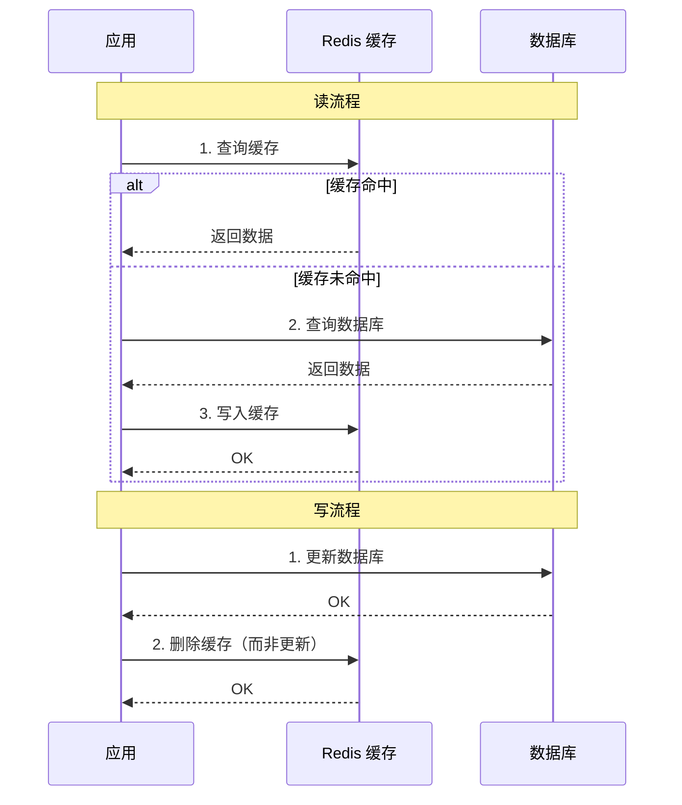
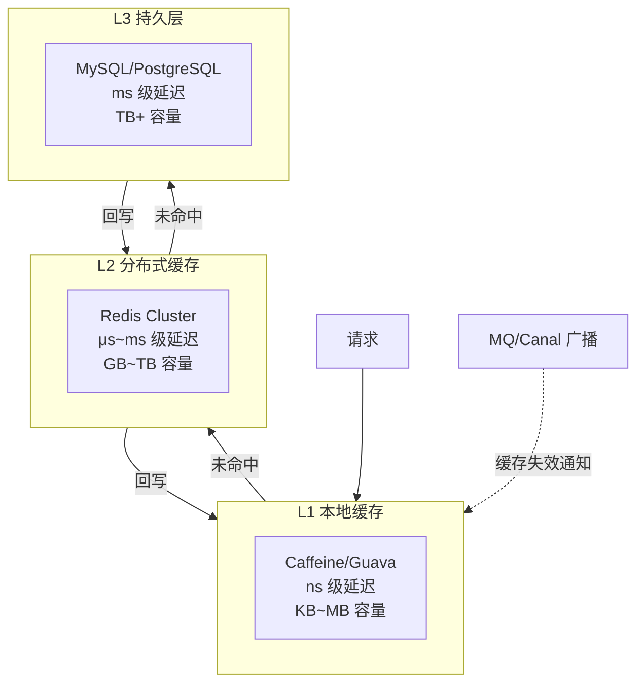

## 一、为什么需要缓存

核心矛盾：**读多写少**场景下数据库压力巨大。缓存将热点数据前移。

## 速查卡

- **Cache-Aside**（最常用）：读缓存→未命中读 DB→写缓存；写 DB→删缓存（删而非更新，防并发覆写）
- **三大问题**：穿透（布隆过滤器/缓存空值）→ 击穿（互斥锁/永不过期）→ 雪崩（TTL 加随机值/多级缓存/熔断）
- **多级缓存**：L1 Caffeine（本地 ns 级）→ L2 Redis（分布式 μs 级）→ L3 DB，一致性靠 MQ/Canal 广播或短 TTL
- **DB 缓存一致性**：延迟双删、Canal Binlog 异步、先写 DB 再删缓存（推荐）
- **热点发现**：客户端统计、Redis `--hotkeys`（LFU）、集群 QPS 监控；热点多副本分散到不同节点

---

## 一、为什么需要缓存

## 二、缓存策略

### Cache-Aside（最常用）



**为什么删除而非更新？** 并发写时更新缓存可能覆写为旧值。删除更安全。

### 四种策略对比

| 策略 | 特点 | 一致性 | 适用 |
|------|------|:---:|------|
| **Cache-Aside** | 应用控制读缓存+写DB | 最终 | 通用 |
| **Read-Through** | 缓存层代理读 | — | 配合 Write-Through |
| **Write-Through** | 同步写缓存+DB | 强 | 不能丢数据 |
| **Write-Behind** | 只写缓存，异步刷DB | 弱 | 写密集型 |

---

## 三、多级缓存



| 层级 | 技术 | 容量 | 延迟 |
|------|------|:---:|:---:|
| L1 本地 | Caffeine / Guava | KB~MB | ns |
| L2 分布式 | Redis | GB~TB | μs~ms |
| L3 数据库 | MySQL/PostgreSQL | TB+ | ms+ |

**多级缓存一致性**：更新 DB → 删除 Redis → 广播删除本地缓存（MQ/Canal），或使用短 TTL 容忍短暂不一致。

---

## 四、缓存三大问题

### 缓存雪崩

**大量 key 同时过期**或**缓存服务宕机**，请求全打向 DB。

**防护**：
- TTL 加随机值（±30%），避免同时过期
- 多级缓存兜底（本地缓存 → Redis → DB）
- 缓存高可用（Redis Cluster/Sentinel）
- 限流熔断保护 DB

### 缓存穿透

查询**不存在的数据**（id=-1），缓存永不命中，请求穿透到 DB。

**防护**：
- **布隆过滤器**：提前判断 key 是否存在（见下方详解）
- **缓存空值**：对不存在的数据也缓存（短 TTL，如 5 分钟）
- **参数校验**：拦截非法 ID（负数、超长等）

#### 布隆过滤器详解

```
┌─────────────────────────────────────┐
│  布隆过滤器 (bit 数组)               │
│  [0][1][0][1][1][0][0][1]...        │
│    ↑     ↑  ↑     ↑                 │
│    hash1(key)=2, hash2(key)=3, ...    │
│                                      │
│  判断：所有 hash 位=1 → "可能存在"     │
│       任一位=0       → "一定不存在"    │
└─────────────────────────────────────┘
```

**关键特性**：
- **空间效率极高**：10 亿数据约 1.2 GB（误判率 1%）
- **有误判**：不存在判定为存在（可通过调整参数控制误判率）
- **不可删除**：删除一位可能影响其他 key
- **Redis 集成**：Redis Stack 提供 `BF.ADD` / `BF.EXISTS` 命令

```java
// Guava 布隆过滤器
BloomFilter<String> filter = BloomFilter.create(
    Funnels.stringFunnel(Charsets.UTF_8),
    1_000_000,  // 预计插入量
    0.01         // 误判率 1%
);
```

**bit 数组长度计算**：

```
m = -(n × ln(p)) / (ln2)²

n = 预期元素数量, p = 目标误判率

例：1 亿数据，1% 误判率 → m ≈ 958,505,837 bits ≈ 114 MB
```

### 缓存击穿

**热点 key 过期瞬间**，大量并发查 DB 重建缓存。

**防护**：
- **互斥锁**：只允许一个线程查 DB 重建，其余等待
- **热点永不过期**：逻辑过期 + 异步刷新
- **预热**：启动时提前加载热点数据

```java
// 互斥锁防击穿
public String get(String key) {
    String val = redis.get(key);
    if (val != null) return val;
    // 获取锁，只让一个请求去查 DB
    if (redis.setnx("lock:" + key, "1", 10, SECONDS)) {
        try {
            val = db.query(key);
            redis.set(key, val, 30, MINUTES);
        } finally {
            redis.del("lock:" + key);
        }
    } else {
        Thread.sleep(50);
        return get(key); // 自旋重试
    }
    return val;
}
```

---

## 四-额外、缓存预热与热点发现

### 缓存预热

系统启动或缓存清空后，提前将热点数据加载到缓存，避免冷启动击穿。

| 策略 | 说明 |
|------|------|
| **启动预热** | 应用启动时从 DB 批量加载热点数据到缓存 |
| **定时预热** | 定时任务在业务低峰前刷新热点缓存 |
| **触发式预热** | 监听到数据变更后主动更新缓存 |

### 热点 Key 发现

| 方法 | 说明 |
|------|------|
| **客户端统计** | SDK 侧统计 key 访问频率，上报热点 |
| **Proxy 层统计** | 代理层（如 Codis/Twemproxy）收集访问统计 |
| **Redis 命令** | `redis-cli --hotkeys`（Redis 4.0+，基于 LFU） |
| **集群监控** | 各节点 QPS 监控，发现倾斜的热 key |

> **热 Key 处理**：发现后可将热点 key 复制多份（key_1, key_2, ...），分散到不同 Redis 节点，或使用本地缓存兜底。

---

## 五、缓存与数据库一致性

### 延迟双删

```
1. 删除缓存 → 2. 更新DB → 3. sleep(几百ms) → 4. 再次删除缓存
```

### 订阅 Binlog

```
更新DB → Canal/Debezium 监听 binlog → 异步删除/更新缓存
```

业务代码解耦，最终一致性的可靠方案。

### 方案对比

| 方案 | 一致性 | 复杂度 | 性能 |
|------|:---:|:---:|:---:|
| 先删缓存再写DB | 最终 | 低 | 高 |
| 先写DB再删缓存 | 最终 | 低 | 高 |
| 延迟双删 | 较高 | 中 | 中 |
| Binlog 异步 | 最终 | 中 | 高 |
| 分布式事务 | 强 | 高 | 低 |

---

## 自测

1. **Cache-Aside 为什么更新 DB 后是「删除」缓存而不是「更新」缓存？**
   <br/>→ 并发写场景下，两个写请求先后更新 DB，若都用 set 更新缓存，后到的可能覆盖先到的，导致缓存与 DB 不一致。删除更安全，下次读时自动重建。

2. **缓存穿透和缓存击穿的核心区别是什么？解决方案各有什么侧重？**
   <br/>→ 穿透：查询不存在的数据（恶意攻击/非法 ID），方案侧重「判定键是否存在」（布隆过滤器、参数校验）。击穿：热点 key 过期瞬间大量并发请求，方案侧重「控制并发重建」（互斥锁、逻辑过期）。

3. **多级缓存（L1 Caffeine → L2 Redis → L3 DB）的一致性如何保证？**
   <br/>→ 更新 DB → 删除 Redis → 通过 MQ/Canal 广播删除本地缓存，或使用短 TTL 容忍短暂不一致。关键：容忍最终一致性，不强求各层实时一致。

4. **布隆过滤器删除元素为什么困难？有什么替代方案？**
   <br/>→ 一个 bit 可能被多个 key 共享，删除会影响其他 key 的判断。替代：计数布隆过滤器（Counting Bloom Filter）、布谷鸟过滤器（Cuckoo Filter，原生支持删除）。

5. **线上缓存突然大面积失效（雪崩），你如何快速恢复？**
   <br/>→ 立即限流熔断保护 DB → 开启多级缓存兜底（本地缓存）→ 分批预热热点数据（控制并发重建）→ 排查原因（TTL 集中？Redis 宕机？）→ 修复后逐步放开流量。
