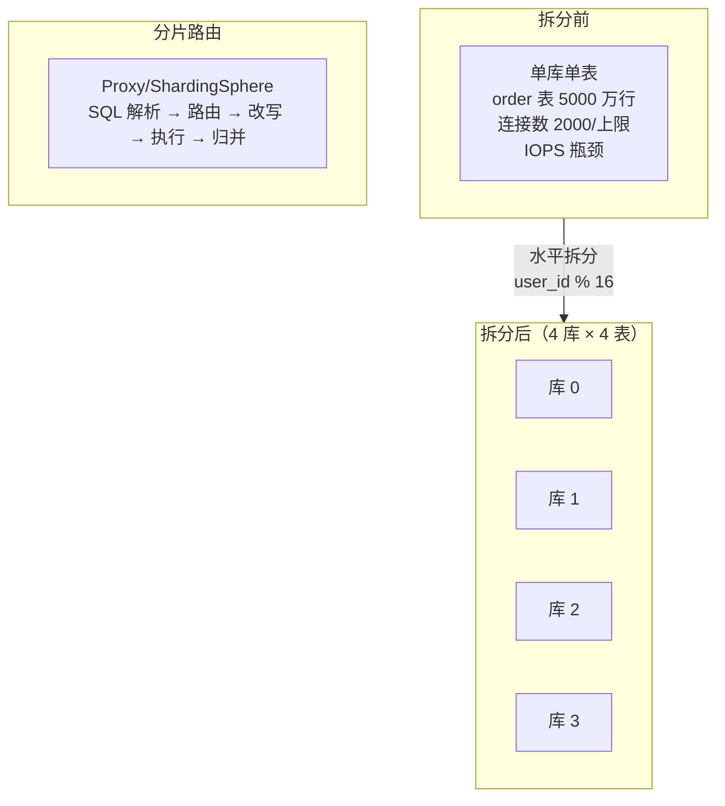
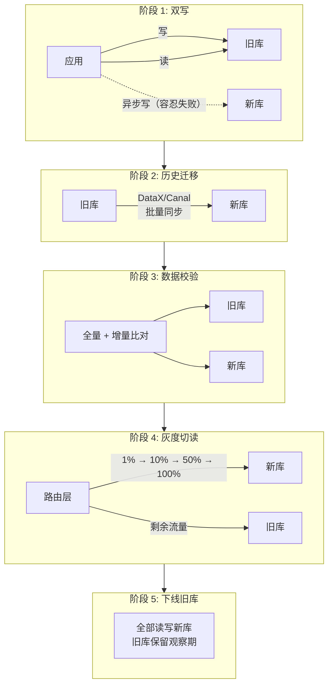

## 一、事务 ACID

| 特性 | 说明 |
|------|------|
| **原子性** | 事务不可分割，全做或全不做 |
| **一致性** | 事务前后数据完整性一致 |
| **隔离性** | 并发事务互不干扰 |
| **持久性** | 提交后数据永久保存 |

---

## 二、事务隔离级别（InnoDB）

| 级别 | 问题 | 实现 |
|------|------|------|
| **Read Uncommitted** | 脏读 | — |
| **Read Committed** | 不可重复读 | 每次查询创建新 ReadView |
| **Repeatable Read**（默认） | 幻读（部分解决） | 事务首次查询创建 ReadView（MVCC） |
| **Serializable** | 性能最低 | 读加共享锁 |

**幻读**：事务 A 更新全表，事务 B 新增记录，A 查询时发现还有未更新数据。

> InnoDB 的 RR 级别通过 **MVCC + Gap Lock + Next-Key Lock** 实际上已解决了大部分幻读问题，但在 `SELECT ... FOR UPDATE` 或范围更新时仍可能出现。

### MVCC 实现原理

- 每行记录有两个隐藏列：`trx_id`（最后一次修改的事务 ID）和 `roll_pointer`（指向 undo log）
- **ReadView** 记录当前活跃事务 ID 列表
- 根据 ReadView 判断数据版本可见性，读取 undo log 中的历史版本

**实现方式**：
- RR：MVCC 版本控制，读取快照
- Serializable：读加共享锁，写加排他锁

---

## 三、InnoDB 锁机制

### 行级锁

| 类型 | 说明 |
|------|------|
| **共享锁 (S)** | 允许读一行 |
| **排他锁 (X)** | 允许删除/更新一行 |

### 意向锁

| 类型 | 说明 |
|------|------|
| **意向共享锁 (IS)** | 想获得表中某几行的共享锁 |
| **意向排他锁 (IX)** | 想获得表中某几行的排他锁 |

### 一致性非锁定读（MVCC）

读取行正在进行 UPDATE/DELETE 时，读操作不阻塞，而是读取快照数据。

---

## 四、Spring 事务

### 异常回滚

- 默认对 **RuntimeException** 回滚
- checked 异常不回滚

```java
@Transactional(rollbackFor = Exception.class)      // checked 也回滚
@Transactional(noRollbackFor = RuntimeException.class) // unchecked 不回滚
```

### 七种传播属性

| 行为 | 说明 |
|------|------|
| **REQUIRED**（默认） | 有则加入，无则新建 |
| **SUPPORTS** | 有则加入，无则以非事务 |
| **MANDATORY** | 必须有事务，否则抛异常 |
| **REQUIRES_NEW** | 新建事务，挂起当前 |
| **NOT_SUPPORTED** | 非事务执行，挂起当前 |
| **NEVER** | 非事务，有事务则抛异常 |
| **NESTED** | 嵌套事务 |

---

## 六、分库分表

### 为什么需要分库分表？

单表数据量过大（> 2000 万行或 >10GB）时，查询性能急剧下降。单库连接数、IOPS 成为瓶颈。



### 垂直拆分 vs 水平拆分

| 维度 | 垂直拆分 | 水平拆分 |
|------|------|------|
| **拆分方式** | 按列拆分（不同表放不同库） | 按行拆分（同一表数据分散到多个库/表） |
| **解决问题** | 表太宽、IO 竞争 | 表太大、单库瓶颈 |
| **例子** | 用户库(用户表+账户表)、订单库(订单表+详情表) | `order_0`、`order_1`...`order_15` |
| **复杂度** | 低，跨库 JOIN 减少 | 高，跨分片查询难 |

> 实际项目通常**先垂直再水平**，或垂直水平结合。

### 分片键（Sharding Key）选择

分片键决定了数据分布和查询效率，是最关键的决策：

| 原则 | 说明 |
|------|------|
| **高区分度** | 数据尽可能均匀分布到所有分片 |
| **查询绑定** | 绝大多数查询能带上分片键（避免全分片扫描） |
| **避免热点** | 避免某个分片承载绝大部分流量 |
| **业务相关性** | 同一用户/订单的数据尽量在同一分片 |

**常见的分片键**：

| 分片键 | 适用 | 问题 |
|------|------|------|
| **user_id** | C 端系统，查询总带用户 ID | 商户/运营视角需跨分片 |
| **order_id** | 订单系统 | 按用户查订单需跨分片 |
| **时间**（按天/月） | 日志、监控 | 历史热数据集中 |

### 分片算法

| 算法 | 实现 | 特点 |
|------|------|------|
| **取模** | `id % N` | 简单，扩容时全量迁移 |
| **一致性哈希** | Hash Ring | 扩容只迁移相邻数据，但可能分布不均 |
| **范围分片** | 0~1亿→分片0，1~2亿→分片1 | 易于扩容，但可能热点 |
| **哈希槽** | Redis Cluster：CRC16 % 16384 | 预分片，扩容迁移槽粒度 |

### 跨分片查询处理

| 场景 | 方案 |
|------|------|
| **按非分片键查询** | 冗余查询（每个分片都查一次 → 合并结果） |
| **跨分片分页** | 每个分片取前 N 条 → 内存二次排序 → 取前 N（深度分页性能差） |
| **跨分片排序** | 各分片分别排序 → 归并（耗费内存），尽量避免 |
| **跨分片聚合** | COUNT/SUM 在各分片分别算 → 合并（AVG 不能简单求平均） |
| **跨分片 JOIN** | 应用层 JOIN、全局表（每个分片存一份）、禁止跨分片 JOIN |

```sql
-- 跨分片分页：每个分片取前 N 条，归并（深度分页性能随 offset 增大线性恶化）
-- 分片 0: SELECT * FROM order_0 ORDER BY create_time DESC LIMIT 1000, 20;
-- 分片 1: SELECT * FROM order_1 ORDER BY create_time DESC LIMIT 1000, 20;
-- ...在应用层合并 20 × N 条结果，二次排序，取前 20 条

-- 改进方案：禁止跳页，改用游标分页
-- WHERE create_time < '上页最小时间' ORDER BY create_time DESC LIMIT 20
```

### 分库分表面临的问题汇总

| 问题 | 方案 |
|------|------|
| **分布式 ID** | Snowflake（有序 + 趋势递增）、Leaf 号段模式 |
| **分布式事务** | 尽量避免；无法避免则用 Seata AT/TCC |
| **扩容** | 一致性哈希/双倍扩容/停服迁移 |
| **数据迁移** | 见下方"不停机数据迁移"节 |

---

## 七、不停机数据迁移

核心目标：**在线将数据从旧集群/旧分片迁移到新集群/新分片，业务不中断**。

### 双写 + 灰度切流



### 各阶段详解

| 阶段 | 关键动作 | 注意事项 |
|------|------|------|
| **双写** | 应用层同时写新旧库 | 新库写入失败不阻塞主流程，异步补偿 |
| **历史迁移** | DataX/Canal/DTS 批量同步存量数据 | 注意限速，避免影响在线业务 |
| **数据校验** | 全量比对 + 增量持续比对 | 允许短暂不一致窗口 |
| **灰度切流** | 按百分比/用户 ID hash 逐步切读 | 每步观察业务指标和数据库负载 |
| **下线旧库** | 确认新库稳定后停止双写 | 保留旧库一段时间作为备份 |

### 核心原则

- **可回滚**：每一步都可回退到旧库
- **可观测**：每步都有数据对账和业务监控
- **渐进式**：灰度步骤足够细，问题影响面可控
- **补偿机制**：双写阶段新库写入失败要有异步补偿（扫 binlog 补齐）

---

## 八、索引优化（续）

### 索引失效场景

| 场景 | 效果 |
|------|------|
| 使用不等式 `!=` `<>` | 索引失效 |
| 类型不一致 | 不一致列后索引失效 |
| 函数计算 | 计算列后索引失效 |
| `LIKE '%xxx'` 前缀模糊 | 索引失效 |
| 不适用复合索引首列 | 索引失效 |

### 复合索引

遵循**最左前缀原则**，查询条件必须从索引的最左列开始匹配。

### MySQL 8.0+ 新特性

| 特性 | 说明 |
|------|------|
| **窗口函数** | `ROW_NUMBER()`、`RANK()`、`LAG()`/`LEAD()` 等 |
| **CTE** | `WITH RECURSIVE` 递归查询 |
| **原子 DDL** | DDL 原子操作，不再部分失败 |
| **不可见索引** | `ALTER TABLE ... ALTER INDEX ... INVISIBLE` |
| **降序索引** | 真正支持 DESC 索引 |
| **hash join** | 替代部分嵌套循环 join |

### EXPLAIN ANALYZE（MySQL 8.0.18+）

```sql
EXPLAIN ANALYZE SELECT ... ;
```

实际执行查询并返回每步的实际耗时和行数，比传统 EXPLAIN 更精确。
