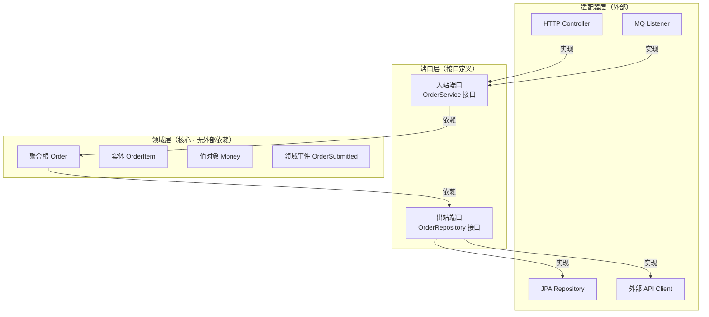

## 一、DDD 解决什么

传统三层架构下业务逻辑散落在 Service 层，**业务概念被技术实现淹没**。

## 速查卡

- **实体 vs 值对象**：实体有唯一 ID、可变（User, Order）；值对象无 ID、不可变、由值定义相等性（Email, Money）
- **聚合**：聚合根是外部唯一入口，一个聚合一个事务，通过 ID 引用其他聚合
- **限界上下文**：同一个词在不同上下文有不同含义，每个上下文有统一通用语言
- **六边形架构**：端口（Port，接口定义）+ 适配器（Adapter，接口实现），领域层无框架和基础设施依赖
- **Anti-Corruption Layer**：下游构建翻译层，防止上游模型污染到下游

> DDD 不是技术框架，而是一套**建模方法论**。核心：用领域模型表达业务规则。

---

## 二、核心概念

### 实体（Entity）

具有**唯一标识**的对象，标识在生命周期中不变。

```java
public class User {
    private UserId id;     // 唯一标识（不可变）
    private String name;   // 可变属性
    private Email email;

    public void changeEmail(Email newEmail) {
        if (this.email.equals(newEmail)) return;
        this.email = newEmail;
    }
}
```

**识别**：有生命周期、需要 ID 跟踪、属性会变化。

### 值对象（Value Object）

无唯一标识，由**属性值**定义相等性。**不可变**。

```java
public record Email(String value) {
    public Email {
        if (!value.matches("^[\\w.-]+@[\\w.-]+\\.[a-z]{2,}$"))
            throw new IllegalArgumentException("Invalid email");
    }
}

public record Money(BigDecimal amount, Currency currency) {
    public Money add(Money other) { /* 同币种相加 */ }
}
```

**识别**：由值决定身份、不需要 ID、通常作为实体的属性。

### 聚合（Aggregate）

通过**聚合根**访问的一组对象。聚合根保证内部一致性。

```java
public class Order {  // 聚合根
    private OrderId id;
    private List<OrderItem> items;  // 内部实体
    private OrderStatus status;
    private Money totalAmount;

    public void addItem(Product product, int quantity) {
        if (status != OrderStatus.DRAFT)
            throw new IllegalStateException("只能修改草稿订单");
        items.add(new OrderItem(product, quantity));
        totalAmount = totalAmount.add(product.getPrice().multiply(quantity));
    }
}
```

**原则**：一个聚合一个事务、通过 ID 引用其他聚合、聚合尽量小。

| 概念 | 判断 | 举例 |
|------|------|------|
| 实体 | 有唯一 ID，可变 | User, Order |
| 值对象 | 无 ID，不可变 | Email, Money |
| 聚合根 | 外部访问唯一入口 | Order |
| 仓储 | 聚合持久化抽象 | OrderRepository |

---

## 三、限界上下文（Bounded Context）

同一个词在不同上下文有不同含义：
- **用户**在「电商上下文」：买家、收货地址
- **用户**在「认证上下文」：用户名、密码、角色

每个上下文内部有统一的**通用语言（Ubiquitous Language）**。

### 上下文映射关系

| 关系 | 说明 |
|------|------|
| Customer-Supplier | 下游依赖上游 |
| Conformist | 下游无条件遵循上游 |
| **Anti-Corruption Layer** | 下游构建翻译层防上游模型污染 |
| Open Host Service | 上游提供标准化 API |

---

## 四、六边形架构



- **端口（Port）**：定义接口（如 `OrderRepository` 接口）
- **适配器（Adapter）**：实现端口（如 `JpaOrderRepository`）
- 领域层**不依赖任何框架和基础设施**

### 推荐包结构

```
order/
├── domain/           # 领域层（核心）
│   ├── Order.java              # 聚合根
│   ├── OrderRepository.java    # 仓储接口（端口）
│   └── Money.java              # 值对象
├── application/      # 应用层
│   └── OrderApplicationService.java
├── infrastructure/   # 基础设施层（适配器）
│   └── JpaOrderRepository.java
└── interfaces/        # 接口层
    └── OrderController.java
```

---

## 自测

1. **实体和值对象的核心区别是什么？什么时候该用值对象？**
   <br/>→ 实体有唯一标识（ID），生命周期中有状态变化需要追踪。值对象由属性值定义相等性，不可变。当概念没有独立身份、仅由其属性描述时应建模为值对象（如 Email、Address、Money）。

2. **聚合设计原则中为什么强调"通过 ID 引用其他聚合"？**
   <br/>→ 避免聚合过大导致事务范围过宽、并发冲突增加。通过 ID 引用解耦聚合，每个聚合独立保证一致性边界，跨聚合通过最终一致性或领域事件协作。

3. **六边形架构中端口（Port）和适配器（Adapter）的关系是什么？为什么领域层不依赖框架？**
   <br/>→ 端口定义接口（在领域层），适配器实现接口（在基础设施层）。依赖倒转：领域层定义接口，外部层实现它。这样领域层可独立测试、替换外部技术（换数据库不改领域逻辑）。

4. **限界上下文（Bounded Context）解决什么问题？ACL 模式何时用？**
   <br/>→ 同一个业务概念在不同上下文中含义不同（如「用户」在电商 vs 认证上下文）。ACL 在下游需要隔离上游模型变更影响时使用，避免上游模型污染下游代码。
