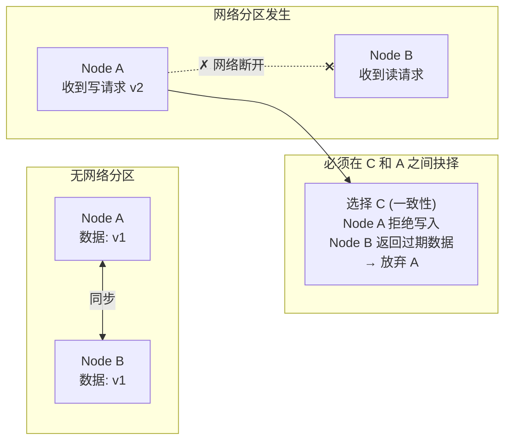
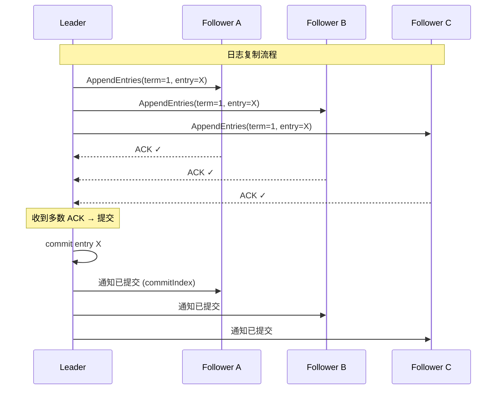
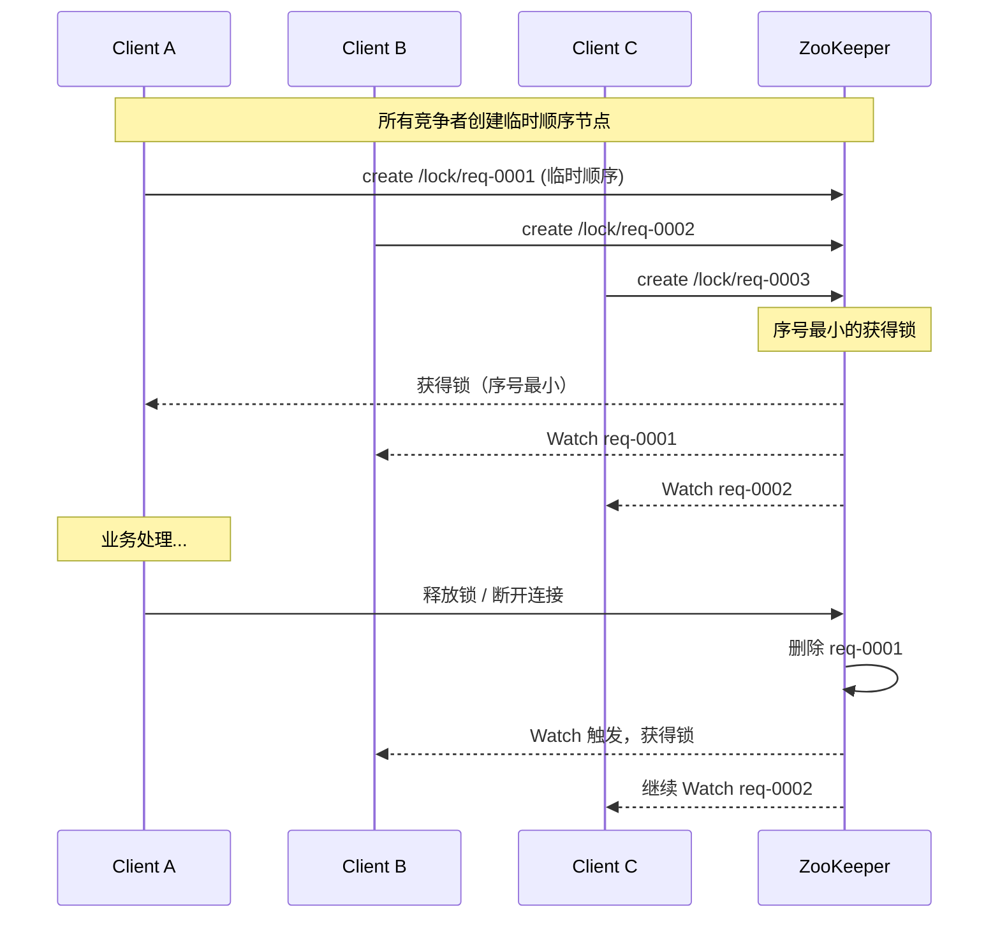

## 速查卡

- **CAP**：P（分区）发生时必须在 C（一致性）和 A（可用性）间抉择。ZooKeeper/etcd 选 CP，Eureka/Cassandra 选 AP
- **BASE**：基本可用 + 软状态 + 最终一致性，AP 方案的延伸
- **Raft**：Leader 选举（随机超时）+ 日志复制（AppendEntries，多数 ACK 后提交）+ 安全性（已提交日志必被未来 Leader 包含）
- **分布式锁**：Redis（Redisson，SET NX + 看门狗续期，AP 可能脑裂）；ZooKeeper（临时顺序节点 + Watch，CP 更安全）；etcd（CP）
- **最终一致性**：可靠消息模式（本地事务+消息表）、补偿模式、定期校对、Canal Binlog
- **HLC**（混合逻辑时钟）：物理时钟+逻辑时钟混合，CockroachDB 使用；TrueTime：Google Spanner 原子钟+GPS 全球强一致

## 一、CAP 定理

分布式系统无法同时满足以下三点，只能三选二：

| 特性 | 含义 | 典型实现 |
|------|------|------|
| **C（Consistency）** | 所有节点同一时刻看到相同数据 | 强一致性存储、分布式事务 |
| **A（Availability）** | 每次请求都能获得（非错的）响应 | 最终一致性系统 |
| **P（Partition Tolerance）** | 网络分区发生时系统仍能正常运作 | 实际分布式系统必备 |

### 为什么 CAP 只能三选二？

当 P（网络分区）发生时，必须在 C 和 A 之间抉择：



> **关键认知**：CAP 不是"三选二"的设计选择，而是在 P 发生时**必须放弃 C 或 A**。没有分区时，C 和 A 可以共存。

### CP vs AP 实际举例

| 类型 | 系统 | 取舍分析 |
|------|------|------|
| **CP** | ZooKeeper、etcd、Consul | 发生分区时，少数派节点拒绝服务（放弃 A），保证数据一致 |
| **AP** | Eureka、Cassandra、DynamoDB | 发生分区时，允许写入所有节点（放弃 C），后续通过反熵修复 |
| **CA** | 传统 RDBMS 单机 | 不考虑 P，单机同时满足 C 和 A |

> **面试常问**：为什么 ZooKeeper 是 CP？—— 发生网络分区时，Leader 失联后集群不可用（选举期间拒绝写），保证不会脑裂导致数据不一致。

---

## 二、BASE 理论

BASE 是 CAP 中 AP 方案的延伸，核心思想：**牺牲强一致性，换取高可用**。

| 特性 | 含义 |
|------|------|
| **BA（Basically Available）** | 基本可用：系统出现故障时允许损失部分可用性（响应变慢/降级） |
| **S（Soft State）** | 软状态：允许系统存在中间状态，不同节点数据副本可短暂不一致 |
| **E（Eventually Consistent）** | 最终一致性：不保证立刻读到最新值，但经过一段时间后数据最终一致 |

**ACID vs BASE**：

| 维度 | ACID | BASE |
|------|------|------|
| 思想 | 悲观、强一致 | 乐观、最终一致 |
| 适用 | 传统 RDBMS | 大型分布式系统 |
| 核心 | 一致性优先 | 可用性优先 |

---

## 三、共识算法

分布式系统中，如何让多个节点就某个值达成一致。

### Raft（易懂、工程化）

将共识问题分解为三个子问题：



| 子问题 | 机制 |
|------|------|
| **领导者选举** | 随机超时发起投票，获得多数票当选，Term 递增 |
| **日志复制** | Leader 将日志同步到多数 Follower，AppendEntries RPC |
| **安全性** | 只有包含所有已提交日志的节点才能当选 Leader |

> **关键**：Raft 保证已提交的日志一定被未来 Leader 包含，这是安全的基石。

### Paxos（经典、难理解）

Basic Paxos 两阶段：

| 阶段 | 操作 |
|------|------|
| **Phase 1 - Prepare** | Proposer 发出提案号，Acceptor 承诺不接收比它小的提案 |
| **Phase 2 - Accept** | Proposer 发出值，Acceptor 接受（如未承诺更高号） |

> Raft 是 Paxos 的工程优化版，更易理解和实现。etcd、TiKV、Consul 均使用 Raft。

### ZAB（ZooKeeper Atomic Broadcast）

ZooKeeper 专有协议，类似 Raft + Paxos 的混合：

- 所有写请求必须经过 Leader
- Leader 将事务 Proposal 广播给 Follower
- 半数以上 ACK 后 Commit
- 强顺序保证

**Raft vs ZAB**：

| 维度 | Raft | ZAB |
|------|------|------|
| 日志顺序 | 连续 | 允许空洞 |
| 恢复策略 | 从 Leader 追日志 | 补齐空洞 + 截断 |
| 实现 | etcd, Consul | ZooKeeper |

---

## 四、分布式锁

### 基于 Redis

```java
// Redisson 分布式锁（看门狗自动续期）
RLock lock = redisson.getLock("order:" + orderId);
lock.lock(30, TimeUnit.SECONDS);
try {
    // 业务逻辑
} finally {
    lock.unlock();
}
```

| 特性 | 实现 |
|------|------|
| **互斥** | SET NX + Lua 脚本释放 |
| **防死锁** | 过期时间 + 看门狗自动续期 |
| **可重入** | Hash 结构记录持有线程和重入次数 |

> **Redlock 争议**：Martin Kleppmann 指出时钟跳跃和 GC 停顿会使 Redlock 不安全。对正确性要求极高的场景，建议使用 ZooKeeper/etcd。

### 基于 ZooKeeper

利用**临时顺序节点** + **Watch 机制**：



> ZK 锁比 Redis 更安全（CP 保证），但性能更低。

### 选型

| 维度 | Redis | ZooKeeper | etcd |
|------|:---:|:---:|:---:|
| 一致性 | AP（最终） | CP | CP |
| 性能 | 高 | 中 | 中 |
| 可靠性 | 可能脑裂 | 强 | 强 |
| 推荐场景 | 性能敏感可容忍极低概率错 | 正确性要求极高 | 正确性要求极高 |

---

## 五、微服务交互模式

### 1. 同步调用

服务 A 调用 B，A 阻塞等待响应。适合大规模、高并发的短小操作。

接口返回状态：成功/失败，或成功/失败/处理中。

### 2. 接口异步调用

A 调用 B，B 返回受理结果，任务完成后通知 A。减轻核心链路负载。

### 3. 消息队列异步处理

A 发送到 MQ → MQ 返回受理结果 → B 消费任务。服务间充分解耦，A 不关心下游结果。

### 同步还是异步？

| 场景 | 选择 |
|------|------|
| 性能不是问题、短小轻量 | 同步 |
| 耗时任务、响应时间无要求 | 异步 |

---

## 二、超时解决方案

| 模式 | 方案 |
|------|------|
| 同步超时 | 调大超时、幂等重试、返回处理中轮询 |
| 异步超时 | 回调通知、轮询查询 |
| MQ 超时 | 消费幂等、消息 TTL、死信队列 |

---

## 三、保证最终一致性的模式

| 模式 | 说明 |
|------|------|
| **查询模式** | 定期查询下游状态确认结果 |
| **补偿模式** | 失败后执行逆向操作恢复 |
| **异步确保模式** | 异步回调或消息确认完成 |
| **定期校对模式** | 定时对账，发现不一致修复 |
| **可靠消息模式** | 本地事务 + 消息表 |
| **缓存一致性模式** | 先更新 DB，再删除缓存 | 读多写少 |

### 可靠消息模式详解

```
本地事务内：
  1. 更新业务表
  2. 插入消息表（同库同事务）
  
异步：
  3. 定时任务轮询消息表 → 发送 MQ → 标记已发送
  4. 消费端幂等处理
```

这是实现分布式事务最终一致性最常用的方案。

---

## 八、分布式时钟与顺序

| 方案 | 说明 | 适用 |
|------|------|------|
| **NTP** | 网络时间同步，毫秒级精度 | 通用，无法保证单调性 |
| **Lamport 逻辑时钟** | 事件间 happened-before 关系 | 偏序关系判定 |
| **向量时钟** | 多节点版本向量，可检测并发冲突 | 冲突检测（Dynamo 风格） |
| **TrueTime** | Google Spanner 原子钟 + GPS | 全球强一致性事务 |
| **混合逻辑时钟（HLC）** | 物理时钟 + 逻辑时钟混合 | CockroachDB 等

---

## 自测

1. **为什么说 CAP 不是"三选二"而是"P 发生时的取舍"？**
   <br/>→ 没有网络分区时，C 和 A 可以共存。只有当网络分区发生时，必须在 C（拒绝写入保证一致）和 A（允许写入但可能不一致）之间抉择。P 不是可选项——在分布式系统中必须假设网络分区会发生。

2. **Raft 如何保证新 Leader 一定包含所有已提交的日志？**
   <br/>→ 投票时 Candidate 携带自己最后日志的 term 和 index，Follower 只投票给比自己日志新的 Candidate。"日志更新"的标准：term 更大，或 term 相同但 index 更大。已提交的日志在多数节点上 → 获得多数票的 Candidate 必然包含它。

3. **Redis 分布式锁（Redisson）和 ZooKeeper 分布式锁的核心区别？什么场景必须用 ZK？**
   <br/>→ Redis 基于 SET NX + Lua 释放，AP 模型（主从切换可能丢锁），看门狗自动续期。ZK 基于临时顺序节点+Watch，CP 模型（更安全但性能较低）。资金扣减、库存修改等对正确性要求极高的场景必须用 ZK/etcd。

4. **可靠消息模式如何保证"本地事务 + 消息发送"的原子性？**
   <br/>→ 在同一数据库事务中同时写业务表和消息表（同库同事务），然后异步轮询消息表发送到 MQ，发送成功后标记已完成。消费端保证幂等。这是实现最终一致性最常用的方案。
