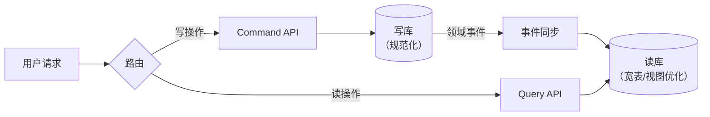
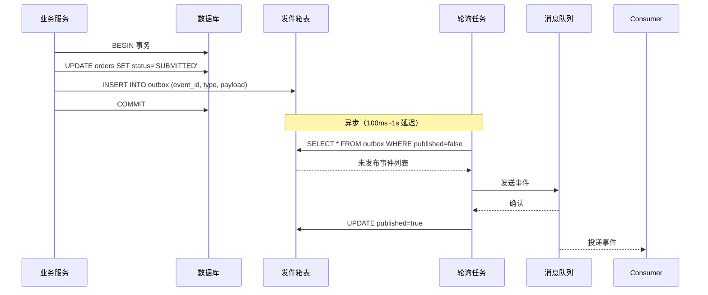

## 一、为什么事件驱动

传统同步调用链 A→B→C→D，任何一环失败都需处理且耦合紧密。

事件驱动：A 发布事件 → B/C/D 各自订阅独立处理。**解耦、异步、可扩展**。

## 速查卡

- **事件 vs 命令**：事件描述"已发生的事实"（过去时，不可拒绝，广播），命令是"请求做某事"（可拒绝，定向）
- **CQRS**：读写分离为不同模型，写库规范化+事件同步到读库（宽表优化查询），适合读写负载差异大的场景
- **Event Sourcing**：不存当前状态，存所有变更事件，状态=事件流重放。优势：完整审计、可回溯；挑战：schema 演化、需快照
- **Outbox 模式**：同一事务写业务表+发件箱表，异步轮询发件箱发送 MQ，保证 DB-MQ 原子性
- **事件驱动 vs 请求驱动**：事件松耦合+最终一致+水平扩展，请求紧耦合+强一致+垂直扩展

## 二、核心概念

### 事件（Event）

描述「已经发生的事实」，命名用**过去时**：

`OrderSubmitted` ✓（正确）、`SubmitOrder` ✗（是命令）

```json
{
  "eventId": "evt_abc",
  "eventType": "OrderSubmitted",
  "timestamp": "2026-06-29T10:30:00Z",
  "aggregateId": "order_456",
  "payload": {
    "userId": "user_789",
    "totalAmount": { "amount": "99.99", "currency": "CNY" }
  }
}
```

### 命令 vs 事件

| 维度 | 命令 | 事件 |
|------|:---:|:---:|
| 语义 | 请求做某事 | 某事已发生 |
| 命名 | PlaceOrder | OrderPlaced |
| 方向 | 明确目标 | 广播 |
| 可拒绝 | 可以 | 不可以 |

---

## 三、CQRS（命令查询职责分离）

将**读（Query）**和**写（Command）**分离为不同模型。



**优势**：读写各自优化、读模型可按需创建多个。
**代价**：数据最终一致、架构复杂度增加。

| 适用 | 不适用 |
|------|--------|
| 读写负载差异大 | 简单 CRUD |
| 复杂查询需求 | 强一致性要求 |
| 事件驱动体系 | 团队经验不足 |

---

## 四、Event Sourcing（事件溯源）

不存当前状态，存储**所有状态变化事件**。状态 = 事件流重放。

```
传统：User { balance: 100 } → 直接更新为 150（旧值丢失）
ES：  [存100]→[取50]→[存100] → 重放得余额 = 150
```

**优势**：完整审计日志、可查询历史状态、调试可重现。
**挑战**：事件 schema 演化、需快照避免全量重放。

---

## 五、Outbox 模式

### 问题

DB 更新和消息发送的原子性：

```
db.updateOrder(order);    // 成功
mq.send(event);            // 失败 → 不一致！
```

### 方案

同一事务中写入发件箱表，异步轮询发送：



```sql
BEGIN;
  UPDATE orders SET status = 'SUBMITTED' WHERE id = 456;
  INSERT INTO outbox (event_id, event_type, payload) VALUES (...);
COMMIT;

-- 异步：轮询 outbox 表 → 发送 MQ → 标记已发送
```

```java
@Transactional
public void submitOrder(OrderId id) {
    orderRepo.save(order.submit());
    outboxRepo.save(new OutboxEvent("OrderSubmitted", order));
}

@Scheduled(fixedDelay = 100)
public void publishOutbox() {
    for (OutboxEvent e : outboxRepo.findUnpublished(100)) {
        kafka.send(e.getType(), e.getPayload());
        outboxRepo.markPublished(e.getId());
    }
}
```

> Outbox 轮询有延迟（~100ms-1s）。实时性要求更高可用 **Debezium + CDC** 监听 binlog。

---

## 六、事件驱动 vs 请求驱动

| 维度 | 请求驱动 | 事件驱动 |
|------|:---:|:---:|
| 耦合 | 紧 | 松 |
| 一致性 | 强（ACID） | 最终（事件+补偿） |
| 调试 | 简单 | 复杂 |
| 扩展 | 垂直为主 | 水平为主 |
| 适用 | 事务性强、链路短 | 流程长、需解耦 |

---

## 自测

1. **CQRS 如何保证读写模型的一致性？为什么会有延迟？**
   <br/>→ 写操作更新写库后发布领域事件，事件处理器异步更新读库。延迟来自事件发布→消费→投影的过程。当读写模型间需要强一致性时，CQRS 不适用。

2. **Event Sourcing 中快照（Snapshot）的作用是什么？**
   <br/>→ 避免每次重建聚合都需要从第一个事件重放。定期保存聚合当前状态的快照，恢复时从最近的快照开始重放后续事件，大幅减少重放事件数量。

3. **Outbox 模式和 CDC（Change Data Capture）方案各有什么优缺点？**
   <br/>→ Outbox：简单易实现，但轮询有延迟（~100ms-1s），轮询增加 DB 负载。CDC（如 Debezium）：实时监听 binlog，延迟低、不额外改业务代码，但运维复杂度高。

4. **事件驱动架构调试困难，有什么应对策略？**
   <br/>→ 全局 trace ID 关联事件链路、事件日志集中存储（ELK）、端到端测试环境能重放事件、Event Sourcing 场景可精确重现任意时间点状态。
