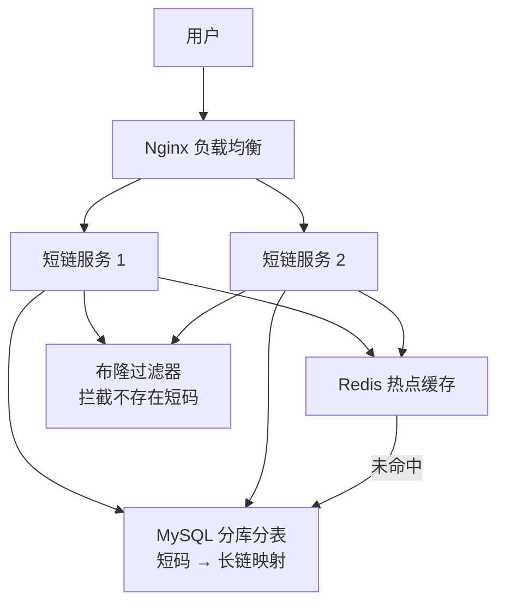
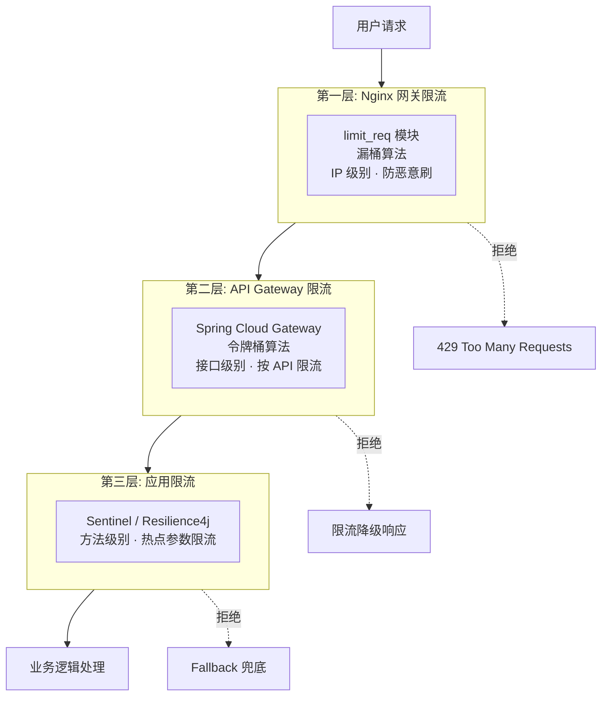

## 一、短链系统设计

### 核心流程

```
提交长URL → 生成短码 → 存储映射 → 返回短链
访问短链 → 查询映射 → 301/302 重定向
```

### 短码生成

**发号器方案**（推荐）：

```java
long id = idGenerator.nextId();       // 如 12345678
String code = Base62.encode(id);      // → "dnh8f"
// Base62: 0-9a-zA-Z，7位 ≈ 3.5万亿链接
```

**预生成码池**：提前生成短码入队列，高并发直接取用。

### 架构



---

## 二、分布式 ID 生成

| 方案 | 原理 | 优点 | 缺点 |
|------|------|------|------|
| **Snowflake** | 时间戳+机器ID+序列号 | 有序递增，高性能 | 依赖时钟同步 |
| **号段模式** | DB 批量分配 ID 段 | 强一致，不依赖时钟 | 依赖 DB |
| UUID v7 | 时间排序 UUID | 本地生成 | 较长 |

### Snowflake 结构

```
1bit(未用) | 41bit(时间戳ms) | 10bit(机器ID) | 12bit(序列号)
每毫秒 4096 个，理论 400万 QPS
```

### 时钟回拨处理

- 等待时钟追上（短时间回拨）
- **美团 Leaf**：号段模式不依赖时钟 + Snowflake 模式用 ZK 持久化时间戳

---

## 三、计数系统

### Redis 计数

```bash
# Redis 基础计数
INCR post:123:views
SADD post:123:likers user_456
```

### 高并发优化

**异步合并写**：本地累加 → 满100或超时 → `INCRBY` 批量写 Redis。

**HyperLogLog**：UV 估算。12KB 统计 2^64 元素，误差 < 0.81%。

```bash
PFADD page:uv user_1 user_2
PFCOUNT page:uv
```

### 排行榜（Sorted Set）

```bash
ZADD rank 100 user_1
ZREVRANGE rank 0 9
ZRANK rank user_1
```

---

## 四、限流策略

限流是保护系统的第一道防线，防止突发流量击垮服务。

### 四种算法对比

| 算法 | 原理 | 突发 | 平滑 | 复杂度 | 适用 |
|------|------|:---:|:---:|:---:|------|
| **固定窗口** | 窗口内请求数 < N，边界可翻倍 | ✓ | ✗ | 低 | 粗粒度保护 |
| **滑动窗口** | 窗口细分多格，统计更平滑 | ✗ | ✓ | 中 | 精确控制 |
| **漏桶** | 恒定速率流出，超出排队/丢弃 | ✗ | ✓✓ | 低 | 流量整形 |
| **令牌桶** | 恒定速率放入令牌，允许突发取走 | ✓ | ✓ | 中 | **最常用** |

### 算法图解

```
固定窗口（边界问题）：      令牌桶：
| 100 req/min              ┌─────────┐
| ┌────┬────┐              │ Token   │ ← 以恒定速率填充
| │ 80 │100 │ ← 翻倍!      │┌─┐┌─┐┌─┐│
| └────┴────┘              │└─┘└─┘└─┘│
| 边界瞬间 180 req         └─────────┘
                            ↓ 突发可取多个令牌
漏桶：
  →→→ ═══ →→→              滑动窗口：
  入水   出水恒定             |← 60s 窗口 →|
                           ┌─┬─┬─┬─┬─┬─┐  统计窗口内请求数
                           │ │ │ │ │ │ │  随时间移动，更平滑
                           └─┴─┴─┴─┴─┴─┘
```

### 令牌桶实现

```java
public class TokenBucket {
    private final long capacity;       // 最大令牌数
    private final double refillRate;   // 令牌/秒
    private double tokens;             // 当前令牌数
    private long lastRefill;           // 上次填充时间

    public synchronized boolean tryAcquire() {
        refill();
        if (tokens >= 1) { tokens--; return true; }
        return false;
    }

    private void refill() {
        long now = System.currentTimeMillis();
        double newTokens = (now - lastRefill) / 1000.0 * refillRate;
        tokens = Math.min(capacity, tokens + newTokens);
        lastRefill = now;
    }
}
```

### 分布式限流（Redis + Lua）

单机限流在分布式场景不够，需要用集中式限流：

```lua
-- 滑动窗口限流 Lua 脚本
local key = KEYS[1]                                    -- 限流 key
local window = tonumber(ARGV[1])                       -- 窗口大小（秒）
local limit = tonumber(ARGV[2])                        -- 窗口内限制次数
local now = tonumber(redis.call('TIME')[1])             -- 当前秒级时间戳
local cutoff = now - window

-- 移除窗口外的记录
redis.call('ZREMRANGEBYSCORE', key, 0, cutoff)

-- 获取当前窗口内请求数
local count = redis.call('ZCARD', key)

if count < limit then
    -- 用随机后缀避免同一秒内多请求分值相同
    redis.call('ZADD', key, now, now .. '-' .. math.random(100000))
    redis.call('EXPIRE', key, window + 1)
    return 1  -- 放行
else
    return 0  -- 拒绝
end
```

**注意**：Redis 限流需要每次请求都访问 Redis，高并发时可先用本地令牌桶粗筛，再走 Redis 精确控制。

### 工业级限流组件

| 组件 | 类型 | 特点 |
|------|------|------|
| **Sentinel** | 分布式 | 阿里开源，支持流控/熔断/系统保护，控制台实时监控 |
| **Guava RateLimiter** | 单机 | 平滑突发限流（SmoothBursty）/ 预热限流（WarmUp） |
| **Resilience4j** | 单机 | 轻量级，RateLimiter + CircuitBreaker + Retry |
| **Nginx limit_req** | 网关 | 漏桶实现，接入层第一道防线 |

### 多层限流架构



### 限流 vs 熔断 vs 降级

| 手段 | 触发条件 | 行为 | 目的 |
|------|------|------|------|
| **限流** | 超过设定阈值 | 拒绝多余请求 | 保护自身不被冲垮 |
| **熔断** | 调用下游失败率过高 | 快速失败，不再调用 | 防止级联故障（不雪崩） |
| **降级** | 系统压力大/依赖不可用 | 返回兜底结果 | 有损提供服务 |

> 三者常配合使用：限流在前 → 熔断在调用链 → 降级做最后兜底。
