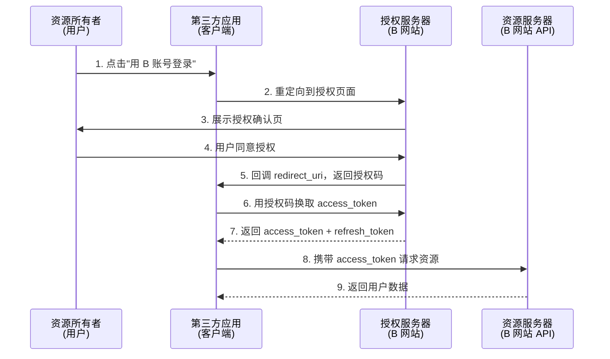

## 概述

OAuth 2.0 的标准是 **RFC 6749**。其核心是向第三方应用颁发令牌。

> OAuth 引入了一个授权层，用来分离两种不同的角色：客户端和资源所有者。资源所有者同意以后，资源服务器可以向客户端颁发令牌。客户端通过令牌，去请求数据。

### 整体流程



## 前置条件

不管哪种授权方式，第三方应用都必须先到系统备案，拿到两个身份识别码：
- **客户端 ID（client_id）**
- **客户端密钥（client_secret）**

## OAuth 2.1 与最新实践

> **OAuth 2.1**（草稿阶段）整合并简化了 OAuth 2.0：
> - **隐藏式（Implicit）已废弃** — 所有客户端都应使用授权码 + PKCE
> - **密码式（Password）已废弃** — 不再允许直接传输用户密码
> - **PKCE 成为必选** — 即使是机密客户端
> - 强制要求 `exact` redirect_uri 匹配
> - 刷新令牌必须使用 sender-constrained 或一次性使用

### PKCE（Proof Key for Code Exchange）

防止授权码拦截攻击（即使是公开客户端如 SPA）：

```
# 1. 客户端生成 code_verifier（随机字符串）和 code_challenge（SHA256 哈希）
code_challenge = BASE64URL(SHA256(code_verifier))

# 2. 授权请求时发送 code_challenge
https://b.com/oauth/authorize?
  response_type=code&
  client_id=CLIENT_ID&
  code_challenge=CODE_CHALLENGE&
  code_challenge_method=S256&
  redirect_uri=CALLBACK_URL

# 3. 换取令牌时发送 code_verifier
https://b.com/oauth/token?
  grant_type=authorization_code&
  code=AUTHORIZATION_CODE&
  code_verifier=CODE_VERIFIER
```

> **SPA 最佳实践**：使用授权码 + PKCE 流程，配合 **BFF（Backend For Frontend）** 模式在后端安全存储令牌，避免将 access_token 暴露在浏览器中。

---

## 四种授权方式

### 1. 授权码（Authorization Code）

**最常用、安全性最高**，适用于有后端的 Web 应用。前后端分离避免令牌泄漏。

**第一步** — A 网站提供链接，用户点击跳转到 B 网站授权：

```
https://b.com/oauth/authorize?
  response_type=code&
  client_id=CLIENT_ID&
  redirect_uri=CALLBACK_URL&
  scope=read
```

**第二步** — 用户登录 B 并同意授权，B 跳回 redirect_uri 并传回授权码：

```
https://a.com/callback?code=AUTHORIZATION_CODE
```

**第三步** — A 后端用授权码请求令牌（client_secret 保密，只能在后端发请求）：

```
https://b.com/oauth/token?
  client_id=CLIENT_ID&
  client_secret=CLIENT_SECRET&
  grant_type=authorization_code&
  code=AUTHORIZATION_CODE&
  redirect_uri=CALLBACK_URL
```

**第四步** — B 颁发令牌：

```json
{
  "access_token": "ACCESS_TOKEN",
  "token_type": "bearer",
  "expires_in": 2592000,
  "refresh_token": "REFRESH_TOKEN",
  "scope": "read"
}
```

### 2. 隐藏式（Implicit）⚠️ 已废弃

适用于**纯前端应用**（没有后端），直接向前端颁发令牌。

```
# 第一步
https://b.com/oauth/authorize?
  response_type=token&
  client_id=CLIENT_ID&
  redirect_uri=CALLBACK_URL&
  scope=read

# 第二步：令牌在 URL 锚点（fragment，不发送到服务器）
https://a.com/callback#token=ACCESS_TOKEN
```

> ⚠️ **OAuth 2.1 中已废弃此方式**。SPA 应使用**授权码 + PKCE** 流程代替。

### 3. 密码式（Password）⚠️ 已废弃

用户把用户名和密码直接给应用，适用高度信任的场景。

```
https://oauth.b.com/token?
  grant_type=password&
  username=USERNAME&
  password=PASSWORD&
  client_id=CLIENT_ID
```

B 验证通过后直接返回 JSON 令牌，不需要跳转。

> ⚠️ **OAuth 2.1 中已废弃此方式**。不再允许应用直接接触用户凭据。

### 4. 凭证式（Client Credentials）

适用于**命令行应用**（没有前端），令牌针对第三方应用而非用户。

```
https://oauth.b.com/token?
  grant_type=client_credentials&
  client_id=CLIENT_ID&
  client_secret=CLIENT_SECRET
```

---

## 令牌的使用与更新

### 使用令牌

```bash
curl -H "Authorization: Bearer ACCESS_TOKEN" "https://api.b.com"
```

### 更新令牌

```bash
https://b.com/oauth/token?
  grant_type=refresh_token&
  client_id=CLIENT_ID&
  client_secret=CLIENT_SECRET&
  refresh_token=REFRESH_TOKEN
```

---

## 对比总结

| 方式 | 适用场景 | 安全性 | OAuth 2.1 |
|------|----------|:------:|:---------:|
| 授权码 + PKCE | 所有现代应用（Web/SPA/Mobile） | 最高 | ✅ 推荐 |
| 隐藏式 | — | 较低 | ❌ 已废弃 |
| 密码式 | — | 低 | ❌ 已废弃 |
| 凭证式 | 服务间通信（M2M）、命令行 | 中 | ✅ 保留 |
