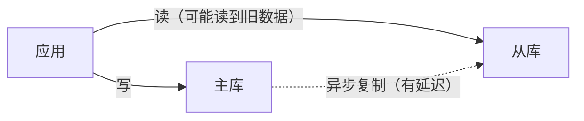

## 速查卡

- **防重复支付**：幂等三层防线——前端防抖 + 后端幂等（token/唯一索引/分布式锁）+ 订单状态机
- **读写分离立即读**：主从延迟导致读旧数据，方案：关键操作强制读主、写后同步更新缓存、半同步复制
- **停车场设计**：面向对象，类抽象（停车场/车位/车辆/票据）+ 策略模式计费
- **假币称重**：二分/三分，n 次天平最多区分 3ⁿ 个硬币（8 枚只需 2 次）
- **老虎吃羊**：博弈论归纳，老虎数为**奇数**会吃、**偶数**不吃（100 只是偶数 → 羊安全）
- **概率博弈**：赛点类问题用「动态规划/递归 + 边界条件」求解，不要硬枚举

---

## 一、防重复支付

### 问题

用户在网络延迟下**连续点击两次支付按钮**，产生两笔扣款。本质是**幂等**问题——同一个操作重复执行，结果必须一致。

### 三层防线

| 层 | 手段 | 作用 |
|----|------|------|
| **前端** | 点击后立即禁用按钮 + loading | 拦截大部分误触 |
| **后端幂等** | token / 唯一索引 / 分布式锁 | 兜底，保证即使重复请求也只会成功一次 |
| **状态机** | 订单状态只允许单向流转 | 已支付的订单不再处理 |

### 后端幂等的三种实现

**方案一：幂等 token（推荐）**

下单时生成唯一 token 返回前端，支付请求携带 token，服务端校验 token 是否已用：

```java
// ① 生成 token 并存入 Redis：SET pay:token:{orderId} 1 EX 300
// ② 支付时先「占用」token（原子删除，删成功才继续）
boolean used = redis.del("pay:token:" + orderId) > 0;
if (!used) return "请勿重复提交";
// ③ 执行扣款
```

`del` 的原子性保证「只有第一次请求能删成功」，后续请求都失败。

**方案二：数据库唯一索引**

给订单表加「订单号 + 支付状态」唯一约束，或建一张「支付流水表」，`pay_no` 唯一索引。重复支付时第二次 `INSERT` 触发唯一键冲突，捕获后返回「已支付」。

**方案三：分布式锁**

用 Redis `SET NX` 对 `orderId` 加锁，业务完成后释放。与 token 思路类似，但锁有时间窗口，需注意锁过期后重复支付的风险。

### 状态机兜底

订单状态：`待支付 → 支付中 → 已支付 / 已关闭`。用 CAS 更新（`UPDATE ... WHERE status = '待支付'`），保证只有「待支付」订单能进入「支付中」，天然拦截重复。

> 面试关键：**幂等 key 的选择**。token 用「订单号」而非「用户 ID」，否则同一用户的两次不同订单会被误判为重复。

---

## 二、读写分离如何立即读到新写入

### 问题

主从架构下，写主库后立刻读从库，可能因**主从同步延迟**读到旧数据。



### 三种方案

| 方案 | 做法 | 优缺点 |
|------|------|--------|
| **强制读主** | 写操作后的关键读、或整个事务读主 | 简单可靠，但主库读压力增大 |
| **缓存补偿** | 写入时同步更新 Redis，读先走缓存 | 命中率高，需处理缓存一致性问题 |
| **半同步复制** | 主库等至少一个从库确认后才返回 | 降低延迟但不消除，且有性能损耗 |

### 工程实践

- **「写后读」场景读主**：支付、下单等「刚写入就要读回」的操作，直接读主库
- **非关键读走从库**：列表、详情等容忍短暂不一致的读走从库
- **路由规则**：用「是否在写事务内」或「距上次写入 < N 秒」判断读主还是读从

> 关键认知：**读写分离的本质是「牺牲一致性换吞吐」**。「立即读到新写入」和「读从库」天然矛盾，只能二选一或按场景路由，不存在零延迟的完美方案。

---

## 三、停车场计费系统设计

### 面向对象设计

```
┌─────────────┐       ┌──────────────┐
│ ParkingLot  │ 1..*  │ ParkingSpot  │
│  停车场      │──────▶│  车位         │
└─────────────┘       │ 类型: 小车/大车 │
                      └──────┬───────┘
                             │ 1
                      ┌──────▼───────┐
                      │   Ticket     │
                      │ 入场时间/车位  │
                      └──────┬───────┘
                             │ 1
                      ┌──────▼───────┐
                      │  Payment     │
                      │ 费用/时长     │
                      └──────────────┘
```

### 类与职责

| 类 | 职责 |
|----|------|
| `ParkingLot` | 管理所有车位，分配/释放车位 |
| `ParkingSpot` | 车位，类型枚举（`SMALL`/`LARGE`/`EV`），占用状态 |
| `Vehicle` | 车辆，车牌、车型 |
| `Ticket` | 入场票据，记录入场时间、车位 |
| `PricingStrategy` | 计费策略接口（策略模式），不同车型不同费率 |

### 计费用策略模式

```java
interface PricingStrategy {
    double calculate(Duration duration);
}

class SmallCarStrategy implements PricingStrategy {
    public double calculate(Duration d) { return d.toHours() * 5; }   // 小车 5 元/小时
}

class LargeCarStrategy implements PricingStrategy {
    public double calculate(Duration d) { return d.toHours() * 10; }  // 大车 10 元/小时
}
```

不同车型、不同计费规则（按时/按次/会员折扣）都可以通过新增策略实现，符合**开闭原则**。

### 面试要点

1. 用**枚举**表示车位类型，而非魔法数字
2. 用**策略模式**隔离计费规则，方便扩展（如会员折扣、节假日费率）
3. 车位分配要考虑**并发**（同一车位不能同时分配给两辆车），可用 `synchronized` 或原子操作
4. 状态流转：车位 `空闲 → 占用 → 空闲`

---

## 四、智力题

### 假币称重

**题目**：8 枚硬币中有一枚较轻的假币，用天平最少几次找出？

**答案**：2 次。

**思路**：第一次分成 `3 / 3 / 2`。

| 第一次称 3 vs 3 | 结果 | 第二次 |
|----------------|------|--------|
| 平衡 | 假币在剩下的 2 枚中 | 称这 2 枚，轻的是假 |
| 不平衡 | 假币在轻的一侧 3 枚中 | 取其中 2 枚称，平则剩的是假，不平则轻的是假 |

**通用公式**：n 次天平最多能区分 **3ⁿ** 个硬币（每枚有「左/右/不称」3 种状态）。8 ≤ 3² = 9，所以 2 次足够。

### 老虎吃羊

**题目**：100 只老虎和 1 只羊。老虎吃羊后自己会变成羊，所有老虎都想吃羊，但若吃完会被其他老虎吃掉就不敢吃。问羊会不会被吃？

**答案**：羊**安全**，不会被吃。

**思路（归纳）**：

| 老虎数 | 会不会吃 | 原因 |
|:---:|:---:|------|
| 1 | 会吃 | 吃完变羊，没有其他老虎，安全 |
| 2 | 不吃 | 吃了变羊，剩 1 虎 1 羊，那只会吃它 |
| 3 | 会吃 | 吃了变羊，剩 2 虎 1 羊（2 虎情况不会吃）→ 安全 |
| 4 | 不吃 | 吃了变羊，剩 3 虎（会吃）→ 被吃 |

**规律**：老虎数为**奇数**会吃，**偶数**不吃。100 是偶数 → 不吃，羊安全。

**本质**：递归博弈，倒推——每只老虎都假设「我吃完后的局面下，下一只老虎会怎么做」，用归纳法从 1 只往上推。

### 概率博弈（赛点类）

**题目**：比赛采用「A 先赢 2 局则 A 胜，B 先赢 3 局则 B 胜」，每局独立，A 胜率为 p，求 A 最终获胜概率。

**思路**：这类「谁先到目标局数谁赢」的问题，用**递归 + 记忆化**而非硬枚举：

```
P(a, b) = A 还需赢 a 局、B 还需赢 b 局时，A 获胜的概率
P(a, b) = p · P(a-1, b) + (1-p) · P(a, b-1)

边界：
  P(0, b) = 1   （A 已赢够，无论 b 如何 A 胜，b > 0）
  P(a, 0) = 0   （B 已赢够，A 败，a > 0）
```

当 `p = 1/2`、`a = 2`、`b = 3` 时，代入递推得 **P(2,3) = 11/16 ≈ 0.6875**。

**为什么不用枚举**：局面数随局数指数增长，但很多局面重复。递归 + 记忆化（或倒推 DP）把每个 `(a,b)` 只算一次，时间复杂度 O(ab)。

---

## 自测

1. **防重复支付的核心是什么？幂等 token 为什么能防重复？**
   <br/>→ 核心是幂等。token 方案用 `DEL` 的原子性：第一次请求删除成功继续扣款，后续请求删除返回 0 直接拦截。幂等 key 用「订单号」而非「用户 ID」，避免误判同一用户的不同订单。

2. **读写分离下「立即读到新写入」为什么难？有哪些方案？**
   <br/>→ 主从是异步复制，从库读取天然有延迟。方案：关键操作/写事务内强制读主；写后同步更新 Redis 缓存；半同步复制降低延迟。本质是「一致性」与「吞吐」的取舍，没有零延迟的完美方案。

3. **停车场计费为什么用策略模式？车位类型用什么表示？**
   <br/>→ 计费规则（不同车型费率、会员折扣、节假日）会频繁变化，策略模式隔离规则、符合开闭原则。车位类型用枚举而非魔法数字，可读且类型安全。车位分配需考虑并发（同一车位不能同时分给两辆车）。

4. **8 枚硬币 1 枚较轻假币，为什么 2 次能找出？n 次最多区分几枚？**
   <br/>→ 第一次分 3/3/2：平衡则假币在 2 枚中，第二次称出；不平衡则轻侧 3 枚中取 2 称，平则剩者为假。每次天平有 3 种结果（左重/右重/平），n 次最多区分 3ⁿ 个，8 ≤ 9 所以 2 次够。

5. **100 只老虎 1 只羊，老虎会不会吃羊？为什么？**
   <br/>→ 不会。归纳法：1 只会吃、2 只不吃、3 只会吃、4 只不吃……老虎数为奇数会吃、偶数不吃。100 是偶数，吃了会变成「99 只老虎」的局面（会被吃），所以不敢吃，羊安全。

6. **「A 先赢 2 局、B 先赢 3 局」这类概率题怎么算？**
   <br/>→ 用递归：P(a,b) = p·P(a-1,b) + (1-p)·P(a,b-1)，边界 P(0,b)=1、P(a,0)=0，记忆化避免重复计算。比硬枚举局面更清晰，复杂度 O(ab)。
