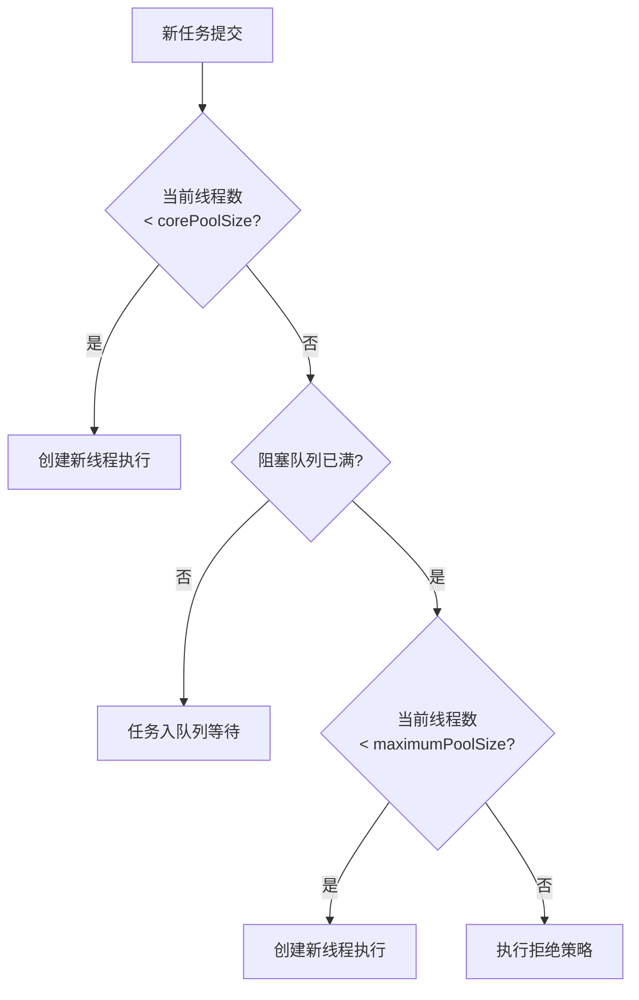

## 速查卡

- **线程池**：corePoolSize → 队列 → maxPoolSize → 拒绝策略。CPU 密集型设 N，IO 密集型设 2N
- **AQS**：CLH 虚拟双向队列 + volatile state + CAS，模版方法模式，子类重写 tryAcquire/tryRelease
- **synchronized 锁升级**：无锁 → 偏向锁（避免 CAS）→ 轻量级锁（CAS+自旋）→ 重量级锁（阻塞）。JDK21 移除偏向锁
- **synchronized vs ReentrantLock**：前者自动释放、JVM 内置；后者灵活（公平锁/超时/中断/多条件队列）、AQS 实现
- **虚拟线程**（Java 21）：轻量级（~KB），阻塞时自动释放平台线程，无需池化
- **CompletableFuture**：异步编排，thenApply/thenAccept/exceptionally
- **StampedLock**：乐观读 + 悲观读/写，比 ReadWriteLock 更高效

---

## 一、Java 线程池

### ThreadPoolExecutor 核心参数

| 参数 | 说明 |
|------|------|
| `corePoolSize` | 核心线程数 |
| `maximumPoolSize` | 最大线程数 |
| `keepAliveTime` | 线程空闲存活时间 |
| `RejectedExecutionHandler` | 队列已满、线程数达最大时的拒绝策略 |

### corePoolSize 优化设置

定义：
- `N` = CPU 数量
- `U` = 目标 CPU 使用率（0 ≤ U ≤ 1）
- `W/C` = 等待时间与计算时间的比率

最优池大小公式：`corePoolSize = N × U × (1 + W/C)`

- **计算密集型**：`corePoolSize = N`
- **IO 密集型**：保守估计 `corePoolSize = 2N`

### 新建 task 时的处理逻辑



### 淘汰策略

| 策略 | 行为 |
|------|------|
| `AbortPolicy`（默认） | 抛出异常 |
| `CallerRunsPolicy` | 用调用者线程执行 |
| `DiscardPolicy` | 直接忽略 |
| `DiscardOldestPolicy` | 丢弃队列中最老的任务，尝试执行新任务 |

### pool.execute() 执行步骤

源码注释描述：如果运行的线程 < corePoolSize，尝试使用给定 task 启动新线程；如果任务可以成功排队，重新检查状态；如果无法排队，尝试添加新线程，失败则拒绝任务。

### Worker 线程集合

Worker 继承 AQS，实现简单的不可重入互斥锁（而非 ReentrantLock），防止工作线程在执行池控制方法时重新获得锁。

---

## 二、AQS（AbstractQueuedSynchronizer）

### 核心思想

将每条请求共享资源的线程封装成 CLH 队列的一个结点（Node），实现锁的分配：

> 基于 CLH 虚拟 FIFO 双向队列，用 `volatile` 修饰共享变量 `state`，线程通过 **CAS** 机制修改状态标识。成功则获取锁，失败则进入等待队列。提供原子式管理同步状态、阻塞和唤醒线程功能。

### 特性要点

- 子类通过 `getState()`、`setState()`、`compareAndSetState()` 操作同步状态
- 支持**独占模式**和**共享模式**（如 ReadWriteLock）
- 设计采用**模版方法模式**

### 需重写的方法

| 方法 | 说明 |
|------|------|
| `tryAcquire()` | 尝试获取锁（独占） |
| `tryRelease()` | 尝试释放锁（独占） |
| `tryAcquireShared()` | 尝试获取锁（共享），返回负数=失败 |
| `tryReleaseShared()` | 尝试释放锁（共享） |
| `isHeldExclusively()` | 该线程是否正在独占资源 |

**ReentrantLock 示例**：state 初始为 0，lock() 调用 tryAcquire() 将 state+1，其他线程 tryAcquire 失败；unlock() 将 state 减到 0 后其他线程方可获取。重复获取即 state 累加 = 可重入。

---

## 三、synchronized

### 实现原理

基于**监视器(Monitor)模式**。Java 中每个对象关联一个 monitor，monitor 中 `Owner` 字段标识拥有锁的线程。

线程执行 synchronized 的过程：
1. monitor 进入数为 0 → 线程进入，进入数设为 1
2. 线程已占有 monitor → 进入数 +1（可重入）
3. 其他线程已占用 → 阻塞等待

### 锁升级机制（JDK6+）


| 锁状态 | 存储内容 | 标志位 |
|--------|----------|--------|
| 无锁 | hashCode、分代年龄 | 01 |
| 偏向锁 | 偏向线程ID、时间戳 | 01 |
| 轻量级锁 | 指向栈中锁记录的指针 | 00 |
| 重量级锁 | 指向互斥量的指针 | 10 |

**偏向锁**：无竞争时 Mark Word 存储偏向线程 ID，进入/退出同步块只需检测 ThreadID，无需 CAS。

**轻量级锁**：偏向锁被其他线程访问时升级，等待线程自旋尝试获取。自旋超时或第三个线程介入时升级为重量级锁。

**重量级锁**：除拥有锁外的所有线程阻塞。概括：偏向锁避免 CAS，轻量级锁用 CAS+自旋避免阻塞，重量级锁阻塞所有竞争线程。

---

## 四、synchronized vs ReentrantLock

| 维度 | synchronized | ReentrantLock |
|------|-------------|---------------|
| 灵活性 | 不灵活 | 支持响应中断、超时、尝试获取 |
| 锁类型 | 非公平锁 | 支持公平锁和非公平锁 |
| 条件队列 | 一个 | 可关联多个 |
| 实现机制 | 监视器模式 | 依赖 AQS |
| 可重入性 | 可重入 | 可重入 |
| 释放形式 | 自动释放 | 必须显式 unlock() |

### 使用选择

- 需要**公平锁、轮询锁、超时锁、中断锁** → `ReentrantLock`
- 简单场景 → 优先 `synchronized`（JDK6+ 优化后性能接近）
- 高并发、资源竞争激烈 → `ReentrantLock`
- 读多写少 → `ReentrantReadWriteLock` 或 `StampedLock`（JDK8+，性能更好）

> **注意**：偏向锁在 JDK 15 默认禁用，JDK 21 中已被移除。现代 JVM 中锁升级路径简化为：无锁 → 轻量级锁 → 重量级锁。

---

## 五、现代并发编程

### 虚拟线程（Virtual Threads / Java 21+）

JEP 444 引入虚拟线程（Project Loom），是 JVM 管理的轻量级线程：

- 一个虚拟线程占用的资源远少于平台线程（~几 KB vs ~1 MB）
- 阻塞时自动释放底层平台线程，适合**IO 密集型**任务
- 无需池化，可以创建数百万个虚拟线程

```java
// 使用虚拟线程执行器
try (var executor = Executors.newVirtualThreadPerTaskExecutor()) {
    executor.submit(() -> { /* 阻塞 IO 操作 */ });
}

// 直接创建虚拟线程
Thread.ofVirtual().start(() -> { /* ... */ });
```

> 对于大量并发 IO 任务的场景，虚拟线程可以大幅简化代码，减少对线程池和 CompletableFuture 的依赖。

### CompletableFuture（JDK8+）

用于异步编程和任务编排：

```java
CompletableFuture.supplyAsync(() -> fetchData())
    .thenApply(data -> transform(data))
    .thenAccept(result -> save(result))
    .exceptionally(ex -> { log(ex); return fallback; });
```

### StampedLock（JDK8+）

比 `ReentrantReadWriteLock` 更高效的读写锁，支持乐观读：

```java
StampedLock lock = new StampedLock();
long stamp = lock.tryOptimisticRead();
// 乐观读过程中检查是否被写锁修改
if (!lock.validate(stamp)) {
    stamp = lock.readLock(); // 升级为悲观读
    try { /* ... */ } finally { lock.unlockRead(stamp); }
}
```

---

## 自测

1. **线程池提交任务后，如果当前线程数 = corePoolSize、队列未满，任务会走哪条路径？**
   <br/>→ 入队列等待，不会创建新线程。只有队列满了才会创建线程直到 maxPoolSize。

2. **AQS 中 state 变量为什么用 volatile 修饰？CAS 操作 state 时，线程阻塞和唤醒依赖什么机制？**
   <br/>→ volatile 保证多线程间的可见性。阻塞和唤醒依赖 `LockSupport.park()` / `unpark()`，底层基于 `Unsafe` 类。

3. **synchronized 偏向锁在 JDK 21 中被移除的原因是什么？**
   <br/>→ 现代应用大多是多线程高并发场景，偏向锁的撤销成本（Stop-The-World）反而高于收益，JEP 374/450 逐步废弃并移除。

4. **ReentrantLock 相比 synchronized，哪个场景必须用 ReentrantLock？**
   <br/>→ 需要公平锁、可中断获取锁（`lockInterruptibly()`）、超时获取锁（`tryLock(timeout)`）、多个条件队列（`newCondition()`）时。

5. **虚拟线程适合什么场景？为什么不建议在虚拟线程中使用 synchronized 块或 `Thread.sleep()` 长时间阻塞？**
   <br/>→ 适合 IO 密集型高并发场景。synchronized 会 pin 住底层平台线程（虚拟线程无法 unmount），`Thread.sleep()` 在虚拟线程中会被自动处理（非阻塞），真正需要避免的是长时间持有 monitor 锁。
