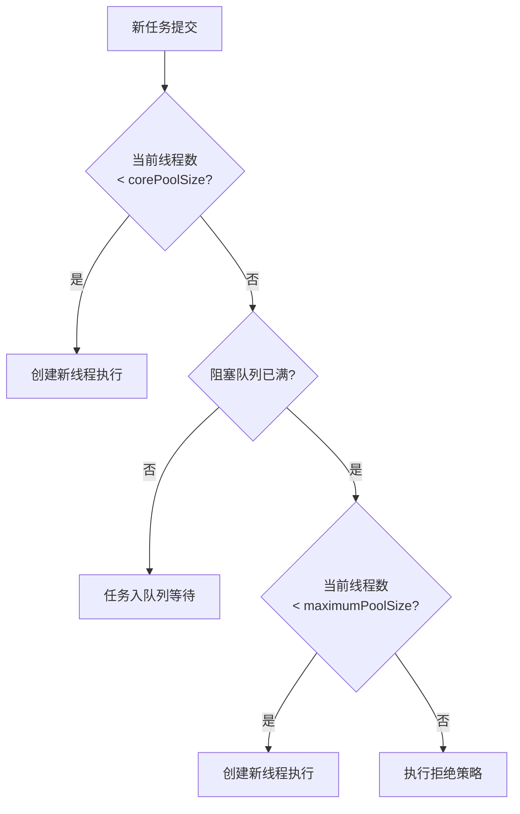
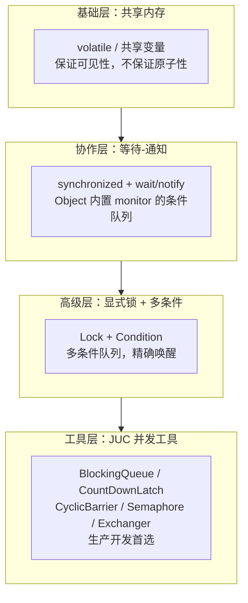
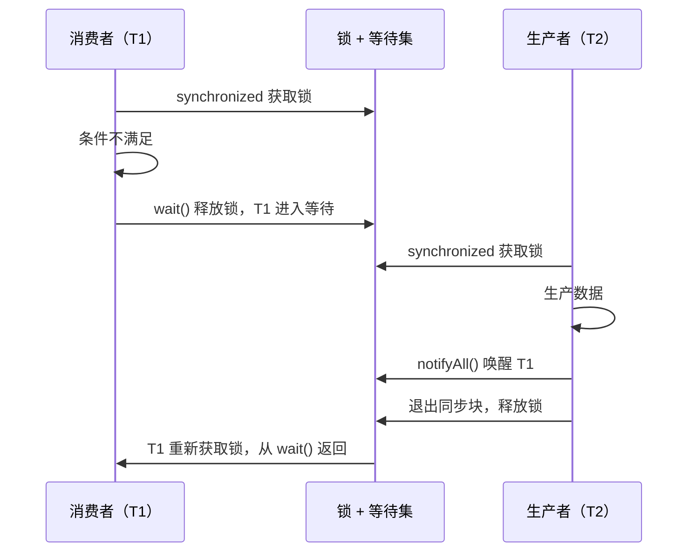
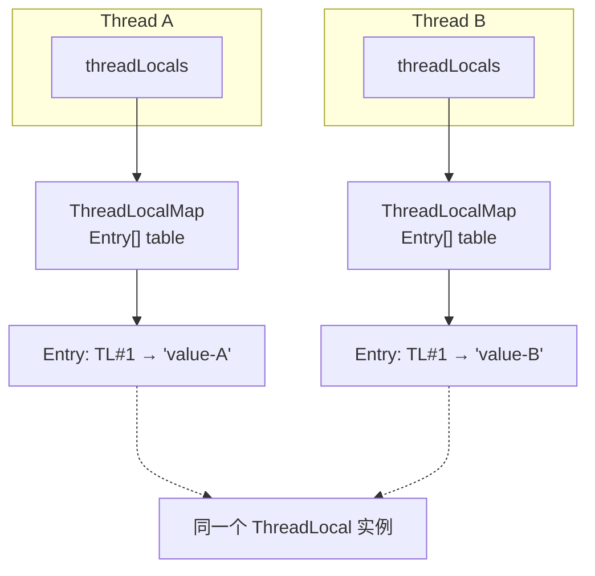

## 速查卡

- **线程池**：corePoolSize → 队列 → maxPoolSize → 拒绝策略。CPU 密集型设 N，IO 密集型设 2N
- **AQS**：CLH 虚拟双向队列 + volatile state + CAS，模版方法模式，子类重写 tryAcquire/tryRelease
- **synchronized 锁升级**：无锁 → 偏向锁（避免 CAS）→ 轻量级锁（CAS+自旋）→ 重量级锁（阻塞）。JDK21 移除偏向锁
- **锁优化**：锁消除（逃逸分析去锁）、锁粗化（合并相邻锁）、自适应自旋（动态调自旋次数）、偏向延迟（启动阶段延迟偏向）
- **synchronized vs ReentrantLock**：前者自动释放、JVM 内置；后者灵活（公平锁/超时/中断/多条件队列）、AQS 实现
- **虚拟线程**（Java 21）：轻量级（~KB），阻塞时自动释放平台线程，无需池化
- **CompletableFuture**：异步编排，thenApply/thenAccept/exceptionally
- **StampedLock**：乐观读 + 悲观读/写，比 ReadWriteLock 更高效
- **线程通信**：volatile（标志位）→ wait/notify（等待通知）→ Lock+Condition（多条件精确唤醒）→ BlockingQueue/CountDownLatch/CyclicBarrier（高层工具）
- **ThreadLocal**：数据存在 Thread 内部的 ThreadLocalMap，ThreadLocal 做 key（弱引用），开放地址法解决冲突，不调 remove() 即泄漏

---

## 一、Java 线程池

### ThreadPoolExecutor 核心参数

| 参数 | 说明 |
|------|------|
| `corePoolSize` | 核心线程数 |
| `maximumPoolSize` | 最大线程数 |
| `keepAliveTime` | 线程空闲存活时间 |
| `RejectedExecutionHandler` | 队列已满、线程数达最大时的拒绝策略 |

### corePoolSize 优化设置

定义：
- `N` = CPU 数量
- `U` = 目标 CPU 使用率（0 ≤ U ≤ 1）
- `W/C` = 等待时间与计算时间的比率

最优池大小公式：`corePoolSize = N × U × (1 + W/C)`

- **计算密集型**：`corePoolSize = N`
- **IO 密集型**：保守估计 `corePoolSize = 2N`

### 新建 task 时的处理逻辑


```mermaid
flowchart TB
    Task["新任务提交"] --> Check1{"当前线程数<br/>< corePoolSize?"}
    Check1 -->|"是"| NewThread["创建新线程执行"]
    Check1 -->|"否"| Check2{"阻塞队列已满?"}
    Check2 -->|"否"| Enqueue["任务入队列等待"]
    Check2 -->|"是"| Check3{"当前线程数<br/>< maximumPoolSize?"}
    Check3 -->|"是"| NewThread2["创建新线程执行"]
    Check3 -->|"否"| Reject["执行拒绝策略"]
```

### 淘汰策略

| 策略 | 行为 |
|------|------|
| `AbortPolicy`（默认） | 抛出异常 |
| `CallerRunsPolicy` | 用调用者线程执行 |
| `DiscardPolicy` | 直接忽略 |
| `DiscardOldestPolicy` | 丢弃队列中最老的任务，尝试执行新任务 |

### pool.execute() 执行步骤

源码注释描述：如果运行的线程 < corePoolSize，尝试使用给定 task 启动新线程；如果任务可以成功排队，重新检查状态；如果无法排队，尝试添加新线程，失败则拒绝任务。

### Worker 线程集合

Worker 继承 AQS，实现简单的不可重入互斥锁（而非 ReentrantLock），防止工作线程在执行池控制方法时重新获得锁。

---

## 二、AQS（AbstractQueuedSynchronizer）

### 核心思想

将每条请求共享资源的线程封装成 CLH 队列的一个结点（Node），实现锁的分配：

> 基于 CLH 虚拟 FIFO 双向队列，用 `volatile` 修饰共享变量 `state`，线程通过 **CAS** 机制修改状态标识。成功则获取锁，失败则进入等待队列。提供原子式管理同步状态、阻塞和唤醒线程功能。

### 特性要点

- 子类通过 `getState()`、`setState()`、`compareAndSetState()` 操作同步状态
- 支持**独占模式**和**共享模式**（如 ReadWriteLock）
- 设计采用**模版方法模式**

### 需重写的方法

| 方法 | 说明 |
|------|------|
| `tryAcquire()` | 尝试获取锁（独占） |
| `tryRelease()` | 尝试释放锁（独占） |
| `tryAcquireShared()` | 尝试获取锁（共享），返回负数=失败 |
| `tryReleaseShared()` | 尝试释放锁（共享） |
| `isHeldExclusively()` | 该线程是否正在独占资源 |

**ReentrantLock 示例**：state 初始为 0，lock() 调用 tryAcquire() 将 state+1，其他线程 tryAcquire 失败；unlock() 将 state 减到 0 后其他线程方可获取。重复获取即 state 累加 = 可重入。

---

## 三、synchronized

### 实现原理

基于**监视器(Monitor)模式**。Java 中每个对象关联一个 monitor，monitor 中 `Owner` 字段标识拥有锁的线程。

线程执行 synchronized 的过程：
1. monitor 进入数为 0 → 线程进入，进入数设为 1
2. 线程已占有 monitor → 进入数 +1（可重入）
3. 其他线程已占用 → 阻塞等待

### 锁升级机制（JDK6+）


```mermaid
flowchart LR
    NoLock["无锁<br/>标志位 01"] -->|"线程 A 获取锁"| Biased["偏向锁<br/>标志位 01<br/>Mark Word 存线程 ID"]

    Biased -->|"线程 B 竞争"| Light["轻量级锁<br/>标志位 00<br/>CAS + 自旋"]

    Light -->|"自旋超时 / 第 3 个线程介入"| Heavy["重量级锁<br/>标志位 10<br/>阻塞所有竞争线程"]

    style NoLock fill:#e8f5e9
    style Biased fill:#fff9c4
    style Light fill:#ffe0b2
    style Heavy fill:#ffcdd2
```

| 锁状态 | 存储内容 | 标志位 |
|--------|----------|--------|
| 无锁 | hashCode、分代年龄 | 01 |
| 偏向锁 | 偏向线程ID、时间戳 | 01 |
| 轻量级锁 | 指向栈中锁记录的指针 | 00 |
| 重量级锁 | 指向互斥量的指针 | 10 |

**偏向锁**：无竞争时 Mark Word 存储偏向线程 ID，进入/退出同步块只需检测 ThreadID，无需 CAS。

**轻量级锁**：偏向锁被其他线程访问时升级，等待线程自旋尝试获取。自旋超时或第三个线程介入时升级为重量级锁。

**重量级锁**：除拥有锁外的所有线程阻塞。概括：偏向锁避免 CAS，轻量级锁用 CAS+自旋避免阻塞，重量级锁阻塞所有竞争线程。

### 锁优化手段（JVM 层面）

锁升级是「状态迁移」，锁优化是 JIT/JVM 对锁的「主动优化」，两者常被混淆：

| 优化 | 原理 | 触发条件 |
|------|------|----------|
| **锁消除** | 逃逸分析发现锁对象不被其他线程访问，直接去掉同步 | 局部对象上的 synchronized（如 `StringBuffer` 局部变量） |
| **锁粗化** | 连续对同一锁加锁/解锁，合并为一次大锁，减少加锁次数 | 循环体内反复加锁 |
| **自适应自旋** | 自旋次数不再固定，根据上次自旋是否成功动态调整 | 轻量级锁竞争时 |
| **偏向延迟** | 启动阶段（默认 4s）延迟启用偏向锁 | JVM 启动初期竞争激烈，偏向反成开销 |

```java
// 锁消除：sb 是局部对象，逃逸分析判定不会逃逸 → 去掉锁
void append() {
    StringBuffer sb = new StringBuffer();  // append 方法带 synchronized
    sb.append("a").append("b");           // JIT 可能消除这些锁
}

// 锁粗化：循环内连续加锁 → 合并为一次锁住整个循环
for (int i = 0; i < 100; i++) {
    synchronized (lock) { count++; }   // 100 次加锁
}
// 优化后：
synchronized (lock) { for (int i = 0; i < 100; i++) count++; }
```

> **面试区分**：锁升级回答「无锁→偏向→轻量→重量」的状态流转；锁优化回答「JVM 怎么让锁更省」——消除、粗化、自适应自旋、偏向延迟。

---

## 四、synchronized vs ReentrantLock

| 维度 | synchronized | ReentrantLock |
|------|-------------|---------------|
| 灵活性 | 不灵活 | 支持响应中断、超时、尝试获取 |
| 锁类型 | 非公平锁 | 支持公平锁和非公平锁 |
| 条件队列 | 一个 | 可关联多个 |
| 实现机制 | 监视器模式 | 依赖 AQS |
| 可重入性 | 可重入 | 可重入 |
| 释放形式 | 自动释放 | 必须显式 unlock() |

### 使用选择

- 需要**公平锁、轮询锁、超时锁、中断锁** → `ReentrantLock`
- 简单场景 → 优先 `synchronized`（JDK6+ 优化后性能接近）
- 高并发、资源竞争激烈 → `ReentrantLock`
- 读多写少 → `ReentrantReadWriteLock` 或 `StampedLock`（JDK8+，性能更好）

> **注意**：偏向锁在 JDK 15 默认禁用，JDK 21 中已被移除。现代 JVM 中锁升级路径简化为：无锁 → 轻量级锁 → 重量级锁。

---

## 五、线程间通信

### 通信方式总览

线程通信的核心是：一个线程如何感知另一个线程的状态变化、如何传递数据。Java 按抽象层级提供了多层机制：


```mermaid
flowchart TB
    subgraph Layer1["基础层：共享内存"]
        SM["volatile / 共享变量<br/>保证可见性，不保证原子性"]
    end
    subgraph Layer2["协作层：等待-通知"]
        WN["synchronized + wait/notify<br/>Object 内置 monitor 的条件队列"]
    end
    subgraph Layer3["高级层：显式锁 + 多条件"]
        LC["Lock + Condition<br/>多条件队列，精确唤醒"]
    end
    subgraph Layer4["工具层：JUC 并发工具"]
        JUC["BlockingQueue / CountDownLatch<br/>CyclicBarrier / Semaphore / Exchanger<br/>生产开发首选"]
    end
    Layer1 --> Layer2 --> Layer3 --> Layer4
```

### volatile — 标志位通信

最轻量的通信机制，只保证可见性和禁止重排序，**不保证原子性**：

```java
volatile boolean ready = false;

// 线程 A
void writer() { ready = true; }  // 写入立即刷新到主内存

// 线程 B
void reader() {
    while (!ready) {}   // 每次读取从主内存拉取
    System.out.println("done");
}
```

适用：状态标志位、单写多读的配置值。`i++` 这类复合操作仍需锁保护。

### wait() / notify() / notifyAll()

基于内置锁的等待-通知机制，Java 最经典的通信方式：

```java
class MessageQueue {
    private String message;
    private boolean empty = true;

    public synchronized String take() {
        while (empty) {              // while 而非 if，防虚假唤醒
            wait();                   // 释放锁，进入等待队列
        }
        empty = true;
        notifyAll();                  // 唤醒等待的生产者
        return message;
    }

    public synchronized void put(String msg) {
        while (!empty) { wait(); }
        message = msg;
        empty = false;
        notifyAll();                  // 唤醒等待的消费者
    }
}
```


```mermaid
sequenceDiagram
    participant Consumer as 消费者（T1）
    participant Monitor as 锁 + 等待集
    participant Producer as 生产者（T2）

    Consumer->>Monitor: synchronized 获取锁
    Consumer->>Consumer: 条件不满足
    Consumer->>Monitor: wait() 释放锁，T1 进入等待
    Producer->>Monitor: synchronized 获取锁
    Producer->>Producer: 生产数据
    Producer->>Monitor: notifyAll() 唤醒 T1
    Producer->>Monitor: 退出同步块，释放锁
    Monitor->>Consumer: T1 重新获取锁，从 wait() 返回
```

### wait set 不分角色 — 为什么必须 `notifyAll()` + `while`

一个常被忽略的细节：Java 对象锁的 **wait set 不区分"生产者"和"消费者"**。

```
MessageQueue 对象 this（唯一的一把锁）
├── monitor 锁
└── wait set = { T1(生产者), T2(消费者), T3(消费者), T4(生产者), ... }
```

`put()` 和 `take()` 中的 `wait()` 都将当前线程放入**同一个 this.wait set**——JVM 不做角色标记，只管"这个线程在等这个对象"。

**`notifyAll()` 执行后发生了什么？**

```
notifyAll() 被调用
  │
  ├─ 将 this.wait set 中所有线程一次性移出
  │    T1(生产者) / T2(消费者) / T3(消费者) / T4(生产者) 全部被唤醒
  │
  ├─ 它们进入 entry set 竞争 synchronized 锁
  │
  └─ 每个线程从 wait() 返回后，立即重新检查自己的 while 条件：
       T2: while (empty)    → empty==false → 跳出循环，消费消息 ✅
       T3: while (empty)    → empty==true  → 再次 wait() ⏸️
       T1: while (!empty)   → empty==true  → 跳出循环，生产消息 ✅
       T4: while (!empty)   → empty==false → 再次 wait() ⏸️
```

**为什么只用 `notify()` + `if` 会死锁？**

假设 wait set 中只有 2 个生产者，没有消费者：

```
当前状态: empty = false（消息待消费，消费者应该被唤醒）
wait set = { Producer-X, Producer-Y }

take() 调用 notify() → 随机唤醒 Producer-X
  → if (empty) { wait(); }   // if 只检查一次！
  → empty 仍为 false，Producer-X 不会 wait
  → 没有消费者被唤醒，消息永远不会被消费
  → 所有线程最终都进入 wait 状态 → 死锁 ❌
```

这就是两条经典规则的由来：

- **`notifyAll()` 而非 `notify()`**：因为 JVM 不知道 wait set 里谁是生产者谁是消费者，`notify()` 可能唤醒"错误角色"。`notifyAll()` 叫醒所有人，由 `while` 条件筛选。
- **`while` 而非 `if`**：`if` 只检查一次条件，被虚假唤醒或错误唤醒后直接往下走。`while` 每次从 `wait()` 返回都重新检查——条件不满足的线程自动 `wait()` 回去。**while 循环充当了"角色过滤器"**。

> 《Effective Java》第 81 条：永远优先用 `notifyAll()` 而非 `notify()`，除非你能保证条件谓词（condition predicate）只对应一种等待者线程——在实际代码中这种保证几乎不可能。

**关键规则**：

| 规则 | 说明 |
|------|------|
| 必须在 `synchronized` 内调用 | 否则抛 `IllegalMonitorStateException` |
| **用 `while` 而非 `if`** | 防止虚假唤醒（spurious wakeup） |
| `wait()` 释放锁 | `sleep()` 不释放锁，这是关键区别 |
| `notify()` 不立即释放锁 | 退出同步块后才释放 |
| `notify()` 随机唤醒一个 | `notifyAll()` 唤醒全部等待线程 |

### Lock + Condition — 多条件精确唤醒

`synchronized + wait/notify` 的升级版，支持**多条件队列**，精确唤醒目标线程：

```java
class BoundedBuffer {
    final Lock lock = new ReentrantLock();
    final Condition notFull  = lock.newCondition();   // 生产者等待队列
    final Condition notEmpty = lock.newCondition();   // 消费者等待队列
    final Object[] items = new Object[100];
    int putIdx, takeIdx, count;

    public void put(Object x) throws InterruptedException {
        lock.lock();
        try {
            while (count == items.length) notFull.await();
            items[putIdx] = x;
            if (++putIdx == items.length) putIdx = 0;
            ++count;
            notEmpty.signal();  // 精确唤醒一个消费者
        } finally { lock.unlock(); }
    }

    public Object take() throws InterruptedException {
        lock.lock();
        try {
            while (count == 0) notEmpty.await();
            Object x = items[takeIdx];
            if (++takeIdx == items.length) takeIdx = 0;
            --count;
            notFull.signal();   // 精确唤醒一个生产者
            return x;
        } finally { lock.unlock(); }
    }
}
```

| 对比 | synchronized + wait/notify | Lock + Condition |
|------|---------------------------|-----------------|
| 条件队列数 | 每个对象只有 1 个等待集 | 一个 Lock 可创建多个 Condition |
| 唤醒精度 | `notify()` 随机唤醒 | `signal()` 精确唤醒指定队列 |
| 中断 | 支持 | `await()` 响应中断；`awaitUninterruptibly()` 不响应 |
| 超时 | `wait(ms)` | `await(ms, TimeUnit)` |
| 适用场景 | 简单等待-通知 | 有界缓冲、复杂状态依赖 |

### JUC 工具类（生产开发首选）

底层均基于 **AQS** 实现，是实际开发中最常用的通信方式：

| 工具 | 核心方法 | 通信模式 | 适用场景 |
|------|----------|----------|----------|
| **BlockingQueue** | `put()` / `take()` | 生产者-消费者 | 线程池任务队列、消息队列 |
| **CountDownLatch** | `countDown()` / `await()` | 一等多：倒数门闩 | 主线程等待所有子任务完成（一次性） |
| **CyclicBarrier** | `await()` | 多等互：齐步走 | 多线程分阶段计算（可循环复用） |
| **Semaphore** | `acquire()` / `release()` | 信号量，限流 | 连接池、限流器 |
| **Exchanger** | `exchange(V x)` | 两线程交换数据 | 双向管道 |
| **Phaser** | `arrive()` / `awaitAdvance()` | 多阶段同步 | 比 CyclicBarrier 更灵活，支持动态参与方 |

#### 典型用法

```java
// CountDownLatch：主线程等待 3 个子任务
CountDownLatch latch = new CountDownLatch(3);
for (int i = 0; i < 3; i++)
    new Thread(() -> { doWork(); latch.countDown(); }).start();
latch.await();  // 阻塞直到计数归零

// CyclicBarrier：3 线程互相等待，分阶段同行
CyclicBarrier barrier = new CyclicBarrier(3, () -> log("全部就绪"));
for (int i = 0; i < 3; i++) {
    new Thread(() -> {
        doPhase1(); barrier.await();  // 等其他人完成 Phase1
        doPhase2(); barrier.await();  // 等其他人完成 Phase2，可复用！
    }).start();
}

// BlockingQueue：生产者-消费者，零手工同步
BlockingQueue<Task> queue = new LinkedBlockingQueue<>(100);
// 生产者：队列满则自动阻塞
queue.put(task);
// 消费者：队列空则自动阻塞
Task t = queue.take();
```

### 管道流（Piped Streams）

`PipedInputStream` / `PipedOutputStream` 可在两线程间传输原始字节。用法老旧，生产环境几乎不用。

### 决策速查

```
需要通信 → 什么模式？
├── 简单状态标志位 → volatile
├── 等待特定条件 → synchronized + wait/notify
├── 多条件精确唤醒 → Lock + Condition
├── 一对一传递数据 → BlockingQueue
├── 等待所有子任务完成 → CountDownLatch
├── 多线程分阶段同步 → CyclicBarrier / Phaser
├── 两线程交换数据 → Exchanger
└── 限流控制 → Semaphore
```

---

## 六、现代并发编程

### 虚拟线程（Virtual Threads / Java 21+）

JEP 444 引入虚拟线程（Project Loom），是 JVM 管理的轻量级线程：

- 一个虚拟线程占用的资源远少于平台线程（~几 KB vs ~1 MB）
- 阻塞时自动释放底层平台线程，适合**IO 密集型**任务
- 无需池化，可以创建数百万个虚拟线程

```java
// 使用虚拟线程执行器
try (var executor = Executors.newVirtualThreadPerTaskExecutor()) {
    executor.submit(() -> { /* 阻塞 IO 操作 */ });
}

// 直接创建虚拟线程
Thread.ofVirtual().start(() -> { /* ... */ });
```

> 对于大量并发 IO 任务的场景，虚拟线程可以大幅简化代码，减少对线程池和 CompletableFuture 的依赖。

### CompletableFuture（JDK8+）

用于异步编程和任务编排：

```java
CompletableFuture.supplyAsync(() -> fetchData())
    .thenApply(data -> transform(data))
    .thenAccept(result -> save(result))
    .exceptionally(ex -> { log(ex); return fallback; });
```

### StampedLock（JDK8+）

比 `ReentrantReadWriteLock` 更高效的读写锁，支持乐观读：

```java
StampedLock lock = new StampedLock();
long stamp = lock.tryOptimisticRead();
// 乐观读过程中检查是否被写锁修改
if (!lock.validate(stamp)) {
    stamp = lock.readLock(); // 升级为悲观读
    try { /* ... */ } finally { lock.unlockRead(stamp); }
}
```

---

## 七、ThreadLocal

### 核心思想

> ThreadLocal 本身不存数据。数据存在 **Thread 对象内部**的 `ThreadLocalMap` 里，ThreadLocal 实例只是用来做 key。


```mermaid
flowchart TB
    subgraph T1["Thread A"]
        TL1["threadLocals"]
    end
    subgraph T2["Thread B"]
        TL2["threadLocals"]
    end
    TL1 --> Map1["ThreadLocalMap<br/>Entry[] table"]
    TL2 --> Map2["ThreadLocalMap<br/>Entry[] table"]
    Map1 --> E1["Entry: TL#1 → 'value-A'"]
    Map2 --> E2["Entry: TL#1 → 'value-B'"]
    E1 -..-> TL["同一个 ThreadLocal 实例"]
    E2 -..-> TL
```

### 数据结构

**ThreadLocalMap 内部结构**：

```
ThreadLocalMap
┌──────────────────────────────────────────────┐
│ Entry[] table   初始容量 16，2 的幂           │
│ int size                                      │
│ int threshold   扩容阈值 = len * 2/3          │
│                                               │
│ Entry 继承 WeakReference<ThreadLocal<?>>      │
│ ┌───────────────────────────────────┐         │
│ │ referent → ThreadLocal（弱引用）   │         │
│ │ value    → 实际数据（强引用）       │         │
│ └───────────────────────────────────┘         │
└──────────────────────────────────────────────┘
```

Entry 的 key 是弱引用、value 是强引用。ThreadLocal 对象没有外部强引用时会被 GC，但 **value 不会被自动回收**——这就是内存泄漏的根源。

### 和 HashMap 的关键差异

| | HashMap | ThreadLocalMap |
|------|---------|----------------|
| 数据归属 | Map 对象自身 | **Thread 对象内部** |
| Key 类型 | 任意对象（强引用） | ThreadLocal（**弱引用**） |
| 冲突解决 | 链表 + 红黑树 | **开放地址法**（线性探测） |
| 扩容阈值 | 0.75 | **2/3** |
| 清理机制 | 无 | 惰性清理过期 Entry（key==null） |

### `tl.set("hello")` 源码执行流程

```java
// 入口：ThreadLocal.set()
public void set(T value) {
    Thread t = Thread.currentThread();       // ① 拿当前线程
    ThreadLocalMap map = getMap(t);          // ② = t.threadLocals
    if (map != null)
        map.set(this, value);                // ③ Map 已存在 → 插入
    else
        createMap(t, value);                 // ④ Map 不存在 → 创建
}

// ThreadLocalMap(ThreadLocal<?> firstKey, Object firstValue)
// 首次创建，直接放入第一个 Entry
ThreadLocalMap(ThreadLocal<?> firstKey, Object firstValue) {
    table = new Entry[INITIAL_CAPACITY];     // 初始容量 16
    int i = firstKey.threadLocalHashCode & 15;
    table[i] = new Entry(firstKey, firstValue);
    size = 1;
    setThreshold(INITIAL_CAPACITY);          // threshold = 16 * 2/3 = 10
}
```

**Map 已存在时 — `map.set(this, value)`** 的核心逻辑：

```java
private void set(ThreadLocal<?> key, Object value) {
    Entry[] tab = table;
    int i = key.threadLocalHashCode & (tab.length - 1);  // 计算起始槽位

    for (Entry e = tab[i]; e != null; e = tab[i = nextIndex(i, len)]) {
        ThreadLocal<?> k = e.get();
        if (k == key) { e.value = value; return; }        // 替换已有
        if (k == null) { replaceStaleEntry(key, value, i); return; }  // 复用过期槽位
    }

    tab[i] = new Entry(key, value);                       // 遇到空位，插入
    if (!cleanSomeSlots(i, ++size) && size >= threshold)  // 清理 + 必要时扩容
        rehash();
}
```

### 线性探测

ThreadLocalMap 用开放地址法，而非链表。冲突时向后线性查找：

```java
// hash → index，被占 → index+1 → 继续 +1，直到找到空位
int i = key.threadLocalHashCode & (table.length - 1);
while (table[i] != null) {
    if (table[i].get() == key) return table[i];
    i = (i + 1) % table.length;
}
```

**为什么不用链表？** ThreadLocalMap 的 key 随时可能被 GC 变成 null，链表中过期节点需要断链重排，比数组中直接替换复杂；加之中间件中 ThreadLocal 数量有限，数组效率更高。

### threadLocalHashCode 的生成规则

每创建一个 ThreadLocal 实例，hashCode 递增黄金分割数（斐波那契哈希）：

```java
private static AtomicInteger nextHashCode = new AtomicInteger();
private static final int HASH_INCREMENT = 0x61c88647;

private static int nextHashCode() {
    return nextHashCode.getAndAdd(HASH_INCREMENT);
}
```

`0x61c88647` 使得不同 ThreadLocal 在 2^n 数组中均匀散布，最大程度减少冲突。

### 过期 Entry 的惰性清理

ThreadLocalMap **不依赖后台线程**，而是在 get/set/remove 时顺带清理 key==null 的 Entry：

| 清理方法 | 触发时机 | 范围 |
|----------|----------|------|
| `expungeStaleEntry(int)` | get/set 遇到过期 Entry 时 | 从指定位置开始，连续段内全清 |
| `cleanSomeSlots(int, int)` | set 插入新 Entry 后 | `O(log n)` 次试探性扫描 |
| `expungeStaleEntries()` | rehash / resize | 全量清理 |

### 扩容流程

```
set 后 size > threshold（len * 2/3）
  → cleanSomeSlots() 试探性清理
    → 没清掉且仍超阈值
      → rehash()
        → expungeStaleEntries() 全量清理
        → size >= threshold * 3/4（≈ len/2）? → resize() 两倍扩容
```

### 标准使用范式

```java
// 创建（推荐 withInitial 提供初始值）
ThreadLocal<String> context = ThreadLocal.withInitial(() -> "default");

// 使用
void handleRequest() {
    context.set("traceId-" + UUID.randomUUID());
    try {
        doWork();  // 链路中任意位置 get() 即可拿到
    } finally {
        context.remove();  // 必须！线程池场景防止脏读和内存泄漏
    }
}
```

### 子线程继承

| 方案 | 行为 | 线程池可用？ |
|------|------|:---:|
| `ThreadLocal` | 子线程拿不到父线程值 | ✗ |
| `InheritableThreadLocal` | 子线程创建时拷贝父值 | ✗（拷贝仅 new Thread 时触发） |
| 阿里 **TTL** | `TtlRunnable` 在提交时捕获、执行前回放 | ✓ |

### ThreadLocal 内存泄漏的根因

```
Thread → ThreadLocalMap → Entry[] → Entry
                                       ├─ referent → ThreadLocal (弱引用，GC 可回收)
                                       └─ value    → 对象 (强引用，Thread 存活则无法回收)
```

Key 被 GC 后，value 仍然被 Thread → ThreadLocalMap → Entry → value 这条强引用链可达。只要线程还活着，value 就回收不了。**线程池的线程长期存活，泄漏会持续累积**。

> 不调 `remove()`，就只能依赖 get/set 的惰性清理碰运气。

---

## 自测

1. **线程池提交任务后，如果当前线程数 = corePoolSize、队列未满，任务会走哪条路径？**
   <br/>→ 入队列等待，不会创建新线程。只有队列满了才会创建线程直到 maxPoolSize。

2. **AQS 中 state 变量为什么用 volatile 修饰？CAS 操作 state 时，线程阻塞和唤醒依赖什么机制？**
   <br/>→ volatile 保证多线程间的可见性。阻塞和唤醒依赖 `LockSupport.park()` / `unpark()`，底层基于 `Unsafe` 类。

3. **synchronized 偏向锁在 JDK 21 中被移除的原因是什么？**
   <br/>→ 现代应用大多是多线程高并发场景，偏向锁的撤销成本（Stop-The-World）反而高于收益，JEP 374/450 逐步废弃并移除。

4. **ReentrantLock 相比 synchronized，哪个场景必须用 ReentrantLock？**
   <br/>→ 需要公平锁、可中断获取锁（`lockInterruptibly()`）、超时获取锁（`tryLock(timeout)`）、多个条件队列（`newCondition()`）时。

5. **虚拟线程适合什么场景？为什么不建议在虚拟线程中使用 synchronized 块或 `Thread.sleep()` 长时间阻塞？**
   <br/>→ 适合 IO 密集型高并发场景。synchronized 会 pin 住底层平台线程（虚拟线程无法 unmount），`Thread.sleep()` 在虚拟线程中会被自动处理（非阻塞），真正需要避免的是长时间持有 monitor 锁。

6. **ThreadLocal 为什么可能导致内存泄漏？Entry 的 key 用弱引用能解决问题吗？**
   <br/>→ 根因：Thread → ThreadLocalMap → Entry → value 强引用链，key（弱引用）被 GC 后 value 仍然存在。弱引用只解决了 ThreadLocal 对象本身不被 Map 阻止回收，但 value 还是强引用，线程不死就回收不了。`remove()` 是唯一可靠手段——它会同时清除 key 和 value，并清理过期槽位。
