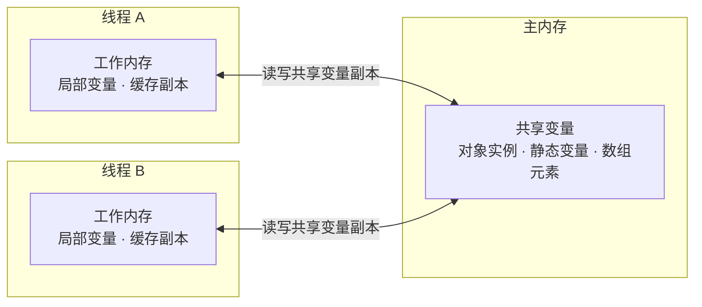

## 速查卡

- **JMM 是什么**：屏蔽硬件/OS 差异的抽象内存模型，定义「主内存 ↔ 工作内存」的交互规范，解决并发下的可见性/有序性问题
- **三性**：原子性（锁/CAS）、可见性（volatile/final/synchronized）、有序性（happens-before/volatile 禁止重排）
- **happens-before**：判断「一个操作的结果对另一个是否可见」的依据，是 Java 对重排的约束
- **volatile**：保证可见性 + 禁止指令重排（写前后插内存屏障），**不保证原子性**（`i++` 仍要锁）
- **内存屏障**：LoadLoad / StoreStore / LoadStore / StoreLoad 四类，`volatile` 写=StoreStore+StoreLoad，读=LoadLoad+LoadStore
- **DCL 单例为什么加 volatile**：防止「分配内存 → 引用赋值 → 初始化」被重排，其他线程拿到半初始化对象

---

## 一、JMM 是什么

Java 内存模型（Java Memory Model）是一套**规范**，不是真实存在的内存结构。它规定了线程通过什么方式访问共享变量、什么情况下能看到别的线程写入的值。

**为什么需要 JMM？** 硬件层有 CPU 多级缓存（L1/L2/L3）、指令重排；不同 CPU 架构内存模型不一致。JMM 屏蔽这些差异，让 Java 程序在并发下有一致的可见性语义。



核心规则：**线程对共享变量的操作必须在自己的工作内存进行，不能直接读写主内存**。线程 A 修改了变量，线程 B 不一定立即看到——这就是「可见性」问题的来源。

---

## 二、三大特性

并发编程的三大核心问题：原子性、可见性、有序性。

| 特性 | 含义 | 反例 | 保证手段 |
|------|------|------|----------|
| **原子性** | 一个操作不可分割，要么全做要么全不做 | `i++` 是「读-改-写」三步，多线程会丢失更新 | `synchronized`、`Lock`、CAS |
| **可见性** | 一个线程修改共享变量后，其他线程能立即看到 | 线程 A 改完 flag，线程 B 因缓存一直读到旧值死循环 | `volatile`、`synchronized`、`final` |
| **有序性** | 程序执行顺序与代码顺序一致 | 编译器/CPU 指令重排导致结果不符合直觉 | `volatile`、`synchronized`、happens-before |

### 原子性：i++ 为什么不是原子的

```java
int count = 0;
// count++ 实际是三步：
// ① 读取 count 到工作内存
// ② count + 1
// ③ 写回主内存
```

两个线程同时 `count++`，可能都读到 0，各自 +1 写回 1，最终丢了一次更新。解决：`AtomicInteger`（CAS）或 `synchronized`。

### 可见性：一个经典死循环

```java
// 不加 volatile 时，线程 B 可能永远看不到 flag 变为 true
private /* volatile */ boolean flag = false;

// 线程 A
flag = true;

// 线程 B
while (!flag) { }  // 可能死循环
```

线程 B 把 `flag` 缓存到自己的 CPU 缓存，线程 A 改的是主内存，B 感知不到。加 `volatile` 后每次读都从主内存拉取。

---

## 三、happens-before 规则

happens-before 是 JMM 定义的**偏序关系**：如果操作 A happens-before 操作 B，那么 A 的结果对 B 可见，且 A 的执行顺序排在 B 之前（JVM 会保证不违反该顺序地重排）。

**8 条规则**：

| 规则 | 含义 |
|------|------|
| **程序顺序** | 同一线程内，前面的操作 happens-before 后面的操作 |
| **监视器锁** | 一个 unlock happens-before 后续对同一锁的 lock |
| **volatile** | 对一个 volatile 变量的写，happens-before 后续任意读 |
| **传递性** | A hb B，B hb C → A hb C |
| **start()** | 线程 `start()` 之前的操作 hb 线程内所有操作 |
| **join()** | 线程内所有操作 hb `join()` 返回后的操作 |
| **中断** | 对线程 `interrupt()` hb 被中断线程检测到中断 |
| **对象终结** | 对象构造完成 hb `finalize()` 开始 |

> 记忆要点：**「解锁后加锁、volatile 写后读、启动后执行、join 后返回」** 是四个最常考的 hb 关系。

happens-before 的意义：**它给了你「什么时候能安全地看到别人的写入」的明确答案**，而不是凭直觉猜「应该能看到了吧」。

---

## 四、volatile 与内存屏障

### volatile 的两层语义

1. **可见性**：写 volatile 变量时立即刷新到主内存；读时从主内存拉取（相当于给变量打上「不做缓存」标记）
2. **禁止重排**：通过内存屏障，禁止 volatile 读写与相邻操作的重排

### 内存屏障（Memory Barrier）

CPU 层面阻止指令重排的指令，JMM 抽象为四类：

| 屏障 | 作用 |
|------|------|
| **LoadLoad** | 屏障前的读先于屏障后的读 |
| **StoreStore** | 屏障前的写先于屏障后的写 |
| **LoadStore** | 屏障前的读先于屏障后的写 |
| **StoreLoad** | 屏障前的写先于屏障后的读（**最强屏障，全能**，开销最大） |

### volatile 的内存屏障插入策略

```
volatile 写：
  普通写
  StoreStoreBarrier   ← 保证前面的写先完成
  volatile 写
  StoreLoadBarrier    ← 保证后面的读不会重排到写之前

volatile 读：
  volatile 读
  LoadLoadBarrier     ← 保证后面的读不被重排到前面
  LoadStoreBarrier    ← 保证后面的写不被重排到前面
```

### volatile 不保证原子性

```java
volatile int count = 0;
// 10 个线程各 count++ 1000 次，最终不一定是 10000
```

`count++` 是「读-改-写」，volatile 只保证每次读/写本身可见，但「读-改-写」之间仍可能被其他线程穿插。**要用 `AtomicInteger` 或锁**。

### DCL 单例为什么必须加 volatile

```java
public class Singleton {
    private static volatile Singleton instance;  // 必须 volatile

    public static Singleton getInstance() {
        if (instance == null) {                  // 第一次检查
            synchronized (Singleton.class) {
                if (instance == null) {          // 第二次检查
                    instance = new Singleton();
                }
            }
        }
        return instance;
    }
}
```

`new Singleton()` 实际是三步，且**可能被重排**：

```
正常顺序：① 分配内存 → ② 初始化对象 → ③ 引用指向内存
重排后：  ① 分配内存 → ③ 引用指向内存 → ② 初始化对象
```

若重排成 ①③②，线程 A 执行到 ③ 时 `instance` 已非 null（但对象还没初始化完），线程 B 第一次检查 `instance != null` 直接返回，拿到一个**半初始化对象**，字段为默认值（null/0）。加 `volatile` 禁止了 ②③ 的重排。

> 这是阿里高频追问：「DCL 单例的两个 if 分别解决什么？volatile 解决什么？」——外层 if 避免每次加锁的性能开销，内层 if 避免重复创建，volatile 解决指令重排导致的半初始化问题。

---

## 自测

1. **JMM 的三大特性是什么？分别用什么手段保证？**
   <br/>→ 原子性（`synchronized`/`Lock`/CAS）、可见性（`volatile`/`final`/锁）、有序性（`volatile`/happens-before）。`i++` 不具原子性，`volatile` 只能保证单次读写可见与有序，不保证复合操作原子性。

2. **happens-before 规则解决了什么问题？举两个最常用的规则。**
   <br/>→ 解决「一个线程的写入何时对另一个线程可见」的判断问题，是 JMM 对可见性和有序性的保证依据。常用：监视器锁规则（unlock hb 后续 lock）、volatile 规则（写 hb 后续读）、传递性。

3. **volatile 为什么不能保证原子性？`volatile int` 的 `i++` 会怎样？**
   <br/>→ `i++` 是「读-改-写」三步，volatile 保证每次读/写单独可见，但三步之间可被其他线程穿插，导致丢更新。应改用 `AtomicInteger`（CAS）或加锁。

4. **DCL 单例中 volatile 的作用是什么？去掉会发生什么？**
   <br/>→ 防止 `new` 被重排为「分配内存 → 引用赋值 → 初始化」。去掉后，线程 A 引用已赋值但对象未初始化完成时，线程 B 可能拿到半初始化对象（字段为默认值）。外层 if 省锁、内层 if 防重复创建、volatile 防重排。

5. **内存屏障有哪几类？volatile 写为什么开销比读大？**
   <br/>→ LoadLoad / StoreStore / LoadStore / StoreLoad 四类。volatile 写末尾插入 StoreLoad 屏障（最强屏障，保证写先于后续任何读写），导致 CPU 缓存行失效和总线锁，开销大于读。
