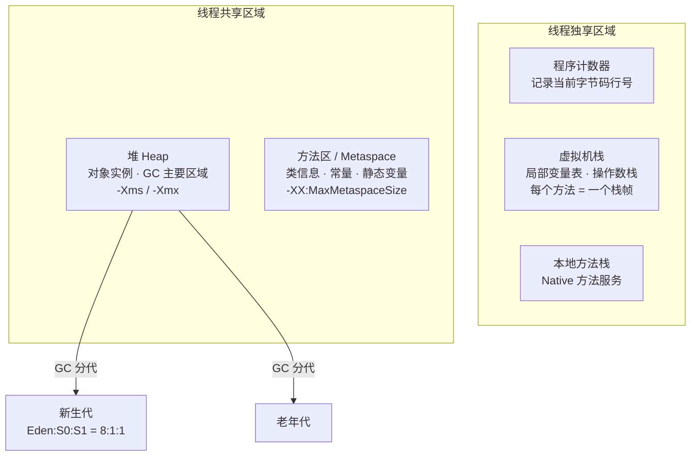

## 一、类加载

### 加载过程

类加载器将 `.class` 文件中的二进制数据读入内存，放在运行时数据区的**方法区**内，然后创建 `Class` 对象封装类在方法区内的数据结构。

三个阶段：**加载 → 连接 → 初始化**

**连接阶段**又分为：

| 阶段 | 说明 |
|------|------|
| **验证** | 确保类信息符合 JVM 规范，无安全问题 |
| **准备** | 为类的静态 Field 分配内存并设置初始值 |
| **解析** | 将类的符号引用替换为直接引用 |

### 双亲委派模型

类加载时，优先委托父加载器加载，依次传递到启动类加载器。顶层无法完成时，再由子加载器加载。

---

## 二、内存布局

| 区域 | 归属 | 说明 |
|------|:---:|------|
| **程序计数器** | 独享 | 记录当前线程执行的字节码行号 |
| **虚拟机栈** | 独享 | 存储局部变量表、操作数栈，每个方法对应一个栈帧 |
| **本地方法栈** | 独享 | 为 Native 方法服务 |
| **堆** | 共享 | 存放对象实例，GC 主要区域 |
| **方法区** | 共享 | 存储类信息、常量、静态变量等 |

---

## 三、垃圾回收算法

| 算法 | 原理 | 缺点 |
|------|------|------|
| **标记-清除** | 标记存活 → 清除未标记 | 产生空间碎片 |
| **复制** | Eden:S0:S1 = 8:1:1，存活对象复制到另一 Survivor | 存活率高时效率低 |
| **标记-整理** | 标记后将存活对象前移，清除边界外 | 移动成本高 |
| **分代收集** | 新生代用复制，老年代用标记-清除/整理 | — |

### Minor GC vs Full GC

- **Minor GC**：仅新生代
- **Full GC**：包含新生代和老年代

触发 Full GC：晋升大小 > 老年代剩余空间、永久代空间不足、`System.gc()`

---

## 四、常用 GC 收集器

### 经典收集器

| 收集器 | 代 | 算法 | 特点 |
|--------|:--:|------|------|
| Serial | 新生代 | 复制 | 单线程，适合客户端应用 |
| Serial Old | 老年代 | 标记-整理 | 单线程 |
| ParNew | 新生代 | 复制 | 多线程，唯一可配 CMS |
| Parallel Scavenge | 新生代 | 复制 | 关注吞吐量（JDK8 默认） |
| Parallel Old | 老年代 | 标记-整理 | 多线程 |
| ~~CMS~~ | 老年代 | 标记-清除 | ~~JDK14 标记废弃，JDK18 移除~~ |
| **G1** | 全堆 | 标记-整理 | **JDK9+ 默认**，无碎片 |

### 现代低延迟收集器

| 收集器 | JDK | 目标 | 特点 |
|--------|:---:|------|------|
| **ZGC** | 11（生产就绪 15+） | 亚毫秒级停顿 | 基于染色指针，堆可 TB 级，暂停与堆大小无关 |
| **Shenandoah** | 12 | 低停顿 | 并发压缩，暂停与堆大小无关 |

> **CMS 已在 JDK 18 中被彻底移除**。现代应用推荐 **G1**（默认）或 **ZGC**（低延迟需求）。

### 垃圾回收过程

**G1**：初始标记 → 并发标记 → 最终标记 → 筛选回收

**ZGC**：几乎所有阶段并发执行，只有根扫描等极少数阶段需要短暂 STW。标记阶段使用染色指针（Colored Pointers）技术。

---

### Metaspace（JDK8+）

JDK 8 移除了永久代（PermGen），引入**元空间（Metaspace）**：
- 使用**本地内存**而非堆内存，不再有 `OutOfMemoryError: PermGen`
- 通过 `-XX:MaxMetaspaceSize` 限制大小
- 类元数据存储在 Metaspace，字符串常量池移至堆中

---

## 五、常用排查命令

| 命令 | 用途 |
|------|------|
| `jps -l` | 查看 Java 进程 |
| `jstack <pid>` | 线程堆栈 |
| `jmap -heap <pid>` | 堆内存映像 |
| `jstat -gc <pid> <ms>` | GC 统计 |
