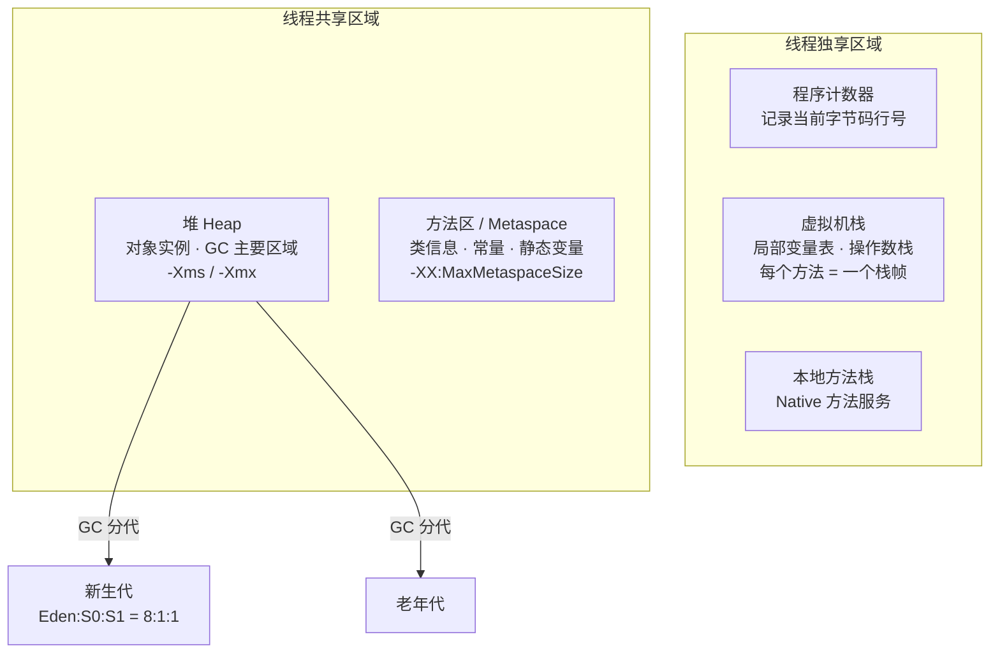
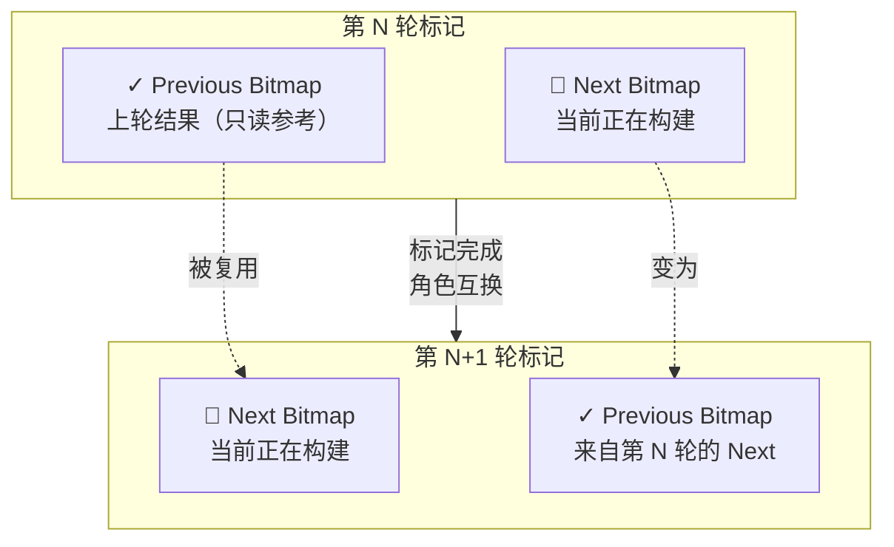
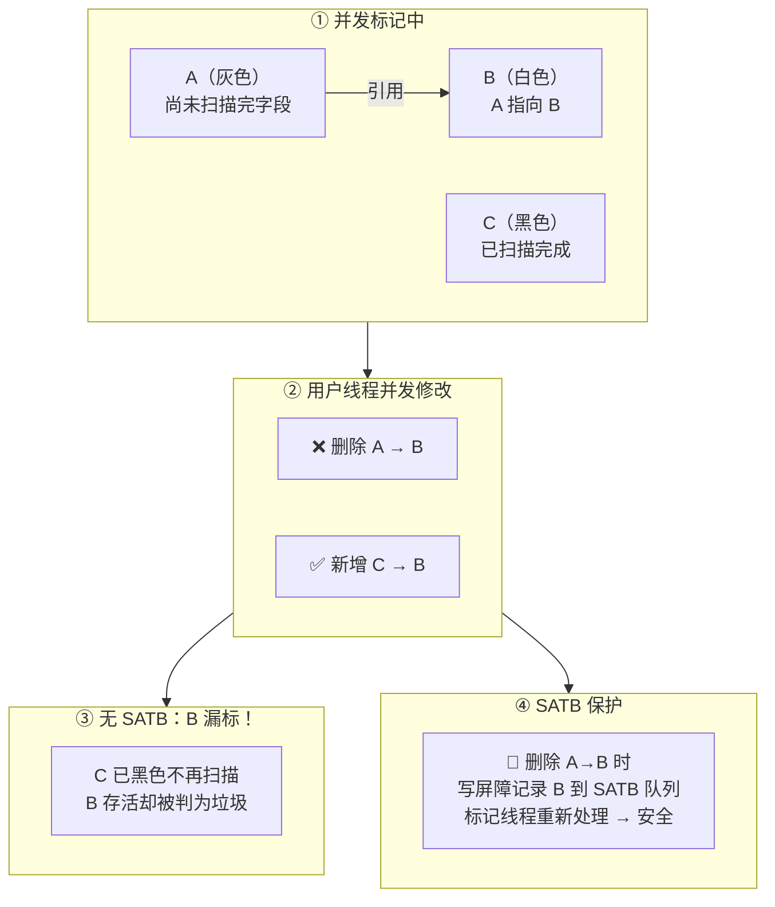
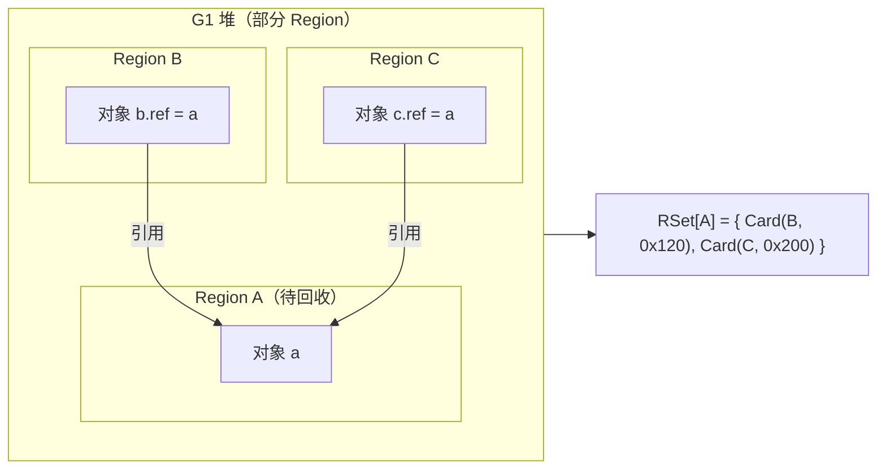

## 速查卡

- **类加载**：加载→连接（验证/准备/解析）→初始化。双亲委派：自底向上委托，自顶向下加载
- **内存布局**：线程独享（PC/虚拟机栈/本地方法栈）+ 线程共享（堆/Metaspace）
- **堆分代**：新生代 Eden:S0:S1=8:1:1 + 老年代（分代收集器模型）；Metaspace 用本地内存，`-XX:MaxMetaspaceSize` 限制
- **GC 算法**：标记-清除（碎片）、复制（新生代）、标记-整理（老年代）、分代收集（组合策略）
- **GC 收集器**：JDK 8 默认 Parallel；JDK 9+ 默认 G1（Region，无碎片）；ZGC（JDK 11+，亚毫秒停顿）
- **分代 vs 单代**：分代收集器（Serial/Parallel/CMS/G1）才有 Eden/Survivor；ZGC 11~20 单代不分，JDK 21 分代 ZGC 回归
- **四种引用**：强（永不回收）> 软（内存不足回收，缓存）> 弱（下次 GC 回收，ThreadLocal）> 虚（仅通知，堆外内存）
- **调优**：先测量后调优 → Xms=Xmx → 按场景选 GC（吞吐 Parallel/低延迟 G1/亚毫秒 ZGC）→ 优先减少对象创建 > 调参数

---

## 一、类加载

### 加载过程

类加载器将 `.class` 文件中的二进制数据读入内存，放在运行时数据区的**方法区**内，然后创建 `Class` 对象封装类在方法区内的数据结构。

三个阶段：**加载 → 连接 → 初始化**

**连接阶段**又分为：

| 阶段 | 说明 |
|------|------|
| **验证** | 确保类信息符合 JVM 规范，无安全问题 |
| **准备** | 为类的静态 Field 分配内存并设置初始值 |
| **解析** | 将类的符号引用替换为直接引用 |

### 双亲委派模型

类加载时，优先委托父加载器加载，依次传递到启动类加载器。顶层无法完成时，再由子加载器加载。

---

## 二、内存布局（运行时数据区）

### 内存区域划分


```mermaid
flowchart TB
    subgraph 线程独享["线程独享区域"]
        PC["程序计数器<br/>记录当前字节码行号"]
        Stack["虚拟机栈<br/>局部变量表 · 操作数栈<br/>每个方法 = 一个栈帧"]
        Native["本地方法栈<br/>Native 方法服务"]
    end

    subgraph 线程共享["线程共享区域"]
        Heap["堆 Heap<br/>对象实例 · GC 主要区域<br/>-Xms / -Xmx"]
        Method["方法区 / Metaspace<br/>类信息 · 常量 · 静态变量<br/>-XX:MaxMetaspaceSize"]
    end

    Heap -->|"GC 分代"| Young["新生代<br/>Eden:S0:S1 = 8:1:1"]
    Heap -->|"GC 分代"| Old["老年代"]
```

| 区域 | 归属 | 说明 |
|------|:---:|------|
| **程序计数器** | 独享 | 记录当前线程执行的字节码行号 |
| **虚拟机栈** | 独享 | 存储局部变量表、操作数栈，每个方法对应一个栈帧 |
| **本地方法栈** | 独享 | 为 Native 方法服务 |
| **堆** | 共享 | 存放对象实例，GC 主要区域 |
| **方法区** | 共享 | 存储类信息、常量、静态变量等 |

### 堆的分代结构

堆分为**新生代**与**老年代**（弱分代假说：大多数对象朝生夕死）：

- **新生代**：Eden + 两个 Survivor（S0/S1），默认比例 8:1:1
- **老年代**：存放长期存活对象
- **晋升**：新生代 GC 后仍存活的对象在 Survivor 间复制，达到晋升阈值（默认 15 次）后进入老年代

> 注意：Eden/Survivor 是**分代收集器**的概念，单代 ZGC（JDK 11~20）不分代，详见「三、垃圾回收」。

### Metaspace（JDK 8+）

JDK 8 移除了永久代（PermGen），引入**元空间（Metaspace）**：

- 使用**本地内存**而非堆内存，不再有 `OutOfMemoryError: PermGen`
- 通过 `-XX:MaxMetaspaceSize` 限制大小
- 类元数据存储在 Metaspace，字符串常量池移至堆中

---

## 三、垃圾回收

### GC 算法

| 算法 | 原理 | 缺点 |
|------|------|------|
| **标记-清除** | 标记存活 → 清除未标记 | 产生空间碎片 |
| **复制** | Eden:S0:S1 = 8:1:1，存活对象复制到另一 Survivor | 存活率高时效率低 |
| **标记-整理** | 标记后将存活对象前移，清除边界外 | 移动成本高 |
| **分代收集** | 新生代用复制，老年代用标记-清除/整理 | — |

### 分代模型与 Minor/Full GC

- **Minor GC**：仅新生代（Eden 满触发，复制算法）
- **Full GC**：包含新生代和老年代

触发 Full GC：晋升大小 > 老年代剩余空间、Metaspace 空间不足、`System.gc()` 显式调用。

### 常用 GC 收集器

#### 经典收集器

| 收集器 | 代 | 算法 | 特点 |
|--------|:--:|------|------|
| Serial | 新生代 | 复制 | 单线程，适合客户端应用 |
| Serial Old | 老年代 | 标记-整理 | 单线程 |
| ParNew | 新生代 | 复制 | 多线程，唯一可配 CMS |
| Parallel Scavenge | 新生代 | 复制 | 关注吞吐量（JDK8 默认） |
| Parallel Old | 老年代 | 标记-整理 | 多线程 |
| ~~CMS~~ | 老年代 | 标记-清除 | ~~JDK14 标记废弃，JDK18 移除~~ |
| **G1** | 全堆 | 标记-整理 | **JDK9+ 默认**，无碎片 |

#### JDK 8 vs JDK 11 默认收集器

JDK 9 起默认 GC 从 Parallel 切换为 G1（JEP 248），JDK 11 作为 LTS 继承该默认配置。

| 维度 | Parallel GC（JDK 8 默认） | G1 GC（JDK 11 默认） |
|------|--------------------------|----------------------|
| **核心思想** | 吞吐量优先，大批量回收 | 低延迟优先，增量回收 |
| **堆结构** | 连续年轻代（Eden + 2 Survivor）+ 老年代 | 大量等大小 Region（约 2048 个），每个 Region 可扮演 Eden / Survivor / Old / Humongous |
| **年轻代回收** | 标记-复制，STW | 标记-复制，STW（仅处理部分 Region） |
| **老年代回收** | 标记-整理，全堆 STW，耗时长 | 并发标记 + 增量式回收，大部分工作与应用线程并发 |
| **停顿时间** | 随堆增长线性增加，大堆可能秒级 | 可指定目标（`-XX:MaxGCPauseMillis`，默认 200ms），自动调控回收规模 |
| **吞吐量** | 更高（STW 虽长，但总 GC 时间占比小） | 略低（并发阶段消耗 CPU，换更短停顿） |
| **内存碎片** | 标记-整理，老年代无碎片 | 混合回收整理 Region，Remembered Sets 管理跨 Region 引用 |
| **适用场景** | 批处理、后台计算、停顿不敏感 | 大堆（>4GB）、要求低延迟的在线服务（Web 应用、API） |

**原因**：随着服务器内存越来越大（几十 G 甚至上百 G），Parallel GC 的 Full GC 停顿可达数秒，在线服务不可接受。G1 将停顿控制在 200ms 量级。

> **注意**：物理内存 < 1792MB 时 JVM 自动回退到 **Serial GC**，与默认配置无关。手动指定 `-XX:+UseParallelGC` 或 `-XX:+UseG1GC` 时以显式参数为准。

#### 现代低延迟收集器

| 收集器 | JDK | 目标 | 特点 |
|--------|:---:|------|------|
| **ZGC** | 11（生产就绪 15+） | 亚毫秒级停顿 | 基于染色指针，堆可 TB 级，暂停与堆大小无关 |
| **Shenandoah** | 12 | 低停顿 | 并发压缩，暂停与堆大小无关 |

> **CMS 已在 JDK 18 中被彻底移除**。现代应用推荐 **G1**（默认）或 **ZGC**（低延迟需求）。

#### 分代 vs 单代（Eden/Survivor 是「分代」的产物）

**Eden/Survivor 不是所有收集器都有**——它是分代收集器的概念，由收集器类型决定，而非 JDK 版本：

| 收集器 | 是否分代 | Eden/Survivor |
|--------|:---:|:---:|
| Serial / Parallel / CMS | ✅ 分代 | ✅ 有 |
| **G1**（JDK 9+ 默认） | ✅ 分代 | ✅ 有（Region 动态扮演 Eden/Survivor/Old） |
| **ZGC**（JDK 11~20） | ❌ 单代 | ❌ 无 |
| Shenandoah（早期） | ❌ 单代 | ❌ 无 |
| **分代 ZGC**（JDK 21，JEP 439） | ✅ 分代 | ✅ 回归 |

**为什么单代 ZGC 又要改回分代？** 单代模式每次回收都要扫描全堆，大量"朝生夕死"的短命对象也参与昂贵的内存搬运，吞吐和 CPU 开销大。分代后短命对象在年轻代内用复制算法快速回收，只有长寿对象才并发整理。

> 一句话：**只要收集器分代，就有 Eden/Survivor**；只有单代 ZGC（11~20）和早期 Shenandoah 才不区分。JDK 11 默认 GC 是 G1，所以默认**仍然区分** Eden/Survivor。

### GC 收集过程

**G1**：初始标记 → 并发标记 → 最终标记 → 筛选回收

**ZGC**：几乎所有阶段并发执行，只有根扫描等极少数阶段需要短暂 STW。标记阶段使用染色指针（Colored Pointers）技术。

### G1 标记数据结构（进阶）

G1 并发标记使用 **SATB（Snapshot-At-The-Beginning）** 算法，涉及以下核心数据结构：

#### 标记位图（Marking Bitmap）

每个 Region 维护**两个位图**，每个 bit 对应堆中一个对象起始地址（通常按 8 字节对齐）：

| 位图 | 作用 |
|------|------|
| **Next Bitmap** | 当前标记周期正在构建的位图，标记过程中不断更新 |
| **Previous Bitmap** | 上次标记周期的稳定快照，代表上一个快照中存活的对象集合 |

**用两个位图的原因**：并发标记期间新对象仍在分配——这些对象不能等标记结束再处理。两个位图交替使用，避免标记周期互相干扰。


```mermaid
flowchart TB
    subgraph Cycle1["第 N 轮标记"]
        direction LR
        N1["🔨 Next Bitmap<br/>当前正在构建"]
        N2["✓ Previous Bitmap<br/>上轮结果（只读参考）"]
    end
    subgraph Cycle2["第 N+1 轮标记"]
        direction LR
        N3["🔨 Next Bitmap<br/>当前正在构建"]
        N4["✓ Previous Bitmap<br/>来自第 N 轮的 Next"]
    end
    Cycle1 -->|"标记完成<br/>角色互换"| Cycle2
    N1 -.->|"变为"| N4
    N2 -.->|"被复用"| N3
```

> 位图的优势：一个 bit 就能精确关联到一个对象起始位置，而 Remembered Set 只能近似记录卡表中的位置。

#### SATB 队列与缓冲区

G1 的写屏障（Write Barrier）在**指针被覆盖之前**，将旧值记录到线程本地 SATB 缓冲区：

```java
// 伪代码：SATB 写屏障
void writeBarrier(oop* field, oop newValue) {
    oop oldValue = *field;          // 先读取旧值
    if (oldValue != null) {
        satbBuffer.enqueue(oldValue); // 旧值入队，防止并发漏标
    }
    *field = newValue;              // 再真正写入
}
```

各线程的本地 SATB 队列满了之后转移到全局队列集合。并发标记线程**定期处理**这些队列中的指针。

> **为什么需要 SATB？**

三色标记中，遍历对象时将其标记为三色之一：**白色**（未访问）、**灰色**（已访问，子引用未扫描完）、**黑色**（子引用全部扫描完成）。

并发场景下可能出现漏标——条件：黑色对象新增了指向白色对象的引用，且灰色对象对它的引用被删除：


```mermaid
flowchart TB
    subgraph Stage1["① 并发标记中"]
        A["A（灰色）<br/>尚未扫描完字段"]
        B1["B（白色）<br/>A 指向 B"]
        C["C（黑色）<br/>已扫描完成"]
        A -->|"引用"| B1
    end
    subgraph Stage2["② 用户线程并发修改"]
        direction LR
        DEL["❌ 删除 A → B"]
        ADD["✅ 新增 C → B"]
    end
    subgraph Stage3["③ 无 SATB：B 漏标！"]
        LOST["C 已黑色不再扫描<br/>B 存活却被判为垃圾"]
    end
    subgraph Stage4["④ SATB 保护"]
        SAFE["📝 删除 A→B 时<br/>写屏障记录 B 到 SATB 队列<br/>标记线程重新处理 → 安全"]
    end
    Stage1 --> Stage2
    Stage2 --> Stage3
    Stage2 --> Stage4
```

SATB 在引用**被删除时**快照记录旧值（逻辑快照），即使该对象后续仅被黑色对象引用，也能通过 SATB 队列被标记线程重新访问到。

#### TAMS（Top At Mark Start）指针

每个 Region 有两个 TAMS 指针，记录并发标记开始时的分配位置：

```
Region 布局：
┌──────────────────────────────────────────────┐
│  上次标记存活  │  本次标记后新分配（隐式存活）│
│◄─prev TAMS    │◄─next TAMS                  │
│  本次标记中    │  默认存活，不参与本轮标记    │
└──────────────────────────────────────────────┘
```

- **TAMS 以下**：标记开始时已存在，需通过标记确定存活
- **TAMS 以上**：标记开始后新分配，**默认视为存活**，不参与本轮标记

#### Remembered Set（RSet）

虽然不是标记对象本身的结构，但它是 G1 增量回收的关键。每个 Region 维护一个 RSet，记录**其他 Region 指向本 Region 的引用**：


```mermaid
flowchart LR
    subgraph Heap["G1 堆（部分 Region）"]
        direction TB
        subgraph RA["Region A（待回收）"]
            OA["对象 a"]
        end
        subgraph RB["Region B"]
            OB["对象 b.ref = a"]
        end
        subgraph RC["Region C"]
            OC["对象 c.ref = a"]
        end
    end
    OB -->|"引用"| OA
    OC -->|"引用"| OA
    Heap --> RSetBox["RSet[A] = { Card(B, 0x120), Card(C, 0x200) }"]
```

内部使用 **哈希表**（Per-Region Table，PRT）实现，以"卡表索引"为键。回收 Region A 时只需查看 `RSet[A]` 就能知道哪些外部 Region 持有 A 内对象的引用，**无需全堆扫描**。

#### 数据结构总览

| 数据结构 | 作用 | 粒度 |
|----------|------|------|
| **Next Bitmap** | 当前标记周期的存活标记 | 每 bit → 一个对象起始地址 |
| **Previous Bitmap** | 上次标记周期的稳定快照 | 每 bit → 一个对象起始地址 |
| **SATB 队列** | 记录被覆盖的旧指针，防并发漏标 | 线程本地 + 全局共享 |
| **TAMS 指针** | 区分标记前/后分配的对象 | 每 Region 两个（对应两个位图） |
| **RSet** | 跨 Region 引用索引，避免全堆扫描 | 每 Region 一个，哈希表实现 |

> **一句话记忆**：G1 用**位图（双缓冲）+ SATB 队列 + TAMS** 实现并发标记，用 **RSet（哈希表）** 实现增量回收。

---

## 四、四种引用类型

Java 提供四种引用，强度递减：**强 > 软 > 弱 > 虚**。后三种可配合 `ReferenceQueue` 使用，让程序在对象被回收时收到通知。

| 类型 | 回收时机 | 典型用途 |
|------|---------|---------|
| **强引用** | 只要可达，永不回收 | 普通 `new` 出来的对象 |
| **软引用** | 内存不足（OOM 前）才回收 | 缓存（图片缓存、`SoftReference` 缓存） |
| **弱引用** | 下次 GC 时无论内存是否够都回收 | `ThreadLocal`、`WeakHashMap`、缓存 |
| **虚引用** | 任何时候都可能被回收，本身无法拿到对象 | 堆外内存回收（`DirectByteBuffer` 的 `Cleaner`） |

```java
Object obj = new Object();                    // 强引用
SoftReference<Object> soft = new SoftReference<>(new Object());  // 软引用
WeakReference<Object> weak = new WeakReference<>(new Object());  // 弱引用
PhantomReference<Object> phantom = new PhantomReference<>(new Object(), queue);  // 虚引用
```

### 关键区别

- **软引用 vs 弱引用**：软引用在**内存不够时**才回收（适合做「内存敏感缓存」，OOM 前自动释放）；弱引用**只要 GC 就回收**（适合「只要有强引用就用，没有就释放」的场景）。
- **弱引用 vs 虚引用**：弱引用还能通过 `weak.get()` 拿到对象（可能为 null）；虚引用 `get()` **永远返回 null**，无法通过它访问对象，唯一作用是在对象回收时收到 `ReferenceQueue` 通知。
- **ThreadLocal 为何用弱引用**：`ThreadLocalMap` 的 key 是弱引用，当 ThreadLocal 对象没有外部强引用时，key 会被 GC，避免 ThreadLocal 被 Map 拖住无法回收。但 value 仍是强引用，需 `remove()` 清理（见并发编程 ThreadLocal 章节）。

> 一句话：**强引用管「活」，软引用管「内存紧」，弱引用管「下次 GC」，虚引用管「回收通知」。**

---

## 五、JVM 调优

### 排查命令

调优的第一步是定位问题，常用 JDK 自带工具：

| 命令 | 用途 |
|------|------|
| `jps -l` | 查看 Java 进程 |
| `jstack <pid>` | 线程堆栈 |
| `jmap -heap <pid>` | 堆内存映像 |
| `jstat -gc <pid> <ms>` | GC 统计 |

### 常用调优参数

| 参数 | 说明 |
|------|------|
| `-Xms` / `-Xmx` | 堆初始/最大大小，建议设为相等避免动态扩容/收缩 |
| `-Xmn` | 新生代大小 |
| `-XX:SurvivorRatio` | Eden 与 Survivor 比例（默认 8） |
| `-XX:MaxMetaspaceSize` | Metaspace 上限，防止本地内存被耗尽 |
| `-XX:MaxGCPauseMillis` | G1 停顿目标（默认 200ms） |
| `-XX:+UseG1GC` / `-XX:+UseZGC` | 选择 GC 收集器 |
| `-XX:PretenureSizeThreshold` | 超过该大小的大对象直接进老年代 |

### 常见问题与优化方向

| 问题 | 排查 | 优化 |
|------|------|------|
| Full GC 频繁 | `jstat -gcutil` 看各区使用率 | 调大堆 / 调大 Survivor 避免过早晋升 |
| 内存泄漏 | `jmap -dump` + MAT 分析 | 修复泄漏点（静态集合、监听器未移除） |
| 大对象频繁创建 | GC 日志观察分配速率 | 对象池复用、`PretenureSizeThreshold` |
| Metaspace OOM | 类加载频繁 | 设 `MaxMetaspaceSize` + 排查动态代理/反射滥用 |
| 停顿过高 | GC 日志分析 | 换 G1/ZGC，调 `MaxGCPauseMillis` |

### JIT 优化（减少 GC 压力）

| 优化 | 说明 |
|------|------|
| **逃逸分析** | 对象只在方法内使用 → **栈上分配**，不进堆、无 GC 压力（`-XX:+DoEscapeAnalysis` 默认开启） |
| **标量替换** | 逃逸对象被拆解为标量，直接在栈上分配字段，省去对象头开销 |
| **锁消除** | 无竞争的同步块被移除（`-XX:+EliminateLocks`） |
| **分层编译** | C1（快速编译，启动快）+ C2（深度优化，运行快） |

### GC 日志

- JDK 8：`-XX:+PrintGCDetails -Xloggc:gc.log`
- JDK 9+：`-Xlog:gc*`

### 调优原则

1. **先测量后调优**：用 `jstat` / GC 日志确认瓶颈，不盲目改参数
2. **Xms = Xmx**：避免运行时动态扩容/收缩的开销
3. **按场景选 GC**：吞吐优先 Parallel，低延迟 G1，亚毫秒 ZGC
4. **优先优化代码**：减少对象创建（复用、`StringBuilder`）> 调参数

---

## 自测

1. **双亲委派模型的作用是什么？打破双亲委派的例子有哪些？**
   <br/>→ 作用：防止核心类被篡改（安全）、避免重复加载（效率）。打破例子：Tomcat 的 WebAppClassLoader（隔离不同应用）、SPI（`Thread.currentThread().getContextClassLoader()`）、JDBC 驱动加载。

2. **什么时候触发 Full GC？如何减少 Full GC 频率？**
   <br/>→ 触发：晋升大小 > 老年代剩余空间、Metaspace 不足、`System.gc()` 显式调用。减少：调大 Survivor 区避免过早晋升、控制大对象直接进老年代、合理设置 Metaspace 大小。

3. **G1 和 CMS 的核心区别是什么？为什么 G1 取代了 CMS？**
   <br/>→ CMS 标记-清除（碎片→需要 Full GC 整理）、并发失败退化为 Serial Old。G1 标记-整理（无碎片）、可预测停顿时间（`-XX:MaxGCPauseMillis`）、将堆分为 Region 精细化回收。CMS 在 JDK 18 被彻底移除。

4. **ZGC 的「亚毫秒停顿」是如何做到的？染色指针是什么？**
   <br/>→ ZGC 几乎所有阶段并发执行。染色指针（Colored Pointers）：将 GC 状态信息编码到 64 位指针的位中（marked0/marked1/remapped/finalizable），无需额外对象头，加载指针时通过屏障实现并发转移。

5. **JDK 11 之后还区分 Eden 与 Survivor 吗？为什么？**
   <br/>→ 取决于 GC 而非 JDK 版本。JDK 11 默认 G1 是分代收集器，仍区分 Eden/Survivor（Region 动态扮演）。只有单代 ZGC（11~20）和早期 Shenandoah 不区分；JDK 21 分代 ZGC（JEP 439）又回归。Eden/Survivor 是分代模型（弱分代假说）的产物，Survivor 起缓冲筛选作用，活过多轮才晋升老年代。

6. **你线上遇到 Full GC 频繁，怎么排查？**
   <br/>→ `jstat -gc` 看 GC 频率和耗时 → `jmap -heap` 看内存分布 → `jmap -dump` 导出堆转储 → MAT/JProfiler 分析大对象/泄漏 → 结合 GC 日志（`-Xlog:gc*`）定位。

7. **JVM 调优的核心思路是什么？从哪些方向优化？**
   <br/>→ 先测量后调优（jstat/GC 日志定位瓶颈，不盲目改参数）。方向：`-Xms=-Xmx` 避免动态扩容；调大 Survivor 避免过早晋升、控制大对象直接进老年代（`PretenureSizeThreshold`）、设 `MaxMetaspaceSize`；按场景选 GC（吞吐 Parallel/低延迟 G1/亚毫秒 ZGC）；优先减少对象创建（复用、`StringBuilder`）并利用 JIT 逃逸分析栈上分配。

8. **软引用和弱引用的回收时机有什么区别？各适合什么场景？**
   <br/>→ 软引用在内存不足（OOM 前）才回收，适合「内存敏感缓存」；弱引用只要发生 GC 就回收，适合「ThreadLocal、WeakHashMap」这类无强引用即释放的场景。虚引用 `get()` 永远返回 null，仅用于回收通知（如 DirectByteBuffer 的 Cleaner 回收堆外内存）。
