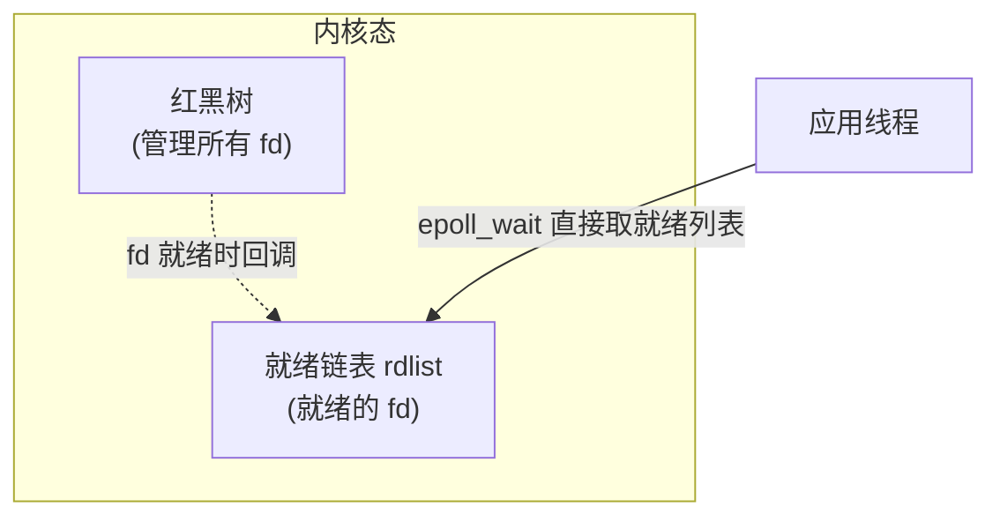

## 概述

NIO 是 **同步非阻塞** 的 I/O 模型，也是 I/O 多路复用的基础。它用「单线程轮询多连接」替代 BIO 的「一线程一连接」，解决海量连接（C10K/C100K）问题。

本文只讲 **Java NIO 本身 + IO 多路复用底层**。Netty 框架层（Reactor 线程模型、ByteBuf、Pipeline）见「中间件 → Netty」。

## 速查卡

- **BIO/NIO/AIO**：BIO 同步阻塞（一线程一连接）→ NIO 同步非阻塞（Selector 单线程轮询）→ AIO 异步非阻塞（OS 回调）
- **三大组件**：Buffer（缓冲区，双向读写）、Channel（通道，连接 Buffer 与 IO）、Selector（多路复用器，一个线程监听多 Channel）
- **Buffer 三指针**：`position`（下一个读/写位置）、`limit`（边界）、`capacity`（容量不变）；`flip()` 写→读：`limit=position; position=0`
- **多路复用演进**：select（1024 上限 + O(n) 轮询）→ poll（无上限仍 O(n)）→ epoll（红黑树 + 就绪链表，事件驱动 O(1)）
- **LT vs ET**：水平触发（默认，只要就绪就一直通知）vs 边缘触发（只在状态变化时通知一次，需一次读干净）
- **零拷贝**：传统 4 次拷贝 → mmap（3 次）→ sendfile（2 次）；Java 的 `FileChannel.transferTo` 走 sendfile
- **实战陷阱**：`selectedKeys` 用完必须 `remove()`、`OP_WRITE` 按需注册（防空转）、非阻塞 connect、空轮询 bug

---

## 一、I/O 模型辨析

### 两个易混维度：阻塞/非阻塞 vs 同步/异步

| 维度 | 回答的问题 | 分界点 |
|------|-----------|--------|
| **阻塞 / 非阻塞** | 「等待数据就绪」时，调用方是否挂起 | 等数据阶段 |
| **同步 / 异步** | 「数据从内核拷贝到用户空间」由谁完成 | 拷贝数据阶段 |

- **阻塞**：等不到数据就一直挂着（BIO 的 `read()`）
- **非阻塞**：没有数据立刻返回（NIO 的 `read()` 返回 0）
- **同步**：用户线程自己调 `read()` 完成内核→用户的拷贝
- **异步**：内核完成拷贝后回调通知（AIO）

所以 **NIO = 同步非阻塞**：等待阶段非阻塞（`select()` 立即返回就绪事件），拷贝阶段同步（用户线程主动 `read()` 拷贝数据）。


---

## 二、三大核心组件

### Buffer（缓冲区）

Buffer 是 NIO 的读写载体，**所有数据都要经过 Buffer**。它是一个「可读写」的内存块，用三个指针管理：

```
        capacity（容量，不变）
┌──────────────────────────────────────────┐
│ 0 1 2 3 4 5 6 7 8 9 10 11 12 13 14 15  │
└──────────────────────────────────────────┘
     ↑                    ↑
  position              limit
  （下一个读写位置）      （边界）
```

| 指针 | 含义 |
|------|------|
| **position** | 下一个要读/写的元素索引 |
| **limit** | 可读/写的边界（`position` 最多到 `limit-1`） |
| **capacity** | 缓冲区容量，创建后不变 |

**写模式**：`limit = capacity`，`position` 从 0 往后写。
**读模式**（`flip()` 切换后）：`limit = 原 position`，`position = 0`，表示「读到 limit 为止」。

#### 四个关键方法（高频易错）

| 方法 | 作用 | position | limit |
|------|------|:---:|:---:|
| **`flip()`** | 写 → 读切换 | 0 | 原 position |
| **`clear()`** | 清空（准备重新写） | 0 | capacity |
| **`rewind()`** | 重读（position 回到 0） | 0 | 不变 |
| **`compact()`** | 未读数据移到开头（读 → 写） | 未读数据长度 | capacity |

```java
ByteBuffer buf = ByteBuffer.allocate(16);
buf.put("hello".getBytes());  // 写入，position = 5
buf.flip();                   // limit=5, position=0
while (buf.hasRemaining()) {
    System.out.print((char) buf.get());  // 读 5 个字节
}
buf.clear();                  // position=0, limit=16，可重新写
```

> **易错点**：`clear()` 不真正清空数据，只把指针复位。旧的 `position..limit` 之间还有残留数据，只是可被覆盖。所以「读之前必须 flip」「写完要重新写必须 clear/compact」，顺序错了会读到脏数据或漏读。

#### 堆内存 vs 直接内存 Buffer

| 类型 | 创建 | 特点 |
|------|------|------|
| **堆内存** | `ByteBuffer.allocate(16)` | 在 JVM 堆，读写快，但多一次拷贝（堆↔内核） |
| **直接内存** | `ByteBuffer.allocateDirect(16)` | 在堆外，少一次拷贝，适合高频 IO，但分配/回收成本高 |

### Channel（通道）

Channel 是双向的「管道」，连接 Buffer 和 IO。与 Stream 的区别：**Channel 可同时读写，Stream 单向**。

| Channel | 用途 |
|---------|------|
| `FileChannel` | 文件读写 |
| `SocketChannel` | TCP 客户端 |
| `ServerSocketChannel` | TCP 服务端 |
| `DatagramChannel` | UDP |

### Selector（多路复用器）

Selector 让**一个线程管理多个 Channel**：

```java
Selector selector = Selector.open();
ServerSocketChannel server = ServerSocketChannel.open();
server.configureBlocking(false);              // 必须非阻塞
server.register(selector, SelectionKey.OP_ACCEPT);  // 注册「接受连接」事件

while (true) {
    selector.select();                        // 阻塞直到有就绪事件
    for (SelectionKey key : selector.selectedKeys()) {
        if (key.isAcceptable()) { /* 接受新连接 */ }
        if (key.isReadable())   { /* 读数据 */ }
        if (key.isWritable())   { /* 写数据 */ }
    }
}
```

| 事件 | 含义 |
|------|------|
| `OP_ACCEPT` | 有连接可接受（服务端） |
| `OP_CONNECT` | 连接建立完成（客户端） |
| `OP_READ` | 有数据可读 |
| `OP_WRITE` | 可写 |

> 核心：`select()` 只在「有 Channel 就绪」时返回，其余时间一个线程空转等待，**不用为每个连接建线程**。

---

## 三、IO 多路复用：select → poll → epoll

Selector 的底层是 OS 的 IO 多路复用。Linux 经历了三代演进，理解「epoll 为什么快」是 NIO 面试的深度分水岭。

### select（早期）

- 用 `fd_set` **位图**标记要监听的 fd，默认上限 **1024**（`FD_SETSIZE`）
- 每次调用把**整个 fd_set 从用户态拷贝到内核态**
- 内核 **O(n) 轮询**所有 fd，返回后用户态再遍历一遍找就绪的

**缺陷**：① 1024 上限；② 每次都要全量拷贝 fd 集合；③ O(n) 轮询，连接数大时开销随 n 线性增长。

### poll（改进）

- 用 `pollfd` 数组（链表式），**去掉了 1024 上限**
- 但仍是「每次全量拷贝 + O(n) 轮询」，连接数大时依然慢

### epoll（Linux 主流）

epoll 用**事件驱动**取代轮询，三个函数配合：

```c
epoll_create()   // 创建 epoll 实例（内核维护一棵红黑树 + 一个就绪链表）
epoll_ctl()      // 注册/修改/删除 fd（只拷贝一次，之后增量维护）
epoll_wait()     // 等待就绪事件，直接从「就绪链表」取
```

| 机制 | 说明 |
|------|------|
| **红黑树** | 管理所有注册的 fd，增删查 O(log n)，**只需注册一次**，不用每次拷贝 |
| **就绪链表（rdlist）** | fd 就绪时通过**回调**加入链表，`epoll_wait` 直接取，**O(1) 拿到就绪事件** |
| **事件驱动** | 有数据到达时中断/回调把 fd 挂到就绪链表，**不用遍历所有 fd** |



**epoll 快在哪**（面试标准答案）：
1. **无 fd 上限**（用红黑树，不是固定位图）
2. **无需每次全量拷贝** fd 集合（`epoll_ctl` 注册一次）
3. **不用 O(n) 轮询**，事件驱动直接拿就绪的，**O(1) 获取就绪事件**

连接数越大，epoll 相对 select 的优势越明显（C10K → C100K）。

### 水平触发（LT）vs 边缘触发（ET）

| 模式 | 触发时机 | 特点 |
|------|---------|------|
| **水平触发 LT**（默认） | fd 只要有数据可读，**每次** `epoll_wait` 都通知 | 编程简单，不处理也没关系，下次还会通知 |
| **边缘触发 ET** | 只在 fd 状态**变化**时（无数据→有数据）通知**一次** | 效率高，但必须**一次读干净**（循环 `read` 直到 `EAGAIN`），否则漏读 |

**为什么 ET 高效但难用**：ET 只通知一次，如果没读完，剩下的数据要等下一次「新数据到达」才会再次触发，期间数据就「卡」在缓冲区。所以 ET 必须配合**非阻塞** + **循环读到 `EAGAIN`**。

> Java NIO 的 `Selector` 在 Linux 上默认用 **LT**（水平触发），这也是 Netty 默认的触发模式（Netty 内部用 LT 简化编程，通过「每次读 16 次」等策略规避）。

---

## 四、零拷贝（OS 层面）

零拷贝指**减少「内核态 ↔ 用户态」之间的数据拷贝**。主线是「传统 4 次拷贝 → mmap → sendfile」。

### 传统 read + write：4 次拷贝 + 4 次切换

```
文件 → 网卡 的完整路径：
① DMA：磁盘 → 内核 read buffer          （DMA 拷贝）
② CPU：内核 read buffer → 用户 buffer    （CPU 拷贝）
③ CPU：用户 buffer → 内核 socket buffer  （CPU 拷贝）
④ DMA：内核 socket buffer → 网卡        （DMA 拷贝）
```

共 **4 次拷贝（2 次 DMA + 2 次 CPU）** + **4 次上下文切换**。其中第 ②③ 两次 CPU 拷贝是「纯搬运」，数据本身没变，白白消耗 CPU。

### mmap：省一次 CPU 拷贝

`mmap` 把内核 read buffer **映射**到用户空间，用户直接操作内核缓冲区：

```
① DMA：磁盘 → 内核 read buffer
② CPU：内核 read buffer → socket buffer（mmap 共享，省去「内核→用户」那次）
③ DMA：socket buffer → 网卡
```

**3 次拷贝**（2 次 DMA + 1 次 CPU）。省了「内核 → 用户」这次拷贝。

### sendfile：数据不经过用户态

```
① DMA：磁盘 → 内核 read buffer
② CPU：内核 read buffer → socket buffer
③ DMA：socket buffer → 网卡
```

**2 次拷贝**（1 次 DMA + 1 次 CPU）+ 2 次切换。数据**完全不经过用户空间**，适合「文件直接发到 socket」的场景（静态文件传输）。

> Linux 2.4+ 进一步优化（scatter-gather），第 ② 次 CPU 拷贝也省掉，只剩 2 次 DMA。Java 的 `FileChannel.transferTo()` 底层就是 `sendfile`。

| 方式 | 拷贝次数 | 上下文切换 | 说明 |
|------|:---:|:---:|------|
| 传统 read+write | 4 | 4 | 数据两次进出用户态 |
| mmap | 3 | 4 | 少一次「内核→用户」拷贝 |
| sendfile | 2 | 2 | 数据不经用户态 |

> 注意区分：**OS 零拷贝**（上面讲的，减少内核/用户态拷贝）vs **Netty 零拷贝**（`CompositeByteBuf`/`slice`/`wrap`，减少用户态内的内存复制）。两者不是一回事，详见 Netty 文档。

---

## 五、NIO 实战陷阱

理论懂了，落地时这几个坑几乎每个人都会踩，也是面试官用来区分「真写过 NIO」和「背过概念」的追问点。

### 1. `selectedKeys` 用完必须 `remove()`

`Selector.selectedKeys()` 返回的集合是**累积的**——已处理的事件**不会自动移除**。如果不手动删除，下次 `select()` 时这些 key 还在集合里，导致**重复处理**（即使事件没再次发生）。

```java
Iterator<SelectionKey> it = selector.selectedKeys().iterator();
while (it.hasNext()) {
    SelectionKey key = it.next();
    if (key.isReadable()) { /* 处理读 */ }
    it.remove();  // 必须！处理完立即移除，否则下次还会返回这个 key
}
```

> 为什么用 `Iterator.remove()` 而不是直接改集合？`selectedKeys` 是 Selector 内部集合的视图，迭代中修改必须走迭代器的 `remove()`，直接 `clear()` 只能在「本次循环全部处理完」之后用。

### 2. `OP_WRITE` 按需注册（防止 CPU 空转）

**最常见的错误**：一开始就给 Channel 注册 `OP_WRITE`。问题在于——**大多数时候 socket 发送缓冲区是空的、随时可写**，`select()` 会**立刻返回**，程序陷入「select → 写 → select」的忙等循环，CPU 100%。

正确做法：**默认不注册 `OP_WRITE`，直接写；只有写不进去时才注册，写完立即取消**：

```java
// 写数据时
int n = channel.write(buffer);
if (n == 0) {
    // 发送缓冲区满了，写不进去，才注册 OP_WRITE 等待可写
    key.interestOps(key.interestOps() | SelectionKey.OP_WRITE);
}

// 可写事件触发时
if (key.isWritable()) {
    if (channel.write(buffer) > 0) {
        // 写完了，立即取消 OP_WRITE，否则一直可写 → 一直空转
        key.interestOps(key.interestOps() & ~SelectionKey.OP_WRITE);
    }
}
```

> 一句话：**`OP_READ` 常驻，`OP_WRITE` 按需**。读事件「一直感兴趣」没问题，写事件「一直感兴趣」就会空转。

### 3. 非阻塞 `connect()`（`OP_CONNECT`）

非阻塞模式下，`SocketChannel.connect()` **立即返回**（可能返回 `false`，表示连接还没建立完成）。需要注册 `OP_CONNECT`，等就绪后调用 `finishConnect()` 确认：

```java
channel.configureBlocking(false);
channel.connect(new InetSocketAddress(host, port));
// 注册 OP_CONNECT，等连接建立
channel.register(selector, SelectionKey.OP_CONNECT);

// 就绪后
if (key.isConnectable()) {
    if (channel.finishConnect()) {
        // 连接成功，切换为 OP_READ
        key.interestOps(SelectionKey.OP_READ);
    }
}
```

### 4. Selector 空轮询 bug（epoll bug）

JDK 早期版本（Linux epoll）的一个著名 bug：即使**没有任何就绪事件**，`select()` 也会立刻返回 0，导致应用陷入**空轮询、CPU 100%**。

- **现象**：没有请求，但 CPU 一直满
- **影响**：这是 JDK 层面的 bug，应用层很难根治
- **Netty 的解法**：统计空轮询次数，超过阈值（默认 512）就**重建 Selector**，把旧的 Channel 重新注册到新 Selector 上

```java
// Netty 的空轮询检测思路
int selectCnt = 0;
while (selector.select() == 0) {
    if (++selectCnt > SELECTOR_AUTO_REBUILD_THRESHOLD) {  // 默认 512
        selector = rebuildSelector();  // 重建 Selector，重新注册所有 Channel
        selectCnt = 0;
    }
}
```

> 面试加分点：能说出「Selector 空轮询 bug + Netty 重建 Selector 兜底」，说明你对 NIO 的理解到了工程落地层。

---

## 自测

1. **NIO 为什么叫「同步非阻塞」？同步和异步、阻塞和非阻塞的分界各是什么？**
   <br/>→ 阻塞/非阻塞看「等数据就绪」时是否挂起；同步/异步看「数据从内核拷到用户空间」由谁完成。NIO 等待阶段非阻塞（select 立即返回），拷贝阶段同步（用户线程主动 read），所以是同步非阻塞。

2. **Buffer 的 `flip()` 做了什么？为什么读之前必须 flip？**
   <br/>→ `flip()` 把 `limit = position`、`position = 0`，表示「从 0 读到 limit」。写完后 position 指向末尾，不 flip 直接读会从末尾读到脏数据（或越界）。`clear()` 只复位指针不清数据，`compact()` 把未读数据前移。

3. **select、poll、epoll 的区别？epoll 为什么能支持海量连接？**
   <br/>→ select 用 fd_set 位图（1024 上限），每次全量拷贝 + O(n) 轮询；poll 去掉上限但仍 O(n)；epoll 用红黑树管理 fd（注册一次）+ 就绪链表（事件驱动回调），`epoll_wait` 直接 O(1) 取就绪事件，无需全量拷贝和遍历。连接数越大优势越明显。

4. **epoll 的水平触发（LT）和边缘触发（ET）有什么区别？ET 为什么必须一次读干净？**
   <br/>→ LT 只要 fd 有数据就绪，每次 epoll_wait 都通知；ET 只在状态变化时通知一次。ET 若没读完，剩余数据要等下次新数据到达才再触发，期间数据卡住，所以 ET 必须配合非阻塞 + 循环 read 直到 EAGAIN。

5. **零拷贝省掉的是哪几次拷贝？传统 read+write 是几次拷贝几次切换？**
   <br/>→ 传统是 4 次拷贝（2 次 DMA + 2 次 CPU）+ 4 次上下文切换，其中 2 次 CPU 拷贝是「内核↔用户」的纯搬运。mmap 省一次「内核→用户」拷贝（3 次），sendfile 数据不经用户态只剩 2 次拷贝（1 次 DMA + 1 次 CPU）。Java 的 transferTo 走 sendfile。

6. **Channel 和传统 Stream 的本质区别？Selector 为什么要求 Channel 非阻塞？**
   <br/>→ Channel 双向（可同时读写）、Stream 单向；Channel 直接和 Buffer 交互。Selector 一个线程监听多个 Channel，若某个 Channel 阻塞，整个线程会被卡住无法处理其他连接，所以必须 `configureBlocking(false)`。

7. **为什么 `selectedKeys` 用完必须 `remove()`？不删会发生什么？**
   <br/>→ `selectedKeys` 是累积的，已处理的事件不会自动移除。不删的话，下次 `select()` 仍会返回这些 key，导致同一事件被重复处理。正确做法是迭代时用 `Iterator.remove()`，或全部处理完后 `clear()`。

8. **`OP_WRITE` 为什么不能一开始就注册？正确的使用时机是什么？**
   <br/>→ 大多数时候 socket 发送缓冲区是空的、随时可写，一开始就注册 `OP_WRITE` 会导致 `select()` 立刻返回、忙等空转、CPU 100%。正确：默认直接写，只有 `write()` 返回 0（缓冲区满）时才注册，写完立即取消。`OP_READ` 常驻、`OP_WRITE` 按需。

9. **什么是 Selector 空轮询 bug？Netty 如何解决？**
   <br/>→ JDK 早期 Linux epoll 的 bug：无就绪事件时 `select()` 也会立刻返回 0，导致空轮询、CPU 100%。Netty 统计空轮询次数，超过阈值（默认 512）就重建 Selector 并重新注册所有 Channel。
