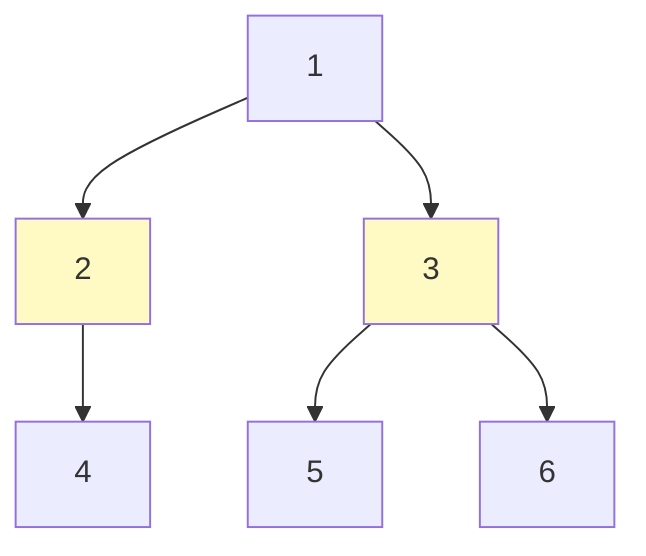

## 问题概述

二叉树是手撕算法最常考的数据结构。核心是掌握**四种遍历**（前序/中序/后序/层序）的递归与迭代写法，以及以「递归求深度」为基础的树形 DP 思维。

| 问题 | 核心 | 复杂度 |
|------|------|--------|
| 前/中/后序遍历 | 递归 / 栈模拟 | O(n) |
| 层序遍历 | 队列 BFS | O(n) |
| 最大深度 | 递归 `max(left, right) + 1` | O(n) |
| 二叉树直径 | 后序遍历，记录「边数」 | O(n) |

---

## 速查卡

- **前序**：根→左→右；**中序**：左→根→右；**后序**：左→右→根
- **递归模板**：三者只有「访问根」的时机不同，先序在递归前、中序在中间、后序在递归后
- **迭代**：前序用栈（先压右再压左）；中序一路压左孩子；后序用「前序改序 + 反转」或双栈
- **层序**：队列，每层记录 `size` 分层输出
- **最大深度**：`max(maxDepth(left), maxDepth(right)) + 1`
- **直径**：任意两节点最长路径 = `left 深度 + right 深度`（边数），后序遍历时更新全局最大

---

## 一、四种遍历

给定二叉树：

```
        1
       / \
      2   3
     / \   \
    4   5   6
```

| 遍历 | 顺序 |
|------|------|
| 前序（preorder） | 1 → 2 → 4 → 5 → 3 → 6 |
| 中序（inorder） | 4 → 2 → 5 → 1 → 3 → 6 |
| 后序（postorder） | 4 → 5 → 2 → 6 → 3 → 1 |
| 层序（level） | 1 → 2 → 3 → 4 → 5 → 6 |

### 递归写法（三序）

三者只有「访问当前节点」的位置不同：

```java
// 前序
void preorder(TreeNode root) {
    if (root == null) return;
    visit(root);          // 先访问根
    preorder(root.left);
    preorder(root.right);
}

// 中序
void inorder(TreeNode root) {
    if (root == null) return;
    inorder(root.left);
    visit(root);          // 中间访问根
    inorder(root.right);
}

// 后序
void postorder(TreeNode root) {
    if (root == null) return;
    postorder(root.left);
    postorder(root.right);
    visit(root);          // 最后访问根
}
```

### 迭代写法

**前序（栈）**：先压右孩子再压左孩子，弹出即访问：

```java
List<Integer> preorderIter(TreeNode root) {
    List<Integer> res = new ArrayList<>();
    if (root == null) return res;
    Deque<TreeNode> stack = new ArrayDeque<>();
    stack.push(root);
    while (!stack.isEmpty()) {
        TreeNode node = stack.pop();
        res.add(node.val);
        if (node.right != null) stack.push(node.right);  // 先右
        if (node.left != null) stack.push(node.left);    // 后左（左先出）
    }
    return res;
}
```

**中序（栈）**：一路向左压栈，弹栈访问，再转向右子树：

```java
List<Integer> inorderIter(TreeNode root) {
    List<Integer> res = new ArrayList<>();
    Deque<TreeNode> stack = new ArrayDeque<>();
    TreeNode curr = root;
    while (curr != null || !stack.isEmpty()) {
        while (curr != null) {       // 一路向左
            stack.push(curr);
            curr = curr.left;
        }
        curr = stack.pop();          // 左子树空了，弹出访问
        res.add(curr.val);
        curr = curr.right;           // 转向右子树
    }
    return res;
}
```

**后序（前序改序 + 反转）**：后序 = 「根→右→左」的反转。把前序的左右压栈顺序对调，得到「根→右→左」，再反转结果：

```java
List<Integer> postorderIter(TreeNode root) {
    List<Integer> res = new ArrayList<>();
    if (root == null) return res;
    Deque<TreeNode> stack = new ArrayDeque<>();
    stack.push(root);
    while (!stack.isEmpty()) {
        TreeNode node = stack.pop();
        res.add(node.val);
        if (node.left != null) stack.push(node.left);   // 先左（改序）
        if (node.right != null) stack.push(node.right); // 后右
    }
    Collections.reverse(res);  // 「根→右→左」反转 → 「左→右→根」
    return res;
}
```

### 层序（BFS 队列）

```java
List<List<Integer>> levelOrder(TreeNode root) {
    List<List<Integer>> res = new ArrayList<>();
    if (root == null) return res;
    Queue<TreeNode> queue = new LinkedList<>();
    queue.offer(root);
    while (!queue.isEmpty()) {
        int size = queue.size();   // 关键：记录当前层的节点数
        List<Integer> level = new ArrayList<>();
        for (int i = 0; i < size; i++) {
            TreeNode node = queue.poll();
            level.add(node.val);
            if (node.left != null) queue.offer(node.left);
            if (node.right != null) queue.offer(node.right);
        }
        res.add(level);
    }
    return res;
}
```

> 层序关键：用 `size` 记录当前层节点数，否则无法区分「哪几个节点属于同一层」。

---

## 二、最大深度（104）

```java
public int maxDepth(TreeNode root) {
    if (root == null) return 0;
    return Math.max(maxDepth(root.left), maxDepth(root.right)) + 1;
}
```

一棵树的深度 = 左右子树深度的最大值 + 1。这是「树形 DP」最基础的形态：**自底向上，用子问题的解算父问题**。

---

## 三、二叉树直径（543）

### 问题描述

直径是树中任意两节点之间的**最长路径**（按边数计），可能不经过根节点。

### 思路

对每个节点，经过它的最长路径 = 左子树深度 + 右子树深度。遍历所有节点，取最大值。用后序遍历「自底向上」，在求深度的过程中顺带更新全局最大直径。

```java
int ans = 0;

public int diameterOfBinaryTree(TreeNode root) {
    depth(root);
    return ans;
}

// 返回节点 node 的深度，同时更新全局最大直径
private int depth(TreeNode node) {
    if (node == null) return 0;
    int left = depth(node.left);    // 左子树深度（边数）
    int right = depth(node.right);  // 右子树深度（边数）
    ans = Math.max(ans, left + right);  // 经过 node 的路径 = left + right
    return Math.max(left, right) + 1;   // node 的深度
}
```



以节点 1 为例：左子树深度 2（1→2→4），右子树深度 2（1→3→5/6），经过 1 的路径 = 4。但直径可能不经过根——所以必须遍历**每个节点**，取全局最大。

---

## 自测

1. **前序、中序、后序遍历的递归写法唯一区别是什么？**
   <br/>→ 唯一区别是「访问根节点的时机」：前序在递归左右之前，中序在中间，后序在递归左右之后。左右子树的递归顺序（先左后右）始终不变。

2. **层序遍历为什么要记录 `size`？不记录会怎样？**
   <br/>→ 记录 `size` 才能把「当前层的节点」与「下一层新入队的节点」区分开，实现按层分组输出。不记录则所有节点混在一起，无法分层。

3. **后序遍历的迭代「前序改序 + 反转」是什么原理？**
   <br/>→ 后序是「左→右→根」，其逆序是「根→右→左」。把前序（根→左→右）的左右压栈顺序对调，就得到「根→右→左」，反转结果即「左→右→根」。

4. **二叉树直径为什么可能不经过根节点？如何保证找到全局最大？**
   <br/>→ 最长路径可能完全在某个子树内。解法是在求每个节点深度（后序遍历）时，顺带计算 `left + right` 并更新全局 `ans`，这样每个节点作为「转折点」的路径都被考虑到了。

5. **「最大深度」和「直径」的递归返回值和全局变量分别代表什么？**
   <br/>→ 深度：递归返回 `max(left, right) + 1`（节点高度），用于给父节点计算。直径：额外用一个全局 `ans` 记录 `left + right` 的最大值，因为「经过某节点的路径」不一定等于「最终答案」，需要全局比较。
