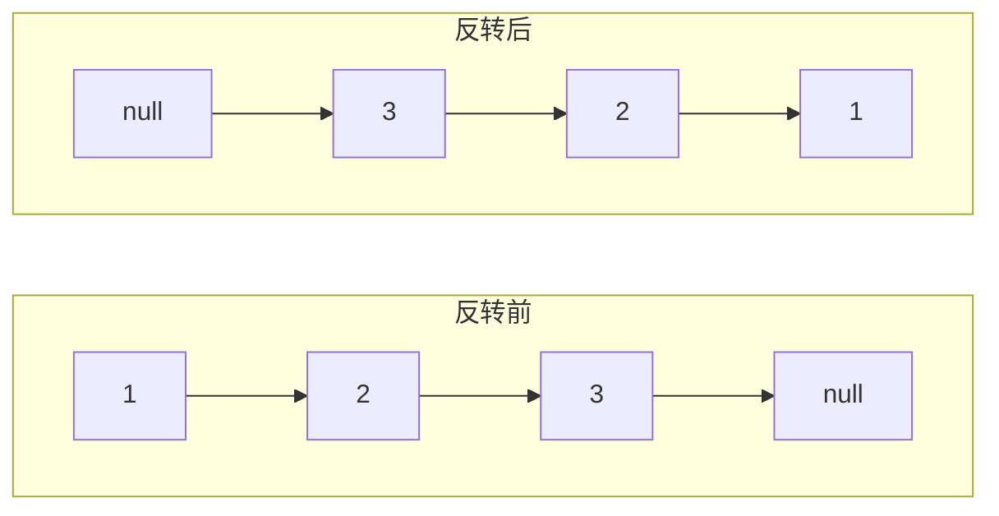

## 问题概述

链表是手撕算法的高频考点，核心技巧只有两个：**哨兵节点（dummy）** 和 **双指针（快慢/前后）**。掌握这两个技巧能解决大部分链表题。

| 问题 | 核心技巧 | 复杂度 |
|------|---------|--------|
| 反转链表 | 三指针迭代 / 递归 | O(n) |
| 环形链表检测 | 快慢指针 | O(n) |
| 找链表中点 | 快慢指针（fast 走 2 步） | O(n) |
| 合并有序链表 | 哨兵节点 + 双指针 | O(n+m) |

---

## 速查卡

- **反转链表（迭代）**：`prev/curr/next` 三指针，`curr.next = prev` 后三者右移
- **反转链表（递归）**：先反转 `head.next` 之后的子链表，再让 `head.next.next = head`
- **快慢指针**：`slow` 走 1 步、`fast` 走 2 步；判环看是否相遇，找中点看 `fast` 到末尾时 `slow` 的位置
- **哨兵节点**：`dummy.next = head`，统一处理头节点删除/插入的边界
- **判环入口**：相遇后 `slow` 回 head，两者同速走，再次相遇即为环入口

---

## 一、反转链表（206）

### 问题描述

反转单链表，返回反转后的头节点。

### 解法一：迭代（三指针）

```java
public ListNode reverseList(ListNode head) {
    ListNode prev = null;
    ListNode curr = head;
    while (curr != null) {
        ListNode next = curr.next;  // ① 暂存下一个
        curr.next = prev;           // ② 反转指向
        prev = curr;                // ③ prev 右移
        curr = next;                // ④ curr 右移
    }
    return prev;  // prev 最终停在原尾节点，即新头
}
```



**关键**：必须先用 `next` 暂存 `curr.next`，否则 `curr.next = prev` 后原链表就断了。

### 解法二：递归

```java
public ListNode reverseList(ListNode head) {
    if (head == null || head.next == null) return head;  // 空或单节点
    ListNode newHead = reverseList(head.next);  // 先反转子链表
    head.next.next = head;  // 让下一个节点反过来指向自己
    head.next = null;       // 断开原指向，防止成环
    return newHead;
}
```

递归思路：**把「反转以 head 为头的链表」转化为「反转以 head.next 为头的子链表 + 处理 head」**。递归到底后，从尾到头逐个扭转指向。

---

## 二、快慢指针

### 核心模板

```java
ListNode slow = head, fast = head;
while (fast != null && fast.next != null) {
    slow = slow.next;        // 慢指针走 1 步
    fast = fast.next.next;   // 快指针走 2 步
}
// 循环结束时：
// 1. 若判环：fast 与 slow 相遇 → 有环
// 2. 若找中点：slow 指向中点（或中点的前一个，取决于 fast 起点）
```

### 找链表中点

- `fast` 走 2 步、`slow` 走 1 步，`fast` 到末尾时 `slow` 恰好在中点
- 若 `fast` 从 `head` 开始：偶数个节点时 `slow` 停在**后半段起点**（中间偏右）

```java
ListNode findMiddle(ListNode head) {
    ListNode slow = head, fast = head;
    while (fast != null && fast.next != null) {
        slow = slow.next;
        fast = fast.next.next;
    }
    return slow;
}
```

---

## 三、环形链表（141 / 142）

### 判断是否有环（141）

快慢指针，若 `fast` 能追上 `slow` 则说明有环：

```java
public boolean hasCycle(ListNode head) {
    ListNode slow = head, fast = head;
    while (fast != null && fast.next != null) {
        slow = slow.next;
        fast = fast.next.next;
        if (slow == fast) return true;  // 相遇 = 有环
    }
    return false;  // fast 到 null，无环
}
```

### 找环的入口（142）

```java
public ListNode detectCycle(ListNode head) {
    ListNode slow = head, fast = head;
    while (fast != null && fast.next != null) {
        slow = slow.next;
        fast = fast.next.next;
        if (slow == fast) {        // ① 快慢相遇
            slow = head;           // ② slow 回到起点
            while (slow != fast) { // ③ 同速前进
                slow = slow.next;
                fast = fast.next;
            }
            return slow;           // ④ 再次相遇 = 环入口
        }
    }
    return null;
}
```

**原理**：设链表头到环入口距离 `a`，环入口到相遇点距离 `b`，相遇点到环入口距离 `c`。相遇时 `fast` 走的路程是 `slow` 的两倍：`2(a+b) = a + b + n(b+c)`，化简得 `a = (n-1)(b+c) + c`——即从相遇点走 `c` 步再走若干整圈，恰好回到环入口，等于从头走 `a` 步。所以相遇后一个从头、一个从相遇点同速走，必在环入口相遇。

---

## 四、合并两个有序链表（21）

### 解法：哨兵节点 + 双指针

```java
public ListNode mergeTwoLists(ListNode l1, ListNode l2) {
    ListNode dummy = new ListNode(-1);  // 哨兵节点
    ListNode curr = dummy;
    while (l1 != null && l2 != null) {
        if (l1.val <= l2.val) {
            curr.next = l1;
            l1 = l1.next;
        } else {
            curr.next = l2;
            l2 = l2.next;
        }
        curr = curr.next;
    }
    curr.next = (l1 != null) ? l1 : l2;  // 剩余部分直接拼接
    return dummy.next;  // 真正的头是 dummy.next
}
```

**哨兵节点的作用**：避免对「头节点为 null」的特殊处理。没有 dummy 时，需要先判断 `l1` 和 `l2` 谁更小作为头，再循环；有了 dummy，所有节点统一「接在 curr 后面」。

---

## 自测

1. **反转链表迭代法为什么必须先暂存 `curr.next`？**
   <br/>→ `curr.next = prev` 会覆盖原指向，若不先暂存，下一步 `curr = next` 就找不到原来的下一个节点了，链表断裂。

2. **快慢指针为什么能判断链表有环？快指针一定能追上慢指针吗？**
   <br/>→ 有环时快慢指针都在环内兜圈，快指针每次相对慢指针靠近 1 步，所以一定会在有限步内相遇（不会跳过）。无环时 fast 会先到 null。

3. **找环入口的数学原理是什么？**
   <br/>→ 相遇时 `2(a+b) = a + b + n(b+c)` → `a = (n-1)(b+c) + c`，说明从头走 a 步 == 从相遇点走 c 步（再绕若干整圈）。故相遇后一个回 head、一个从相遇点同速前进，必在入口相遇。

4. **哨兵节点（dummy）解决什么问题？什么时候需要？**
   <br/>→ 统一「头节点可能被修改」的边界情况，避免单独判断 `head == null` 或「新头是谁」。合并、删除（可能删头）、翻转区间等都需要 dummy。

5. **反转链表递归版中 `head.next.next = head` 和 `head.next = null` 分别做什么？**
   <br/>→ `head.next.next = head` 让下一个节点反过来指向自己（扭转指向）；`head.next = null` 断开原指向，否则原头尾会形成环导致死循环。
