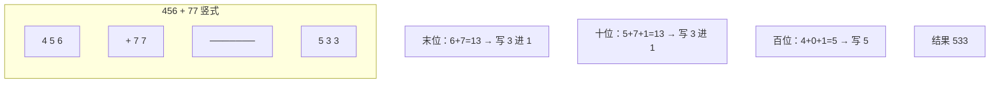

## 问题概述

字符串类手撕题考的是「模拟」能力——把日常对数字/字符串的操作用代码一步步写清楚。核心技巧是**从低位/末尾处理、维护进位/边界**。

| 问题 | 核心 | 复杂度 |
|------|------|--------|
| 大数相加 | 末位对齐逐位相加 + 进位 | O(max(m,n)) |
| 整数转罗马数字 | 贪心，从大到小匹配 | O(1) |

---

## 速查卡

- **大数相加**：两指针从字符串末尾向前，逐位相加 + 进位 `carry`，结果反转
- **进位处理**：`sum = a + b + carry`，`carry = sum / 10`，当前位 `sum % 10`
- **整数转罗马**：从大到小贪心，能减则减，减几次追加几次
- **罗马转整数**：从右向左，小于右侧就减，否则加

---

## 一、字符串相加（大数相加，415）

### 问题描述

给定两个字符串形式的非负整数 `num1`、`num2`，返回它们的和（不能用 `BigInteger` 或转成整数）。

### 思路

模拟竖式加法：从末位开始逐位相加，维护进位 `carry`：

```java
public String addStrings(String num1, String num2) {
    StringBuilder sb = new StringBuilder();
    int i = num1.length() - 1;
    int j = num2.length() - 1;
    int carry = 0;
    while (i >= 0 || j >= 0 || carry != 0) {
        int a = (i >= 0) ? num1.charAt(i) - '0' : 0;
        int b = (j >= 0) ? num2.charAt(j) - '0' : 0;
        int sum = a + b + carry;
        carry = sum / 10;
        sb.append(sum % 10);
        i--; j--;
    }
    return sb.reverse().toString();
}
```



**关键点**：

1. 循环条件要包含 `carry != 0`——两数都遍历完但还有进位时（如 `9 + 1`），还需再处理一次
2. `charAt(i) - '0'` 把字符转数字
3. 结果从低位到高位 `append`，最后 `reverse()`

---

## 二、整数转罗马数字（12）

### 问题描述

将 `1 ~ 3999` 的整数转成罗马数字。

罗马数字符号：`I(1) V(5) X(10) L(50) C(100) D(500) M(1000)`。特殊组合（减法规则）：`IV(4) IX(9) XL(40) XC(90) CD(400) CM(900)`。

### 解法：贪心

把「基础符号 + 特殊组合」按值从大到小排好，能减则减：

```java
public String intToRoman(int num) {
    int[] values = {1000, 900, 500, 400, 100, 90, 50, 40, 10, 9, 5, 4, 1};
    String[] symbols = {"M", "CM", "D", "CD", "C", "XC", "L", "XL", "X", "IX", "V", "IV", "I"};

    StringBuilder sb = new StringBuilder();
    for (int i = 0; i < values.length; i++) {
        while (num >= values[i]) {
            num -= values[i];
            sb.append(symbols[i]);
        }
    }
    return sb.toString();
}
```

**为什么贪心成立**：罗马数字的本质是「用尽量少的符号表示」，从大到小匹配，每次选「不超过当前值的最大符号」，一定是最优的。例如 1994：`M(1000) + CM(900) + XC(90) + IV(4)` = "MCMXCIV"。

### 扩展：罗马数字转整数（13）

从右向左遍历，当前值小于右侧值就减，否则加：

```java
public int romanToInt(String s) {
    Map<Character, Integer> map = new HashMap<>();
    map.put('I', 1); map.put('V', 5); map.put('X', 10); map.put('L', 50);
    map.put('C', 100); map.put('D', 500); map.put('M', 1000);

    int res = 0;
    for (int i = s.length() - 1; i >= 0; i--) {
        int val = map.get(s.charAt(i));
        // 当前值小于右侧值（如 IV 中的 I），说明是减法组合
        if (i < s.length() - 1 && val < map.get(s.charAt(i + 1))) {
            res -= val;
        } else {
            res += val;
        }
    }
    return res;
}
```

**原理**：罗马数字通常从左到右递减，遇到「小的在大的左边」（如 IV、IX）才是减法。从右往左看，若当前值小于右边已处理的最大值，就属于减法组合。

---

## 自测

1. **大数相加的循环条件为什么还要判断 `carry != 0`？**
   <br/>→ 两数都遍历完但还有进位时（如 `9 + 1 = 10`），若不判断会丢掉最高位的进位 1。`carry != 0` 保证最后一轮进位也被处理。

2. **大数相加为什么最后要 `reverse()`？**
   <br/>→ 从末位（个位）向前处理，`append` 的顺序是「个位、十位、百位…」，与实际数字顺序相反，需反转得到正确结果。

3. **整数转罗马数字为什么贪心是正确且最优的？**
   <br/>→ 罗马数字用「尽量少的符号」表示。从大到小匹配、每次取不超过当前值的最大符号，天然得到最少符号组合。特殊组合（4/9/40/90…）已预先列入，覆盖了减法规则。

4. **罗马数字转整数从右往左遍历，如何区分加减？**
   <br/>→ 若当前值小于右侧相邻值（如 IV 中的 I），说明是「减法组合」，应减去当前值；否则加上。从右往左能方便地比较当前与「右边已处理的最大值」。

5. **大数相加为什么不直接把字符串转成 int/long 相加？**
   <br/>→ 字符串可能远超 int/long 上限（如几百位），转整数会溢出。必须逐位模拟竖式加法，只保留单次「进位」和「个位」。
