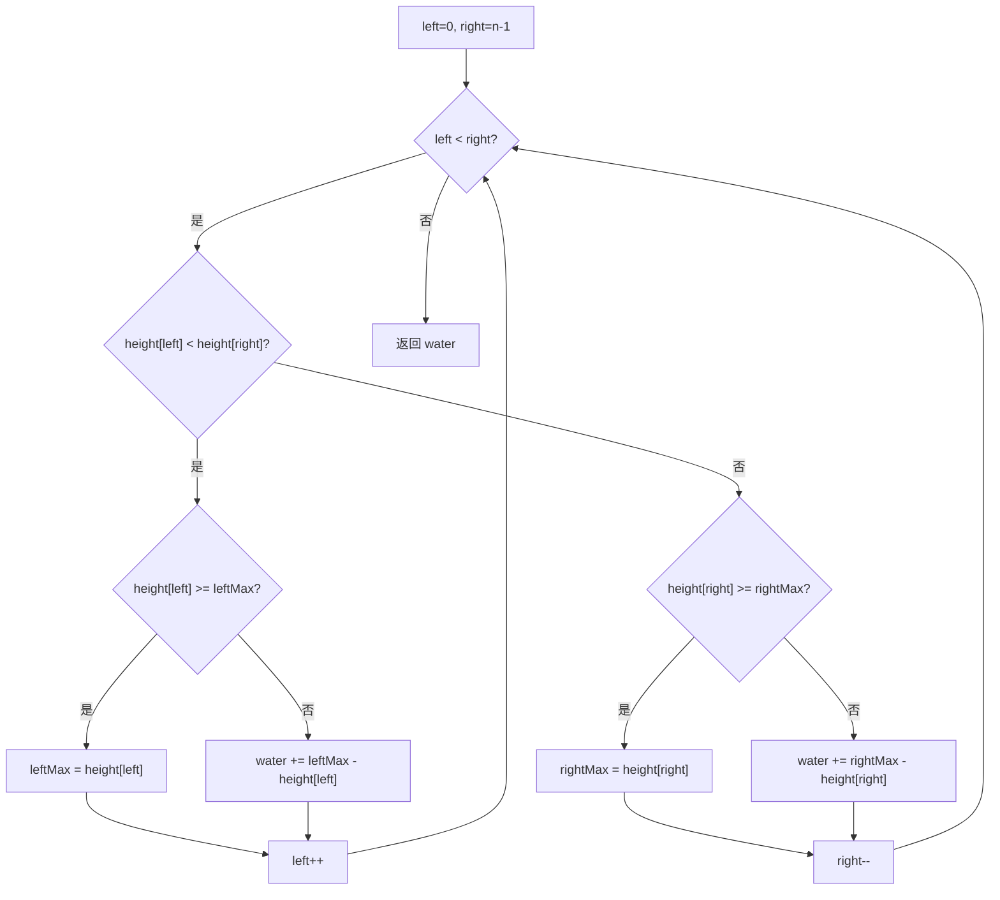

## 问题描述

给定 `n` 个非负整数表示每个宽度为 1 的柱子的高度图，计算按此排列的柱子，下雨之后能接多少雨水。

**示例 1:**
- 输入: `height = [0, 1, 0, 2, 1, 0, 1, 3, 2, 1, 2, 1]`
- 输出: `6`
- 解释: 蓝色部分表示雨水，总共 6 个单位

**示例 2:**
- 输入: `height = [4, 2, 0, 3, 2, 5]`
- 输出: `9`

**提示:**
- `n == height.length`
- `1 <= n <= 2 × 10⁴`
- `0 <= height[i] <= 10⁵`

## 解法：双指针

### 思路

使用双指针 `left` 和 `right` 分别从数组两端向中间移动：

1. 维护 `leftMax` 和 `rightMax` 分别记录左边和右边的最大高度
2. 每次移动较矮一侧的指针：
   - 如果当前高度 ≥ 该侧最大高度，更新最大高度
   - 否则，当前柱子可以接到雨水：`water += maxHeight - height[current]`
3. 核心原理：**木桶效应** — 能接多少水由较矮的一侧决定



### 复杂度分析

| 指标 | 值 |
|------|-----|
| 时间复杂度 | O(n) — 每个元素访问一次 |
| 空间复杂度 | O(1) — 只用了 4 个变量 |

### Java 实现

```java
class Solution {
    public int trap(int[] height) {
        if (height == null || height.length == 0) {
            return 0;
        }

        int left = 0, right = height.length - 1;
        int leftMax = 0, rightMax = 0;
        int water = 0;

        while (left < right) {
            if (height[left] < height[right]) {
                if (height[left] >= leftMax) {
                    leftMax = height[left];
                } else {
                    water += leftMax - height[left];
                }
                left++;
            } else {
                if (height[right] >= rightMax) {
                    rightMax = height[right];
                } else {
                    water += rightMax - height[right];
                }
                right--;
            }
        }

        return water;
    }
}
```

## 关键点

- **双指针 vs 单调栈**: 双指针 O(1) 空间最优；单调栈解法 O(n) 空间但思路不同（按行累加）
- **移动策略**: 总是移动较矮一侧的指针，因为能接的水量由矮侧决定
- **左右对称**: 两侧逻辑完全对称，`leftMax` 和 `rightMax` 分别扮演左右边界角色
- **前缀/后缀最大值**: 另一种思路是用 `leftMax[i]` 和 `rightMax[i]` 前缀数组，但需要 O(n) 空间
