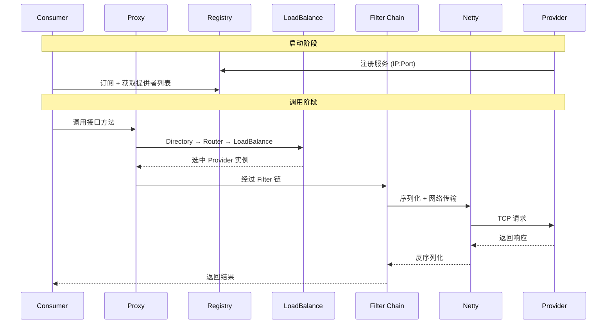

## 概述

Dubbo 是高性能、轻量级的开源 Java RPC 框架，提供三大核心能力：
- 面向接口的远程方法调用
- 智能容错和负载均衡
- 服务自动注册和发现

**Dubbo 3.x 新特性**：
- **Triple 协议**：基于 gRPC 的下一代协议，支持 HTTP/1.1、HTTP/2、Streaming
- **应用级服务发现**：从接口级升级为应用级，降低注册中心存储压力
- **云原生**：原生支持 Kubernetes、Mesh
- **统一路由规则**：支持实例级和 API 级路由

## 架构核心

| 能力 | 说明 |
|------|------|
| **透明远程调用** | 动态代理（Javassist/JDK Proxy）将接口调用转为网络请求 |
| **服务注册与发现** | 注册中心（Zookeeper/Nacos/Redis）存储元数据 |
| **多协议与序列化** | 默认 Dubbo 协议（Netty，单长连接，异步 NIO），支持 Hessian2、Protobuf |
| **集群容错与负载均衡** | Failover、Failfast、Failsafe、Broadcast 等策略 |
| **SPI 扩展点** | 全插件化架构，自适应扩展、自动激活、Wrapper 机制 |

## 解决的问题

- 解决传统 HTTP REST 传输效率和序列化开销上的性能瓶颈
- 为大规模服务化提供服务治理能力
- 屏蔽远程调用复杂度，加速从单体到分布式的演进

---

## Top 面试问题

### Q1：RPC 调用全链路流程

**服务暴露**：提供者通过 `ServiceConfig` 解析注解 → 反射生成 Invoker → 协议端口绑定 → 注册中心注册。

**服务引用**：消费者通过 `ReferenceConfig` 生成代理 → 订阅提供者 URL → Directory 缓存 → Cluster 容错 → Router 过滤 → LoadBalance 选择 → Filter 链 → Protocol → Netty 调用。

**调用链**：Proxy → Cluster Invoker → Directory → Router → LoadBalance → Filter Chain → Protocol → Exchange → Transport → Netty

### Q2：集群容错与负载均衡

**容错策略**：

| 策略 | 说明 |
|------|------|
| Failover（默认） | 失败重试其他服务器 |
| Failfast | 立即报错 |
| Failsafe | 忽略异常 |
| Failback | 失败后定时重发 |
| Forking | 并行调用，一个成功即返回 |
| Broadcast | 广播所有提供者 |

**负载均衡**：Random（权重随机）、RoundRobin（加权轮询）、LeastActive（最少活跃）、ConsistentHash（同参数同提供者）。

**降级**：`mock` 属性，`force:return+null` 强制降级，`fail:return+null` 失败降级。

### Q3：Dubbo SPI vs JDK SPI

| 维度 | JDK SPI | Dubbo SPI |
|------|---------|-----------|
| 加载 | 一次性全加载 | 按需加载，key-value 指定 |
| AOP/IoC | 不支持 | Wrapper 增强、自适应注入 |

**自适应扩展**：`@Adaptive` 或动态代理，根据 URL 参数选择实现。
**自动激活**：`@Activate` + group + order，如 Filter 链自动激活。
