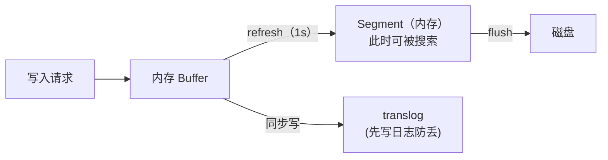

## 速查卡

- **ES 是什么**：基于 Lucene 的分布式搜索引擎，用倒排索引做全文检索，近实时（NRT）
- **倒排索引**：Term → 文档 ID 列表（posting list），「由词找文档」而非「由文档找词」
- **分词**：Analyzer（char filter → tokenizer → token filter），中文常用 IK 分词器
- **段（Segment）**：Lucene 不可变的最小索引单元；新写入进 buffer，`refresh` 生成新段才能被搜到
- **refresh**：默认 1s 一次，把 buffer 落成段，实现近实时搜索（1s 延迟）
- **flush**：把段持久化到磁盘 + 提交 translog，默认 30min 或 translog 满
- **段合并**：小段合并成大段，减少段数、提升查询性能、回收删除空间

---

## 一、什么是 ES

Elasticsearch 是基于 **Lucene** 的分布式搜索引擎，核心能力是**全文检索**和**近实时（NRT）搜索**。它把数据分片（shard）存储，每个 shard 是一个 Lucene 索引。

| 概念 | 说明 |
|------|------|
| 文档（Document） | 一条数据，JSON 格式 |
| 索引（Index） | 一类文档的集合，类比 MySQL 的表 |
| 分片（Shard） | 索引被水平切分，主分片 + 副本分片 |
| 节点（Node） | 一个 ES 实例 |

---

## 二、倒排索引

### 为什么需要倒排索引

正排索引是「文档 → 词」（一本书按顺序翻），全文检索要「词 → 文档」（知道词，找包含它的所有文档），倒排索引就是为此设计。

```
文档 1："小米手机 拍照 好"
文档 2："华为手机 续航 强"

正排：doc1 → [小米, 手机, 拍照, 好]
倒排：
  小米   → [doc1]
  华为   → [doc2]
  手机   → [doc1, doc2]
  拍照   → [doc1]
  ...
```

### 倒排索引的结构

| 组成 | 说明 |
|------|------|
| **Term Dictionary** | 所有词的字典，排序存储（可用 FST 压缩、二分查找） |
| **Posting List** | 每个词对应的文档 ID 列表 |

查询「手机」→ 字典定位到 `手机` → posting list `[doc1, doc2]` → 直接返回命中文档。

**为什么快**：不用扫描所有文档，直接从词典定位词，再取 posting list。词字典有序 + FST（有限状态转换器）压缩，支持 O(词长) 查找。

---

## 三、分词（Analyzer）

英文天然空格分词，中文需要专门分词器。Analyzer 由三部分组成：

| 组件 | 作用 | 例子 |
|------|------|------|
| **Character Filter** | 预处理字符 | 去掉 HTML 标签 |
| **Tokenizer** | 切分词 | 「小米手机」→ 小米/手机 |
| **Token Filter** | 词的后处理 | 转小写、去停用词 |

中文常用 **IK 分词器**（支持 ik_smart 粗粒度 / ik_max_word 细粒度）。分词结果直接决定「能不能搜到」——「小米手机」若被切成「小米手」「机」，搜「小米」就匹配不到。

---

## 四、段（Segment）与近实时搜索

### 段是不可变的最小索引单元

Lucene 索引由多个 **Segment（段）** 组成，每个段是一个独立的倒排索引。**段一旦生成就不可变**，删除只是标记为「已删除」，合并时才真正清除。

### refresh / flush 的区别（高频考点）

| 操作 | 做什么 | 触发 | 意义 |
|------|--------|------|------|
| **refresh** | buffer 中的数据生成新 Segment（**在内存**） | 默认每 1s | 让新数据可被搜索（近实时） |
| **flush** | 把 Segment 持久化到磁盘 + 提交 translog | 默认 30min 或 translog 满 | 保证数据不丢（持久化） |



**为什么是「近实时」而非「实时」**：数据写入后要等下一次 `refresh`（最多 1s）生成 Segment 才能被搜到，所以有 ~1s 的延迟。`refresh` 越频繁搜索越实时，但写入和段合并开销越大。

**translog 的作用**：写入先落 translog（WAL 日志），即使节点宕机，重启后从 translog 恢复 buffer 中未 flush 的数据。

### 段合并（Segment Merge）

小段太多会导致查询变慢（要遍历所有段）、内存占用大、删除空间无法回收。后台线程周期性把**小段合并成大段**：

- 减少段数量，提升查询性能
- 回收已删除文档占用的空间
- 合并是**资源密集型**操作，会消耗 IO/CPU，大流量时需限流

---

## 五、ES 的适用边界

### 为什么不适合当主存储

| 问题 | 说明 |
|------|------|
| **近实时非实时** | 写入有 ~1s 延迟才可见，不满足强一致 |
| **无事务** | 不支持 ACID 事务（多文档原子性弱） |
| **内存消耗大** | JVM 堆 + Lucene 内存，成本高 |
| **写入放大** | refresh/段合并带来额外 IO |

典型用法：**ES 作为「读模型」**——主数据存 MySQL，通过 binlog 同步到 ES，用 ES 提供全文检索/聚合查询，MySQL 保数据一致性和事务。

---

## 自测

1. **倒排索引和正排索引的区别？为什么全文检索用倒排？**
   <br/>→ 正排是「文档 → 词」（顺序扫描文档找词），倒排是「词 → 文档」（直接定位词取 posting list）。全文检索是「给定词找文档」，倒排索引免去全量扫描，配合有序词典 + FST 压缩实现快速定位。

2. **ES 的 refresh 和 flush 有什么区别？各自触发时机？**
   <br/>→ refresh 把内存 buffer 生成新 Segment（仍在内存），默认 1s，让新数据可被搜索（近实时）。flush 把 Segment 持久化到磁盘并提交 translog，默认 30min 或 translog 满，保证数据不丢。

3. **为什么 ES 是「近实时」而不是「实时」搜索？**
   <br/>→ 数据写入后先进入内存 buffer，要等下一次 refresh（最多 1s）生成 Segment 才能被搜到，所以有 ~1s 延迟。这是「搜索实时性」和「写入/合并开销」的权衡。

4. **Lucene 的段为什么设计成不可变？删除是如何实现的？**
   <br/>→ 不可变便于缓存和并发读，避免加锁。删除只是标记「已删除」，不立即物理删除，等段合并时才真正清除并回收空间。

5. **ES 为什么不直接当数据库用？典型架构是什么？**
   <br/>→ ES 近实时、无事务、内存成本高、写入放大，不适合强一致主存储。典型做法：MySQL 做主存储，binlog 同步到 ES，ES 提供全文检索和聚合查询。
