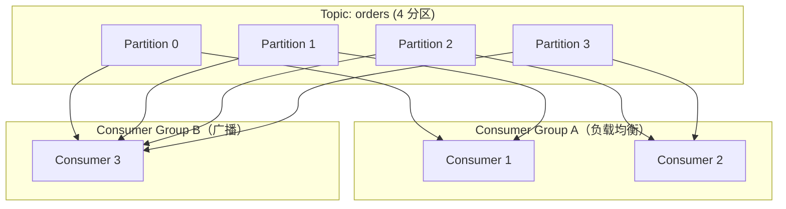

## 概述

Kafka 是一个**分布式流平台**，三个关键功能：
1. 发布和订阅记录流（类似消息队列）
2. 以容错的持久方式存储记录流
3. 在记录发生时处理流

## 速查卡

- **核心概念**：Topic → 分区（有序不可变序列 + offset）→ Leader 处理读写 → Follower 被动复制 → 复制因子 N 容忍 N-1 故障
- **消费者组**：组内负载均衡（类似队列），组间广播（类似发布-订阅），分区数 ≥ 消费者实例数
- **三重角色**：消息系统（分区并行+排序）→ 存储系统（磁盘持久化，线性扩展）→ 流处理（相同方式处理历史和未来数据）
- **KRaft**（Kafka 3.3+）：Raft 协议替代 ZooKeeper 管理元数据，4.0 移除 ZK 依赖
- **生产端保证**：acks=all + 幂等（enable.idempotence）+ 重试，min.insync.replicas ≥ 2
## 核心概念

- Kafka 集群运行在一个或多个服务器上
- 记录流存储在 **Topic** 中
- 每条记录：键 + 值 + 时间戳

## 四个核心 API

| API | 说明 |
|-----|------|
| **Producer API** | 发布记录流到 Topic |
| **Consumer API** | 订阅 Topic 并处理记录流 |
| **Streams API** | 流处理器，消费输入流产生输出流 |
| **Connector API** | 可复用连接器（如关系数据库 CDC） |

---

## Topic 与日志分区

每个 Topic 维护一个**分区日志**：
- 分区是有序、不可变的记录序列
- 记录有顺序 ID：**偏移量（offset）**
- 可配置保留期限持久保存（如 2 天），性能与数据大小无关

**消费者只需维护偏移量**，可随意重置：回退重新处理或跳到最新记录。消费者轻量，不影响集群和其他消费者。

---

## 分区与复制

### 分区用途

1. **扩展**：日志可超出单服务器容量
2. **并行**：多消费者实例并行处理

### Leader 与 Follower

- 每个分区有一个 **Leader** 处理所有读写
- **Follower** 被动复制 Leader
- Leader 故障 → Follower 自动成为新 Leader
- 复制因子 N → 可容忍 **N-1** 个服务器故障

---

## 消费者组

| 场景 | 行为 |
|------|------|
| 同一消费者组 | 记录在实例间负载均衡（类似队列） |
| 不同消费者组 | 记录广播到所有组（类似发布-订阅） |

> Kafka 消费者组统一了队列和发布-订阅两种模式。每个 Topic 同时具备两种属性。

**排序保证**：每个分区由一个消费者独占，确保分区内顺序。但消费者实例**不能超过分区数**。

---

## Kafka 的三重角色

### 作为消息系统

相比传统系统：分区提供并行能力和负载均衡，同时保证分区内排序。

### 作为存储系统

数据写入磁盘并复制容错。磁盘结构线性扩展，50KB 或 50TB 性能相同。

### 作为流处理

结合存储和低延迟订阅，流应用可以**相同方式处理过去和未来的数据** — 包含批处理和消息驱动。

---

## 关键对比

| 特性 | 传统队列 | 发布-订阅 | Kafka |
|------|:------:|:------:|:-----:|
| 多订阅者 | ✗ | ✓ | ✓ |
| 扩展处理 | ✓ | ✗ | ✓ |
| 分区内排序 | — | — | ✓ |

---

## KRaft：去 ZooKeeper 化

从 **Kafka 3.3+** 开始，KRaft（Kafka Raft）模式生产就绪：

- 用内部 Raft 共识协议替代 ZooKeeper 管理元数据
- 简化部署架构，不再需要运维 ZooKeeper 集群
- 支持百万级分区，元数据恢复更快
- **Kafka 4.0 将移除 ZooKeeper 依赖**，KRaft 成为唯一模式

> 新项目应优先使用 KRaft 模式部署。

---

## 自测

1. **Kafka 消费者组如何同时实现"队列"和"发布-订阅"两种模式？**
    → 同一消费者组内，每个分区只分配给一个消费者实例（负载均衡，类似队列）。不同消费者组独立消费同一 Topic 的全部消息（广播，类似发布-订阅）。Kafka 通过消费者组统一了两种模型。

2. **为什么消费者实例数不能超过分区数？多余的消费者会怎样？**
    → 每个分区只能被同一消费者组内的一个消费者消费。多余的消费者实例会处于空闲状态（不分配分区），浪费资源。正确做法：消费者实例数 ≤ 分区数。

3. **Kafka 为什么能作为存储系统？它的持久化设计有什么特点？**
    → 数据写入磁盘并复制容错（分区多副本）。磁盘读写是顺序 I/O（线性扩展），50KB 和 50TB 数据性能相同。可配置保留期限（如 7 天），消费者通过 offset 可重复消费历史数据。

4. **KRaft 模式相比 ZooKeeper 模式有什么优势？**
    → 简化部署（不需要运维 ZK 集群）、元数据恢复更快、支持百万级分区、统一架构减少运维复杂度。Kafka 4.0 将移除 ZK 依赖。
