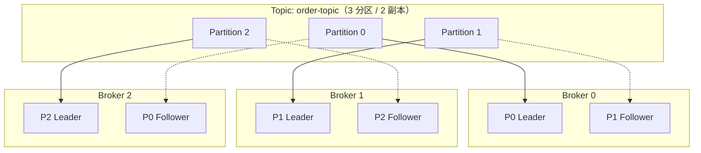
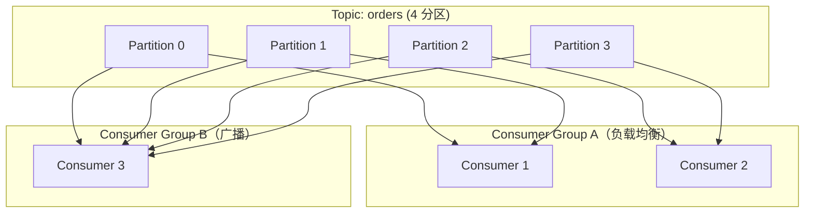

## 概述

Kafka 是一个**分布式流平台**，三个关键功能：
1. 发布和订阅记录流（类似消息队列）
2. 以容错的持久方式存储记录流
3. 在记录发生时处理流

---

## 速查卡

- **核心概念**：Topic（逻辑）→ 多分区（有序不可变日志，跨 Broker 分布）→ Leader 处理读写 → Follower 被动复制 → 复制因子 N 容忍 N-1 故障
- **消费者组**：组内负载均衡（类似队列），组间广播（类似发布-订阅），分区数 ≥ 消费者实例数
- **三重角色**：消息系统（分区并行+排序）→ 存储系统（磁盘持久化，线性扩展）→ 流处理（相同方式处理历史和未来数据）
- **生产端保证**：acks=all + 幂等（enable.idempotence）+ 重试，min.insync.replicas ≥ 2
- **vs 传统 MQ**：Kafka 高吞吐+保留回放+分区扩展（日志/流）；传统 MQ 丰富路由/延迟/事务/精确 ack（业务解耦）
- **KRaft**（Kafka 3.3+）：Raft 协议替代 ZooKeeper 管理元数据，4.0 移除 ZK 依赖

---

## 一、核心概念

Kafka 集群运行在一个或多个服务器上，记录流存储在 **Topic** 中，每条记录由「键 + 值 + 时间戳」组成。

### Topic 与日志分区

Topic 是**逻辑概念**，由**一个或多个分区（Partition）**组成，每个分区是一条**有序、不可变的日志**：
- 分区是有序、不可变的记录序列，不同分区分布在不同 Broker 上，所以 Topic 天然跨机器存储
- 记录有顺序 ID：**偏移量（offset）**
- 可配置保留期限持久保存（如 2 天），性能与数据大小无关

**消费者只需维护偏移量**，可随意重置：回退重新处理或跳到最新记录。消费者轻量，不影响集群和其他消费者。

**数据如何落到某个分区**

生产者写消息时由**分区器（Partitioner）**决定去向：

- 有 key：`hash(key) % 分区数` → 相同 key 恒进同一分区，保证业务顺序
- 无 key：轮询 / **粘性分区**（sticky，批量贴同一分区，减少网络请求）

**分区落盘：日志分段（Log Segment）**

单个分区数据大到单机也装不下时，靠分段滚动 + 保留清理，不会无限膨胀：

```text
partition-0 目录：
  00000000000000000000.log    (默认 1GB)
  00000000000000001000.log    (写满滚动新建)
  00000000000000002000.log    (当前写入中)
  00000000000000000000.index  (偏移量索引)
```

- 每段默认 `log.segment.bytes = 1GB`，写满滚动新建
- 旧段按 `retention`（时间/大小）删除，或 `compact` 压缩
- **分区是 Kafka 最小存储/并行单位，本身不能再拆到多台机器**，Topic 靠「多分区」水平扩展

### 分区与复制

**分区用途**：

1. **扩展**：日志可超出单服务器容量
2. **并行**：多消费者实例并行处理

**Broker 与机器**：

- **Broker 是逻辑服务节点**：一个 JVM 进程 + 独立存储目录，生产环境**一台机器部署一个 broker**（磁盘 I/O 是瓶颈，多 broker 共享磁盘无意义）
- 一台机器理论上可跑多个 broker（多进程 + 多端口），但仅测试环境用；副本必须分散到**不同机器**才有容灾意义

Topic 通过「多分区 + 多副本」跨机器分布：


```mermaid
flowchart TB
    subgraph Topic["Topic: order-topic（3 分区 / 2 副本）"]
        P0["Partition 0"]
        P1["Partition 1"]
        P2["Partition 2"]
    end

    subgraph B0["Broker 0"]
        L0["P0 Leader"]
        F1["P1 Follower"]
    end
    subgraph B1["Broker 1"]
        L1["P1 Leader"]
        F2["P2 Follower"]
    end
    subgraph B2["Broker 2"]
        L2["P2 Leader"]
        F0["P0 Follower"]
    end

    P0 --> L0
    P0 -.-> F0
    P1 --> L1
    P1 -.-> F1
    P2 --> L2
    P2 -.-> F2
```

**Leader 与 Follower**：

- 每个分区有一个 **Leader** 处理所有读写
- **Follower** 被动复制 Leader
- Leader 故障 → Follower 自动成为新 Leader
- 复制因子 N → 可容忍 **N-1** 个服务器故障

复制是**跨 broker 的网络复制**（Follower 主动拉取）：

- **Follower 主动向 Leader 发 Fetch 请求拉取数据**（pull 模式，非 push）
- Follower 返回自身 offset，Leader 据此判断落后程度
- **ISR（In-Sync Replicas）**：与 Leader 保持同步的副本集合，只有 ISR 内 Follower 才能接任新 Leader
- Leader/Follower 是**分区级**概念：同一 Broker 可同时是 P0 的 Leader、又是 P1 的 Follower

**分区数量规划**：

- 创建时指定，**只能增不能减**（减分区会破坏 key 映射与消费 offset）
- 不是越多越好：分区过多增加元数据、文件句柄、Leader 选举开销
- 经验值：分区数 ≈ 目标吞吐 / 单分区吞吐，且 ≥ 消费者并发数

### 消费者组


```mermaid
flowchart TB
    subgraph Topic["Topic: orders (4 分区)"]
        P0["Partition 0"]
        P1["Partition 1"]
        P2["Partition 2"]
        P3["Partition 3"]
    end

    subgraph CG1["Consumer Group A（负载均衡）"]
        C1["Consumer 1"]
        C2["Consumer 2"]
    end

    subgraph CG2["Consumer Group B（广播）"]
        C3["Consumer 3"]
    end

    P0 --> C1
    P1 --> C1
    P2 --> C2
    P3 --> C2

    P0 --> C3
    P1 --> C3
    P2 --> C3
    P3 --> C3
```

| 场景 | 行为 |
|------|------|
| 同一消费者组 | 记录在实例间负载均衡（类似队列） |
| 不同消费者组 | 记录广播到所有组（类似发布-订阅） |

> Kafka 消费者组统一了队列和发布-订阅两种模式。每个 Topic 同时具备两种属性。

**排序保证**：每个分区由一个消费者独占，确保分区内顺序。但消费者实例**不能超过分区数**。

---

## 二、四个核心 API

| API | 说明 |
|-----|------|
| **Producer API** | 发布记录流到 Topic |
| **Consumer API** | 订阅 Topic 并处理记录流 |
| **Streams API** | 流处理器，消费输入流产生输出流 |
| **Connector API** | 可复用连接器（如关系数据库 CDC） |

---

## 三、Kafka 的三重角色

### 作为消息系统

相比传统系统：分区提供并行能力和负载均衡，同时保证分区内排序。

### 作为存储系统

数据写入磁盘并复制容错。磁盘结构线性扩展，50KB 或 50TB 性能相同。

### 作为流处理

结合存储和低延迟订阅，流应用可以**相同方式处理过去和未来的数据** — 包含批处理和消息驱动。

---

## 四、Kafka vs 传统 MQ

### 核心定位差异

| 维度 | 传统 MQ（RabbitMQ / RocketMQ） | Kafka |
|------|-------------------------------|-------|
| 本质 | 消息中间件，重路由 / 投递 / ack | 分布式流平台 / 日志系统，重顺序存储与回放 |
| 吞吐量 | 万级 TPS | 百万级 TPS（顺序写 + 批量 + 零拷贝） |
| 消息保留 | 消费后即删除 | 默认保留（可配置），消费后仍可回放 |
| 消费语义 | 单条 ack、TTL、死信、优先级、延迟 | 按 offset 顺序消费，无单条 ack / 优先级 |
| 有序性 | 单队列内有序（多消费者破坏） | 分区内有序，多分区并行 |
| 扩展性 | 集群 / 镜像队列，扩展复杂 | 分区天然水平扩展 |
| 延迟 | 微秒~毫秒，实时性高 | 批量设计，毫秒级，吞吐优先 |
| 消费模型 | push（RabbitMQ） | pull（消费者组） |

### 适用场景

**选 Kafka**（日志 / 流 / 回放）：
- 日志采集、埋点、监控指标、用户行为分析
- 实时 / 离线数据管道、CDC（binlog 同步）
- 事件溯源、需要重复消费和回放历史数据
- 海量数据、超高吞吐，对单条消息延迟不敏感

**选传统 MQ**（业务解耦 / 复杂路由）：
- 业务系统间异步解耦（订单 → 库存 → 通知）
- 需要复杂路由、优先级、延迟消息、死信队列
- 需要事务消息、精确可靠投递（金融 / 交易）
- 吞吐适中但每条消息都要精确 ack 的场景

### 一句话选型

> 海量日志 / 流数据、要回放 → **Kafka**；业务异步解耦、要丰富消息特性（延迟 / 事务 / 优先级）→ **RocketMQ / RabbitMQ**。两者常同时用：Kafka 做数据管道，业务 MQ 做系统解耦。

---

## 五、KRaft：去 ZooKeeper 化

从 **Kafka 3.3+** 开始，KRaft（Kafka Raft）模式生产就绪：

- 用内部 Raft 共识协议替代 ZooKeeper 管理元数据
- 简化部署架构，不再需要运维 ZooKeeper 集群
- 支持百万级分区，元数据恢复更快
- **Kafka 4.0 将移除 ZooKeeper 依赖**，KRaft 成为唯一模式

> 新项目应优先使用 KRaft 模式部署。

---

## 自测

1. **Kafka 消费者组如何同时实现"队列"和"发布-订阅"两种模式？**
   <br/>→ 同一消费者组内，每个分区只分配给一个消费者实例（负载均衡，类似队列）。不同消费者组独立消费同一 Topic 的全部消息（广播，类似发布-订阅）。Kafka 通过消费者组统一了两种模型。

2. **为什么消费者实例数不能超过分区数？多余的消费者会怎样？**
   <br/>→ 每个分区只能被同一消费者组内的一个消费者消费。多余的消费者实例会处于空闲状态（不分配分区），浪费资源。正确做法：消费者实例数 ≤ 分区数。

3. **Kafka 为什么能作为存储系统？它的持久化设计有什么特点？**
   <br/>→ 数据写入磁盘并复制容错（分区多副本）。磁盘读写是顺序 I/O（线性扩展），50KB 和 50TB 数据性能相同。可配置保留期限（如 7 天），消费者通过 offset 可重复消费历史数据。

4. **Kafka 和传统 MQ（RabbitMQ/RocketMQ）的核心区别是什么？各自适合什么场景？**
   <br/>→ Kafka 是分布式流平台/日志系统：百万级 TPS（顺序写+批量+零拷贝）、消息保留可回放、分区水平扩展，适合日志采集、流处理、CDC、事件溯源。传统 MQ 重消息路由与投递：丰富的路由/延迟/事务/优先级/死信/单条 ack，吞吐万级、延迟更低，适合业务异步解耦（订单→库存→通知）、金融交易。一句话：海量日志/流要回放选 Kafka，业务解耦要丰富特性选 RocketMQ/RabbitMQ。

5. **KRaft 模式相比 ZooKeeper 模式有什么优势？**
   <br/>→ 简化部署（不需要运维 ZK 集群）、元数据恢复更快、支持百万级分区、统一架构减少运维复杂度。Kafka 4.0 将移除 ZK 依赖。

6. **Kafka 的 Topic 是如何分布到多台机器上的？一个分区能拆到多台机器吗？**
   <br/>→ Topic 是逻辑概念，由多个分区组成，每个分区是一条有序不可变日志，分散在不同 Broker 上，所以 Topic 天然跨机器存储。单分区是 Kafka 最小存储/并行单位，不能拆到多台机器，只能靠多分区水平扩展；分区内部靠 log segment 滚动（默认 1GB 一段）+ retention 清理控制单机磁盘。消息由分区器落到分区：有 key 哈希取模，无 key 轮询/粘性。

7. **Kafka 里 Broker 和机器是什么关系？分区 Leader/Follower 副本是怎么复制数据的？**
   <br/>→ Broker 是逻辑服务节点（一个 JVM 进程 + 独立存储目录），生产环境一台机器一个 broker；一台机器理论上可跑多个 broker 但无意义。Leader/Follower 副本分布在不同 broker 上，复制是跨 broker 的网络复制：Follower 主动向 Leader 发 Fetch 请求拉取数据（pull 模式非 push），Leader 靠 Follower 返回的 offset 判断落后程度，只有 ISR 内副本才能接任新 Leader。
