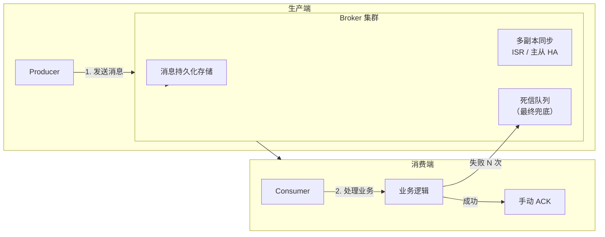
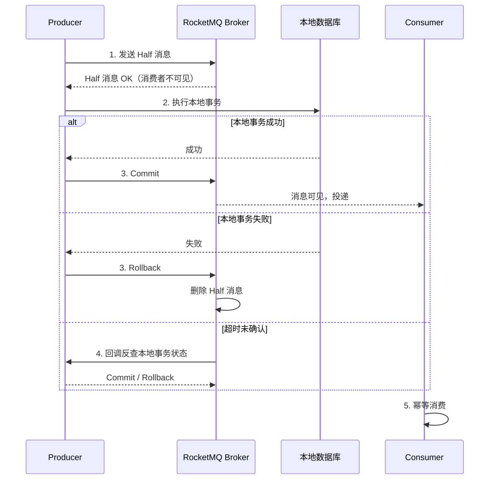
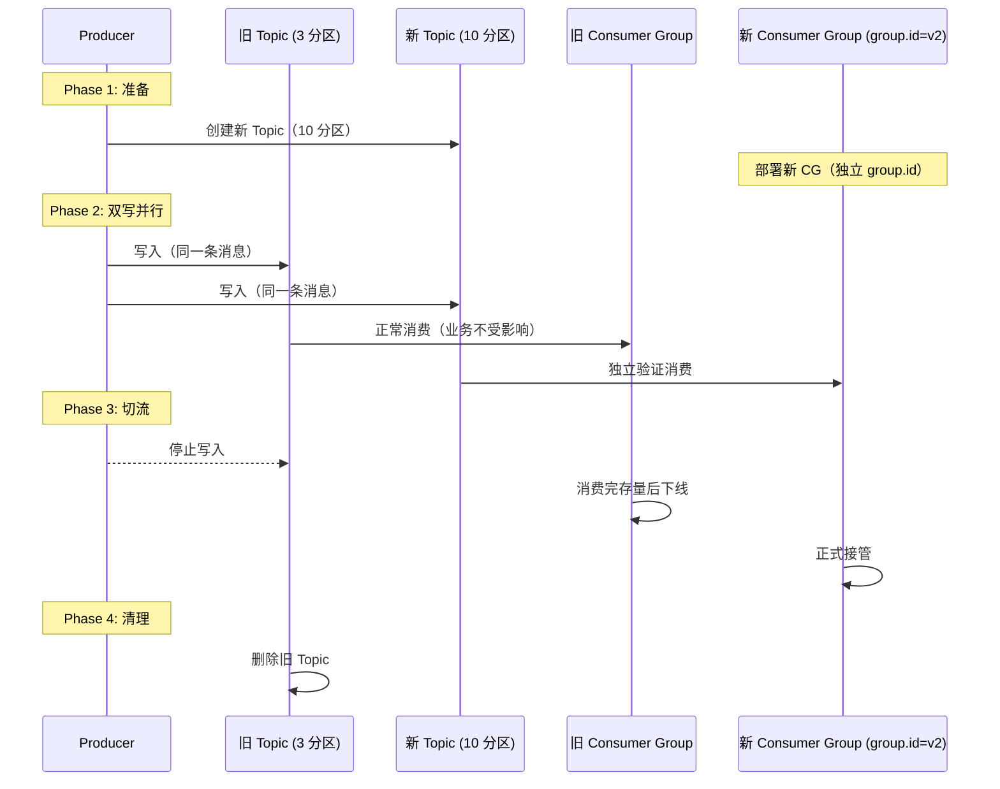

## 应用场景

| 场景 | 说明 |
|------|------|
| **削峰限流** | 高并发进队列，后端按能力消费 |
| **解耦** | 下游故障不影响上游 |
| **异步处理** | 耗时操作异步化 |
| **数据分发** | 一对多广播（如 Kafka 大数据管道） |


## 速查卡

- **应用场景**：削峰限流 → 解耦 → 异步处理 → 数据分发（一对多广播）
- **消息不丢失三环节**：生产端（Confirm/acks=all+幂等重试）→ Broker（持久化+ISR 多副本）→ 消费端（手动 ACK + 死信队列兜底）
- **幂等方案**：DB 唯一键 → Redis setnx → 消费查重表 → 业务状态机（不可逆流转）
- **分布式事务**：本地事务+消息表（可靠消息模式）→ RocketMQ 事务消息（Half → 本地事务 → Commit/Rollback → 回查）
- **消息堆积**：扩容消费者（优先）→ 临时新 Topic 扩容分区 → 降级 → 批量消费 → 跳过陈旧消息
- **顺序保证**：同一 key → 同一分区 = 分区内有序，全局顺序消耗吞吐
- **生产确认等级**：acks=0（发完不管）→ acks=1（Leader 确认）→ acks=all（ISR 全确认）→ 幂等 Producer（去重）→ 事务消息（原子性）
- **分区扩容**：提前预留（最佳）→ 无序直接扩 → 有序则双写迁移（新旧 Topic 并行验证后切流）
## 架构核心

- **异步解耦模型**：Producer → Broker → Consumer
- **可靠性**：生产确认 → 存储持久化 → 消费确认 → 死信队列
- **吞吐与延迟**：RabbitMQ 低延迟复杂路由；Kafka 海量日志（顺序写+零拷贝）；RocketMQ 兼顾高吞吐与事务消息

---

## Top 面试问题

### Q1：如何保证消息不丢失？（可靠性投递）

消息从生产到消费不丢失，需要在三个环节都保证：



| 环节 | RabbitMQ | Kafka | RocketMQ |
|------|----------|-------|----------|
| **生产端** | Publisher Confirm（异步确认+重试） | acks=all + 幂等重试 | SYNC 同步刷盘 |
| **Broker** | durable 队列 + persistent 消息 | 多副本 ISR，min.insync.replicas ≥ 2 | 同步刷盘 + 主从 HA |
| **消费端** | 手动 ack（basicAck） | 手动 commit offset | 消费成功返回 CONSUME_SUCCESS |

> 死信队列作为最终兜底：消费多次失败的消息进入死信，人工处理。

#### 生产端确认机制详解

**RabbitMQ Publisher Confirm**：
```java
// 异步确认 + 重试
channel.confirmSelect();
channel.addConfirmListener((seqNo, multiple) -> {
    // 确认成功，清理重试缓存
}, (seqNo, multiple) -> {
    // 确认失败，重发消息
    retrySend(message);
});
```

**Kafka 生产端保证**：
```properties
# 至少一次语义（不丢消息）
acks=all                    # 所有 ISR 副本确认
retries=3                   # 失败重试
enable.idempotence=true     # 幂等生产，避免重试导致重复
max.in.flight.requests.per.connection=5  # 配合幂等使用
```

### Q2：消息重复消费与幂等

**为什么会有重复**：生产端重试、Broker 未及时收到 ACK 重推、消费端 rebalance。

**幂等方案**：

| 方案 | 实现 | 适用 |
|------|------|------|
| **DB 唯一键** | `INSERT ... ON DUPLICATE KEY` | 强依赖 DB |
| **Redis setnx** | 消息 ID 写入 Redis，存在则跳过 | 高性能 |
| **消费前查重表** | 消费记录表 + 唯一索引 | 通用 |
| **业务状态机** | 订单状态不可逆（已支付 → 已发货），重复消费无效 | 有状态流转 |

```sql
-- 消费记录去重表
CREATE TABLE consumed_messages (
    msg_id VARCHAR(64) PRIMARY KEY,
    consumer_group VARCHAR(64),
    created_at TIMESTAMP DEFAULT CURRENT_TIMESTAMP
);
-- 消费前：INSERT IGNORE INTO consumed_messages VALUES (?, ?, NOW());
-- 受影响行数 0 → 已消费，跳过
```

**顺序保证**：

| MQ | 方式 |
|-----|------|
| RabbitMQ | 单队列单消费者天然有序 |
| Kafka | 同一 key → 同一分区 = 分区内有序 |
| RocketMQ | MessageQueueSelector 指定队列 |

> 全局顺序极大消耗吞吐。业务上常用**版本号**或**状态机**规避全局顺序依赖。

### Q3：MQ 实现分布式事务最终一致性

**模式**：本地事务 + 消息表 → 定时任务或 MQ 可靠发送 → 消费幂等。

**RocketMQ 事务消息**：



**事务消息流程图解**：

```
                      ┌──────────────┐
                      │ 1. 发送半消息  │  ← Consumer 不可见
                      │   (Half Msg)  │
                      └──────┬───────┘
                             │
                             ▼
                      ┌──────────────┐
                      │ 2. 执行本地事务│  ← 扣库存、写订单等
                      │   (Local Tx) │
                      └──────┬───────┘
                             │
                       ┌─────┴─────┐
                       │           │
                      成功         失败
                       │           │
                       ▼           ▼
                    ┌──────┐   ┌──────────┐
                    │Commit│   │ Rollback │
                    └──┬───┘   └──────────┘
                       │
                       ▼
                Consumer 可见
                正常消费

  如果 Producer 在"执行本地事务"后宕机（未 Commit/Rollback）
  → Broker 主动回查 Producer 侧的事务状态 → 决定 Commit 或 Rollback
```

**架构考量**：设计"可查可补偿"的事务模型，保证幂等与恢复能力。

### Q4：消息堆积如何处理？

消息堆积（消费跟不上生产）的应急方案：

| 措施 | 说明 | 优先级 |
|------|------|:---:|
| **扩容消费者** | 增加 Consumer 实例（注意分区数限制） | 1 |
| **临时新 Topic** | 新 Consumer 消费原 Topic，直接转发到新 Topic（扩容分区），新 Consumer Group 消费 | 2 |
| **降级逻辑** | 非核心消息丢弃或暂存，保证核心链路 | 3 |
| **批量消费** | 合并多条消息一次处理，减少 RT | 4 |
| **跳过陈旧消息** | 消息有过期时间，超过时效直接丢弃 | 5 |

```java
// Kafka 消费端优化
props.put("max.poll.records", 500);           // 批量拉取
props.put("enable.auto.commit", false);       // 手动提交，防丢失
// 消费逻辑中批量处理
consumer.poll(Duration.ofMillis(1000)).forEach(record -> {
    batchBuffer.add(record);
    if (batchBuffer.size() >= 500) flushBatch();
});
```

> **预防优先于应急**：生产前做好容量评估，消费端预留 2x 峰值处理能力。

### Q5：生产者如何确保消息已成功发送到 Broker？

**核心矛盾**：Producer 看到的只是"响应"，不是"事实"。网络超时时 Producer 无法区分"消息没到"和"消息到了但 ACK 丢了"。

**Kafka acks 参数（控制"什么叫发送成功"）**：

| acks | 含义 | 可靠性 | 性能 |
|------|------|--------|------|
| `acks=0` | Producer 不等确认，发完即返回 | ❌ 消息可能丢了都不知道 | 最快 |
| `acks=1` | Leader 写入 Page Cache 即确认 | ⚠️ Leader 挂了未同步则丢 | 较快 |
| `acks=all` / `-1` | 所有 ISR 副本确认后才返回 | ✅ 只要还有一个 ISR 活着就不丢 | 较慢 |

```properties
# 生产推荐配置
acks=all
min.insync.replicas=2      # 最少 2 个 ISR 确认，防止 Leader 单点退化
enable.idempotence=true     # 幂等 Producer，解决重试导致的重复
```

**acks=all 完整流程**（`min.insync.replicas=2`）：

```
  Producer                    Leader Broker              Follower 1        Follower 2
     │                             │                         │                 │
     │── send(msg) ───────────────→│                         │                 │
     │                             │── append to log ──────→│                 │
     │                             │── append to log ───────────────────────→│
     │                             │                         │                 │
     │                             │←── ACK ────────────────│                 │
     │                             │←── ACK ──────────────────────────────────│
     │                             │                                            │
     │←── ACK (所有 ISR 确认) ─────│                                            │
     │                                                                          │
     ▼
  send() 返回，确认成功
```

> 所有 ISR 副本都确认后，Leader 才向 Producer 返回成功。`min.insync.replicas=2` 确保至少有两个副本在线，防止只剩 Leader 时 `acks=all` 退化为 `acks=1`。

**RocketMQ 发送结果**：

```java
SendResult result = producer.send(msg);
switch (result.getSendStatus()) {
    case SEND_OK:              // Broker 确认写入成功
    case FLUSH_DISK_TIMEOUT:   // 写入成功但刷盘超时（Broker 会继续刷，不丢）
    case FLUSH_SLAVE_TIMEOUT:  // 主节点成功，从同步超时（主挂可能丢）
}
```

RocketMQ 的两个维度配置：
- **刷盘**：`SYNC_FLUSH`（同步刷盘 ~100 TPS）vs `ASYNC_FLUSH`（异步 ~10w TPS）
- **复制**：`SYNC_MASTER`（等 Slave 确认）vs `ASYNC_MASTER`（不等）

**超时重试与幂等**（网络超时是最棘手的问题）：

```
Producer 超时，无法区分：
  情况 1：消息没到 Broker → 重试没问题
  情况 2：消息到了 Broker，ACK 丢了 → 重试会重复！
```

**Kafka 幂等 Producer 原理（PID + Sequence Number）**：

```
  Producer (PID=1001)                    Broker
       │                                     │
       │── msg(seq=1) ──────────────────────→│ 写入 log，seq=1 ✓
       │←── ACK(seq=1) ─────────────────────│
       │                                     │
       │── msg(seq=2) ───────────X(丢包)     │ 写入 log，seq=2 ✓
       │   (超时，重试)                      │
       │── msg(seq=2) ──────────────────────→│ seq=2 已存在 → 丢弃，返回 ACK
       │←── ACK(seq=2) ─────────────────────│
       │                                     │
  结果：Producer 重试了，但 Broker 只存了一份 → 不重复
```

> **兜底方案**：无论 MQ 有什么机制，业务消息体必须带全局唯一 `msgId`，Consumer 侧通过 Redis/DB 做幂等校验（查重表），这是最后一道防线。

**可靠性等级总结**：

```
Level 0: acks=0           → 发完不管，适合日志/埋点
Level 1: acks=1           → Leader 确认
Level 2: acks=all + ISR≥2 → 多数副本确认（生产标配）
Level 3: + 幂等 Producer   → 解决重试重复（核心业务）
Level 4: + 事务消息        → 本地事务+消息原子性（支付/库存）
```

### Q6：MQ 分区不够如何扩容？

**核心矛盾**：分区数变了 → `hash(key) % N` 的结果变了 → 同一个 key 的消息可能散到不同分区 → **有序性被破坏**。

```
扩容前（3 分区）：
  key="order_1001" → hash % 3 = 0 → P0  [创建][支付][发货] ← 有序

扩容后（5 分区）：
  key="order_1001" → hash % 5 = 2 → P2  [创建][支付]  ← 老消息
                                     P3  [发货]      ← 新消息！乱序！
```

**Kafka vs RocketMQ 的扩容能力**：

| 操作 | Kafka | RocketMQ |
|------|-------|----------|
| 增加分区 | ✅ `--alter --partitions 10` | ✅ `updateTopic -w 8 -r 8` |
| 减少分区 | ❌ 不支持 | ✅ 可以（Queue 只是索引） |

> Kafka 不支持减少分区 — 因为减少意味着删除数据。RocketMQ 的 Queue 是 CommitLog 的索引，增减更灵活。

**三种扩容场景**：

```
场景 A：消息不需要有序（日志、埋点、监控）
  → 直接扩分区 + 增加 Consumer 实例
  → 影响：rebalance 短暂中断（秒级），做好幂等即可

场景 B：需要按 Key 有序，可以短暂停服
  → 1. 停止 Producer
  → 2. 等所有消息被消费完
  → 3. 删除旧 Topic，建新 Topic（更多分区）
  → 4. 重启 Producer 和 Consumer

场景 C：需要按 Key 有序，不能停服 → 双写迁移
```

**双写迁移（零停机扩容）**：



**关键要点**：
- **新 Consumer Group = 同代码 + 新 `group.id` + 独立部署实例**（作用是独立追踪 offset，独立验证）
- **新 Topic = 从零开始以更多分区运行**，没有历史数据 hash 规则混乱的问题
- **回滚**：任何阶段发现问题 → Producer 切回只写旧 Topic 即可（旧链路从未停过）
- **最佳实践**：提前预留充足分区数（预估峰值 2x），避免临时扩容

> 这是**零停机数据迁移**的通用模式 — 不动旧链路，新建新链路，并行验证，平滑切换。数据库分库分表扩容也是这个思路。

---

## 自测

1. **如何保证消息不丢失？三个环节各有什么关键配置？**
   <br/>→ 生产端：Kafka acks=all + enable.idempotence，RabbitMQ Publisher Confirm + 重试。Broker：多副本 ISR，min.insync.replicas ≥ 2。消费端：手动 ACK（处理成功再提交 offset），失败进入死信队列。死信队列是最终兜底。

2. **消息幂等有哪些实现方案？各适合什么场景？**
   <br/>→ DB 唯一键（强一致，适合金融场景）；Redis setnx（高性能，适合高并发缓存场景）；消费查重表（通用方案）；业务状态机（订单状态不可逆流转，最优雅但需要业务支持）。

3. **RocketMQ 事务消息的 Half 消息机制如何工作？回查解决什么问题？**
   <br/>→ 先发送 Half 消息（消费者不可见）→ 执行本地事务 → 成功 commit/失败 rollback。若生产者超时未确认，Broker 主动回查本地事务状态。回查解决生产者在执行本地事务过程中宕机导致的不确定状态。

4. **线上消息大量堆积，你的排查和应急流程是什么？**
   <br/>→ 排查：先看消费端是否有异常日志/性能瓶颈 → 检查是否有 rebalance 风暴。应急：扩容消费者（最优先）→ 临时建新 Topic 扩容分区 → 非核心消息降级丢弃 → 批量消费提高吞吐。预防：消费端预留 2x 峰值处理能力。

5. **Kafka acks=all 就绝对不丢消息吗？什么情况下仍然可能丢？**
   <br/>→ acks=all 保证 ISR 全部确认，但如果 ISR 列表只剩 Leader 一个节点（其他副本挂了），acks=all 退化等同于 acks=1。配合 `min.insync.replicas=2` 可以防止。另外 Producer 超时重试如果没有开启幂等（`enable.idempotence=true`），可能产生重复——重复虽不是"丢失"，但业务层需要幂等消费。

6. **分区不够需要扩容，但不能停服且消息需要按 Key 有序，你的方案是什么？**
   <br/>→ 双写迁移：1) 创建新 Topic（更多分区）；2) Producer 同时写旧 Topic 和新 Topic；3) 新 Consumer Group（独立 group.id）从新 Topic 消费并验证；4) 确认无误后 Producer 切为只写新 Topic；5) 旧 Consumer Group 消费完存量后下线；6) 删除旧 Topic。核心：新旧链路并行运行，任何阶段可回滚（切回只写旧 Topic 即可）。
