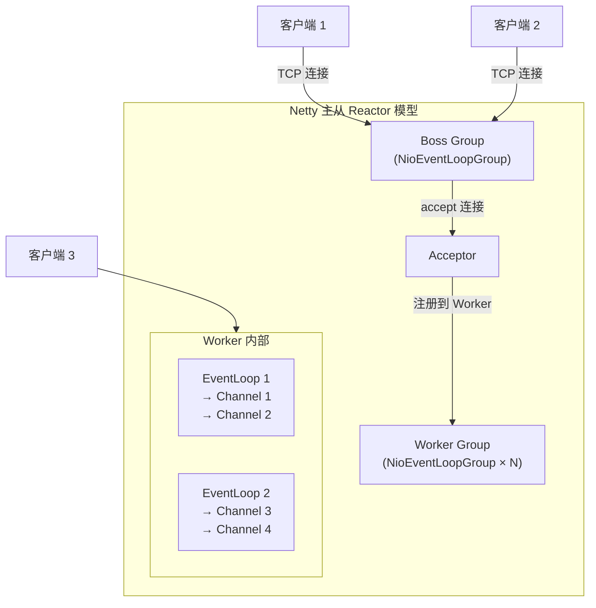
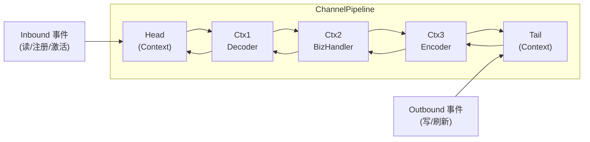
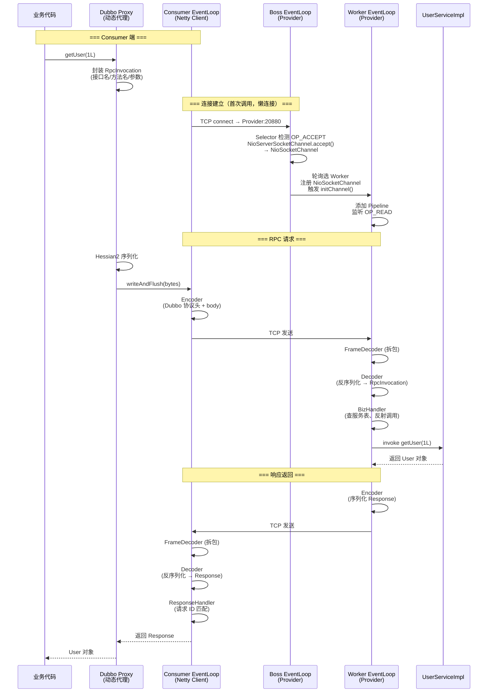
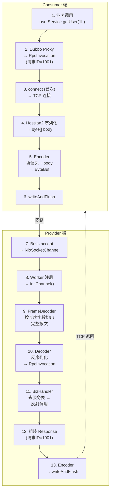
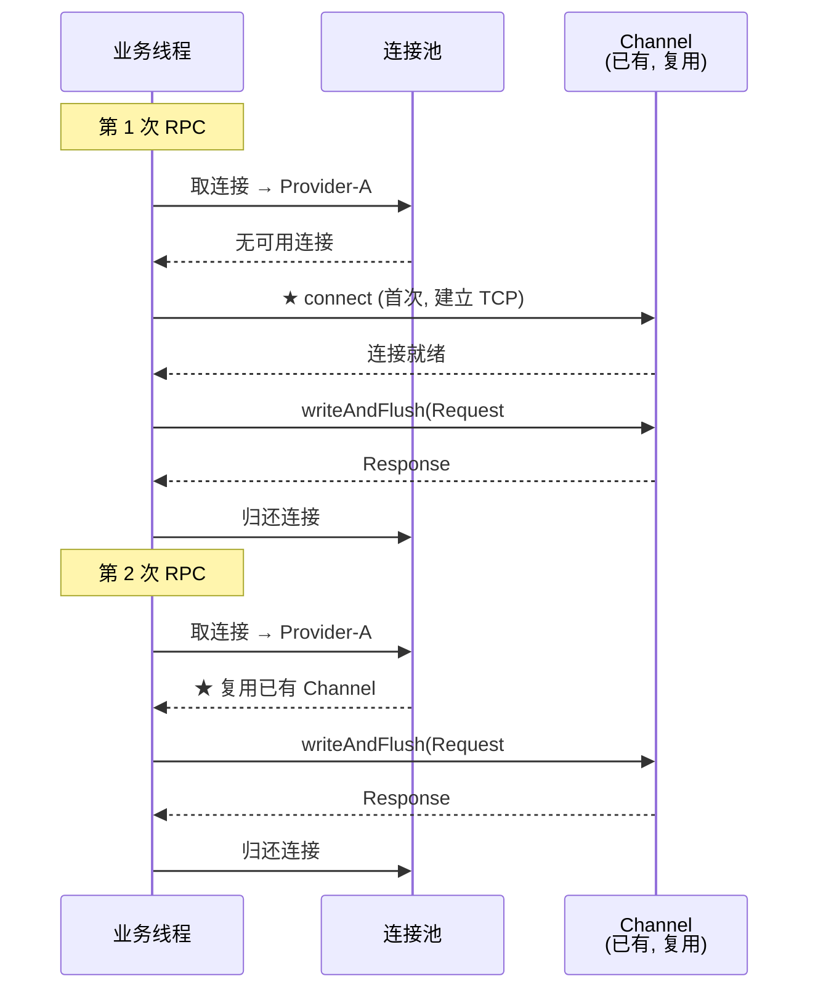
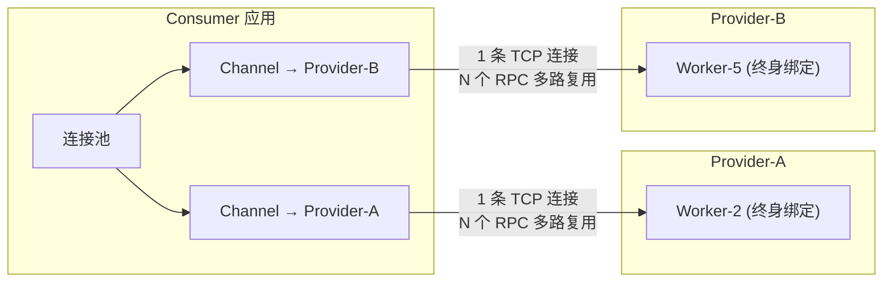

## 概述

Netty 是一个异步事件驱动的网络应用框架，基于 Java NIO 封装，用于快速开发高性能、高并发的协议服务器和客户端。Dubbo、RocketMQ、gRPC、Elasticsearch 等底层通信都基于 Netty。

核心优势：**Reactor 线程模型**（Boss/Worker 分离）、**零拷贝**（用户态 + 内核态双重优化）、**责任链 Pipeline**（灵活组合编解码与业务逻辑）、**池化内存管理**（减少 GC 压力）。

---

## 速查卡

- **Reactor 线程模型**：Boss Group（接收连接、注册 Channel）→ Worker Group（读写处理、pipeline 执行），EventLoop 与 Channel 一对一绑定
- **ChannelPipeline**：双向链表，Inbound（读方向）和 Outbound（写方向）两条传播路径，Handler 通过 `ctx.fireXXX()` 传递事件
- **ByteBuf**：读/写双指针（readerIndex/writerIndex），PooledByteBufAllocator 池化，Direct Memory 减少一次拷贝
- **零拷贝**：CompositeByteBuf（逻辑组合）→ wrap（包装）→ slice（切片共享）→ FileRegion（包装 transferTo → sendfile）
- **拆包粘包**：`LineBasedFrameDecoder` / `DelimiterBasedFrameDecoder` / `FixedLengthFrameDecoder` / `LengthFieldBasedFrameDecoder`
- **编解码**：`ByteToMessageDecoder` → `MessageToMessageDecoder`，`MessageToByteEncoder`，一次只解析一个完整报文
- **Future/Promise**：`ChannelFuture.addListener()` 异步回调，Promise 是可写的 Future

---

## Reactor 线程模型

这是 Netty 面试中最核心的概念。演进过程：**单 Reactor 单线程 → 单 Reactor 多线程 → 主从 Reactor 多线程**。



### 三种模型对比

| 模型 | Boss | Worker | 适用场景 |
|------|------|--------|---------|
| 单 Reactor 单线程 | 1 个线程处理 accept + 读写 | — | Redis 6.0 之前 |
| 单 Reactor 多线程 | 1 个 Reactor 线程 accept | 线程池处理读写 | 大多数通用场景 |
| **主从 Reactor 多线程** | Boss 池处理 accept | Worker 池处理读写 | Netty 默认，高并发 |

### EventLoop 与 Channel 绑定

```java
// 标准 Netty 服务端启动代码
EventLoopGroup bossGroup = new NioEventLoopGroup(1);     // Boss: 通常 1 个线程即可
EventLoopGroup workerGroup = new NioEventLoopGroup();    // Worker: 默认 CPU 核数 × 2

ServerBootstrap b = new ServerBootstrap();
b.group(bossGroup, workerGroup)
 .channel(NioServerSocketChannel.class)
 .childHandler(new ChannelInitializer<SocketChannel>() {
     @Override
     public void initChannel(SocketChannel ch) {
         ch.pipeline().addLast(new MyHandler());
     }
 });
```

> **关键**：一个 EventLoop 绑定多个 Channel，但一个 Channel 的所有 I/O 操作始终由同一个 EventLoop 线程执行，**避免了线程安全问题**。

---

## 核心组件

### ChannelPipeline 责任链

ChannelPipeline 是一个**双向链表**，节点是 `ChannelHandlerContext`（包装了 Handler），事件沿链表传播：



**事件传播规则**：
- **Inbound**：从 Head 向 Tail 传播，调用 `ctx.fireChannelRead(msg)` 传递给下一个
- **Outbound**：从 Tail 向 Head 传播，调用 `ctx.write(msg, promise)` 传递给上一个
- 站在哪个位置跳过哪些 Handler：`ctx.write()` 从当前往前找 Outbound Handler，`ctx.channel().write()` 从 Tail 开始

### Handler 体系

| 类型 | 接口 | 常用实现 |
|------|------|---------|
| **Inbound** | `ChannelInboundHandler` | `SimpleChannelInboundHandler`（自动释放 msg） |
| **Outbound** | `ChannelOutboundHandler` | 编码器（Encoder） |
| **双工** | 两者都实现 | `ChannelDuplexHandler`（日志、监控） |

```java
// 典型 Pipeline 配置
pipeline.addLast("frameDecoder", new LengthFieldBasedFrameDecoder(65536, 0, 4, 0, 4));
pipeline.addLast("decoder", new MyProtoDecoder());       // Inbound
pipeline.addLast("encoder", new MyProtoEncoder());       // Outbound
pipeline.addLast("bizHandler", new MyBizHandler());      // Inbound
// 执行顺序（Inbound）: frameDecoder → decoder → bizHandler
// 执行顺序（Outbound）: encoder → frameDecoder（如果 frameDecoder 也是 Outbound）
```

---

## ByteBuf 与内存管理

### 设计优势

相比 JDK `ByteBuffer`，Netty ByteBuf 的关键改进：

| 对比 | JDK ByteBuffer | Netty ByteBuf |
|------|:---:|:---:|
| 读写指针 | 单个 position，flip 切换模式 | **双指针** readerIndex/writerIndex，无需 flip |
| 容量 | 固定，超出需重新分配 | 自动扩容（`writeBytes` 时动态扩展） |
| 池化 | 无 | **PooledByteBufAllocator**，大幅降低 GC |
| 引用计数 | 无 | `retain()/release()`，与 Netty 内存池配合 |

### 三种内存类型

```
Pooled   — 池化，Netty 预分配内存块，复用 ByteBuf（默认，推荐）
Unpooled — 非池化，每次 new 分配/释放，GC 压力大

Heap     — JVM 堆内存，底层 byte[]，受 GC 管理
Direct   — 堆外直接内存，I/O 时少一次拷贝（堆 → 堆外），需手动释放
```

> **推荐组合**：`PooledByteBufAllocator.DEFAULT`（Pooled + Direct），生产环境标配。

### 引用计数

```java
ByteBuf buf = PooledByteBufAllocator.DEFAULT.buffer(1024);
buf.retain();   // refCnt +1（多一个使用者）
buf.release();  // refCnt -1（用完归还）
// refCnt = 0 → 归还内存池或释放
```

`SimpleChannelInboundHandler` 会自动调用 `release()`，普通 `ChannelInboundHandler` 需要手动释放。

---

## 零拷贝（Zero-Copy）

> Netty Zero-Copy 区别于操作系统层面的 Zero-Copy。操作系统层关注避免用户态和内核态数据拷贝，Netty 关注**用户态数据操作的优化**。

### Netty 零拷贝体现

| 特性 | 说明 |
|------|------|
| **CompositeByteBuf** | 将多个 ByteBuf 组合为一个逻辑 ByteBuf，避免合并时的内存拷贝 |
| **wrap 方法** | 将 `byte[]`、`ByteBuf`、`ByteBuffer` 包装为 Netty ByteBuf，零拷贝 |
| **slice 操作** | 将 ByteBuf 切片为共享同一内存区域的多个 ByteBuf |
| **FileRegion** | 包装 `FileChannel.transferTo()` 实现零拷贝文件传输 |

### transferTo 底层原理（OS sendfile）

`FileChannel.transferTo()` 依赖 Linux 内核 **`sendfile`** 函数：

1. DMA 将磁盘数据读取到**内核缓冲区**（Read Buffer）
2. 更新即将发送的数据偏移量
3. 将数据从 Read Buffer 复制到**网卡设备缓冲区**（NIC Buffer）

整个过程中数据**无需经过用户空间**，避免了内核态 → 用户态 → 内核态的两次拷贝。

---

## 编解码与拆包粘包

### 为什么会有拆包粘包？

TCP 是**流式协议**，不保证消息边界。发送方连续 write 多次小包 → 可能被合并为一个 TCP 段（粘包）；发送方一次 write 大包 → 可能被 TCP 分片发送（拆包）。

### 四种拆包方案

| 解码器 | 原理 | 适用 |
|--------|------|------|
| `LineBasedFrameDecoder` | 按换行符 `\n` 或 `\r\n` 分割 | 文本协议 |
| `DelimiterBasedFrameDecoder` | 按自定义分隔符分割 | 自定义文本协议 |
| `FixedLengthFrameDecoder` | 按固定长度分割 | 定长报文 |
| `LengthFieldBasedFrameDecoder` | 头部声明长度字段，按长度读取 | **二进制协议首选** |

```java
// 最常用的 LengthFieldBasedFrameDecoder 参数说明
// maxFrameLength, lengthFieldOffset, lengthFieldLength, lengthAdjustment, initialBytesToStrip
new LengthFieldBasedFrameDecoder(65536, 0, 4, 0, 4);
// 解释：最大 64KB，从第 0 字节开始是长度字段，长度占 4 字节，
//       不再额外偏移，跳过前 4 字节（去掉长度头）
```

### 编解码器层次

| 类型 | 抽象类 | 职责 |
|------|--------|------|
| 字节→消息 | `ByteToMessageDecoder` | TCP 字节流 → Java 对象（反序列化） |
| 消息→消息 | `MessageToMessageDecoder` | Java 对象 → Java 对象（转换/解码） |
| 消息→字节 | `MessageToByteEncoder` | Java 对象 → TCP 字节流（序列化） |

> 编码器必须放在 Pipeline 前面（Outbound 从 Tail 往前找），解码器必须放在前面（Inbound 从 Head 往后走），**解码一定要先做拆包（粘包处理），再做反序列化**。

---

## 引导类 Bootstrap

| 类 | 用途 |
|------|------|
| **Bootstrap** | 客户端引导，配置单个连接 |
| **ServerBootstrap** | 服务端引导，配置监听端口 + 子 Channel |

```java
// 客户端
Bootstrap b = new Bootstrap();
b.group(group)
 .channel(NioSocketChannel.class)
 .handler(new ChannelInitializer<SocketChannel>() { ... });
ChannelFuture f = b.connect("127.0.0.1", 8080).sync();

// 服务端
ServerBootstrap sb = new ServerBootstrap();
sb.group(bossGroup, workerGroup)
  .channel(NioServerSocketChannel.class)
  .childHandler(new ChannelInitializer<SocketChannel>() { ... });
sb.bind(8080).sync();
```

> 注意：服务端有两个 Handler —— `handler()` 为 Boss Group 设置，`childHandler()` 为 Worker Group 设置。

---

## Future/Promise 异步模型

Netty 的 Future 比 JDK `Future` 多了监听回调能力：

| 类型 | 特点 |
|------|------|
| **ChannelFuture** | 可添加 Listener，操作完成后回调 |
| **Promise** | 可写的 Future，开发者可手动 `setSuccess()` / `setFailure()` |

```java
// 异步连接
ChannelFuture f = b.connect("127.0.0.1", 8080);
f.addListener((ChannelFutureListener) future -> {
    if (future.isSuccess()) {
        System.out.println("连接成功");
    } else {
        System.out.println("连接失败: " + future.cause());
    }
});

// Promise 示例：自定义异步结果
Promise<String> promise = new DefaultPromise<>(eventLoop);
promise.addListener(f -> System.out.println("结果: " + f.get()));
eventLoop.execute(() -> {
    // 业务逻辑
    promise.setSuccess("done");
});
```

---

## 实战：Dubbo 调用中的 Netty 通信全流程

以一次简单的 Dubbo 远程调用为例，串联 Netty 各组件如何协同工作。

### 场景

```java
// Consumer 端
UserService userService = ReferenceConfig.getProxy(UserService.class);
User user = userService.getUser(1L);  // 一行代码触发整条链路
```

### 完整时序

一张图覆盖从 TCP 连接建立、Boss→Worker 交接、RPC 调用到响应返回的全链路：



> **关于 Consumer EventLoop**：Consumer 端用 `Bootstrap`，只有**一个** EventLoopGroup，没有 Boss/Worker 之分。connect、write、read 全部由同一组 EventLoop 处理。时序图中为了清晰展示了两端各自的角色，实际上 Consumer EventLoop 和 Worker EventLoop 底层是同一个类 `NioEventLoop`，只是在不同场景下扮演不同角色——Consumer 侧主动 connect 和写请求，Provider Worker 侧被动接受注册并处理读写。

### Consumer 端 Pipeline 配置

```java
// Dubbo NettyClient 简化版 Pipeline
pipeline.addLast("frameDecoder", new LengthFieldBasedFrameDecoder(
    8388608,   // 最大 8MB
    12,        // 长度字段在头部偏移 12 字节处
    4,         // 长度字段占 4 字节
    0, 0
));

pipeline.addLast("decoder", new ByteToMessageDecoder() {
    @Override
    protected void decode(ChannelHandlerContext ctx, ByteBuf in, List<Object> out) {
        byte[] header = new byte[16]; in.readBytes(header);
        int bodyLen = parseBodyLen(header);
        byte[] body = new byte[bodyLen]; in.readBytes(body);
        out.add(Hessian2.deserialize(body));  // → Response 对象
    }
});

pipeline.addLast("encoder", new MessageToByteEncoder<Object>() {
    @Override
    protected void encode(ChannelHandlerContext ctx, Object msg, ByteBuf out) {
        byte[] body = Hessian2.serialize(msg);
        out.writeBytes(buildDubboHeader(body.length));  // 16 字节协议头
        out.writeBytes(body);
    }
});

pipeline.addLast("handler", new SimpleChannelInboundHandler<Response>() {
    @Override
    protected void channelRead0(ChannelHandlerContext ctx, Response resp) {
        // 根据请求 ID 找到对应的 Future，唤醒阻塞的调用方
        DefaultFuture.received(resp.getId(), resp.getResult());
    }
});
```

### Provider 端 Pipeline 配置

```java
pipeline.addLast("frameDecoder", new LengthFieldBasedFrameDecoder(8388608, 12, 4, 0, 0));
pipeline.addLast("decoder", /* 同上，反序列化为 RpcInvocation */);
pipeline.addLast("encoder", /* 同上，序列化 Response */);

pipeline.addLast("handler", new SimpleChannelInboundHandler<RpcInvocation>() {
    @Override
    protected void channelRead0(ChannelHandlerContext ctx, RpcInvocation inv) {
        // 1. 查本地服务注册表
        Object service = serviceMap.get(inv.getServiceName());
        // 2. 反射调用实际方法
        Object result = inv.getMethod().invoke(service, inv.getArguments());
        // 3. 组装 Response，writeAndFlush 触发 Outbound 编码链
        ctx.writeAndFlush(new Response(inv.getId(), result));
    }
});
```

### 数据流全景



### 连接建立的细节

时序图中「连接建立」阶段展开来看，是两个关键时刻：

| 时机 | 发生了什么 | 触发方 |
|------|-----------|:---:|
| **bind(port)** | 创建 NioServerSocketChannel，注册到 Boss Selector，监听 `OP_ACCEPT` | Provider 启动 |
| **TCP 连接到达** | Boss accept → 轮询选 Worker → 注册 NioSocketChannel → 触发 `initChannel()` 添加 Pipeline → 监听 `OP_READ` | Consumer 首次调用 |

Consumer 端连接是**懒建立的**——Dubbo 首次 RPC 调用时才 `Bootstrap.connect()`，之后连接池复用。Consumer 只有一个 EventLoopGroup，`connect()` 返回 `ChannelFuture`，`addListener` 等待连接完成后才发送数据：

```java
// Consumer 端连接建立（Dubbo NettyClient 简化）
Bootstrap bootstrap = new Bootstrap();
bootstrap.group(eventLoopGroup)  // 客户端只有一个 Group
         .channel(NioSocketChannel.class)
         .handler(new ChannelInitializer<SocketChannel>() {
             @Override
             protected void initChannel(SocketChannel ch) {
                 ch.pipeline()
                   .addLast("decoder", new DubboCountCodec())
                   .addLast("encoder", new NettyCodecAdapter())
                   .addLast("handler", new NettyClientHandler());
             }
         });

// ★ connect 在首次 RPC 调用时发生，不是启动时
ChannelFuture f = bootstrap.connect(providerAddress);
f.addListener(future -> {
    if (future.isSuccess()) {
        channel.writeAndFlush(request);  // 连接成功后才发数据
    }
});
```

> **核心**：Boss 只做一件事——accept 后快速注册到 Worker，然后立刻回去继续 accept。Worker 接管后，该 Channel 终身绑定到此 Worker 线程，**无需加锁**。

### Channel 会被反复创建吗？

**不会**。Channel 代表一条 TCP 长连接，创建成本高（TCP 三次握手 + 两端 Pipeline 初始化），反复创建不可接受。



两端各有 Channel 生命周期：

| 端 | Channel 类型 | 创建时机 | 销毁时机 |
|------|-------------|---------|---------|
| **Consumer** | `NioSocketChannel` | 首次 `connect()`，每个 Provider 地址维持若干条 | 连接 idle 超时 / 对端断开 / 主动 close |
| **Provider** | `NioSocketChannel`（per 客户端连接） | Boss accept 时 `new` | 客户端断开 / idle 超时 / 主动 close |
| **Provider** | `NioServerSocketChannel` | `bind()` 时，**全局唯一** | 服务 shutdown |

Consumer 端通过**连接池**管理 Channel：发 RPC 前从池中取 → 用完归还 → 同 Provider 的后续请求复用同一条连接。只有池中无可用连接时才新建。Provider 端每个客户端连接也是一个 Channel，Boss accept 时创建，伴随整个连接生命周期。

> **一句话**：Channel = TCP 长连接。Consumer 通过连接池复用，Provider 通过 Boss→Worker 注册管理。**每发起一次 RPC 只复用已有 Channel，不会新建。**

### 理清 Channel、RPC 请求、数据通道的关系

这是最容易混淆的地方。用一句话先定调：**Channel 是水管，RPC 请求是水管里流的水，请求 ID 是给每滴水贴的标签。**

```
Consumer                                         Provider

  取连接（复用同一条水管）
     │
     ▼
  ┌───────────────────────────────────────────────────────┐
  │                   Channel (TCP 长连接)                  │
  │                                                       │
  │  RPC #1  getUser(1)    ───请求ID=1001──▶  Worker-2    │
  │  RPC #2  getUser(2)    ───请求ID=1002──▶  Worker-2    │
  │  RPC #3  createOrder() ───请求ID=1003──▶  Worker-2    │
  │                                                       │
  │  ◀───响应ID=1002──  getUser(2) 结果                    │
  │  ◀───响应ID=1001──  getUser(1) 结果    (乱序返回)       │
  │  ◀───响应ID=1003──  createOrder() 结果                 │
  │                                                       │
  └───────────────────────────────────────────────────────┘
     │
     ▼
  Consumer 按 ID 匹配 Future，唤醒对应调用方
```

逐个概念拆开看：

**Channel（管道）**
- 一条 TCP 长连接，Consumer 每个 Provider 地址默认只有 **1 条**
- 创建成本高（TCP 三次握手 + 两端 Pipeline 初始化），所以**复用，不反复建**
- 生命周期：首次 RPC 懒建立 → 之后一直复用 → 连接断开才销毁
- Consumer 端多个 Provider 需要**多条** Channel —— Channel 只连一个 Provider

**RPC 请求（水流）**
- 一个个独立的远程调用，在同一条 Channel 上**多路复用**
- 每次 RPC 分配唯一请求 ID，写进协议头，塞进 Channel
- 请求和响应**不需要一问一答排队**——可以连续发多个，响应乱序回来无所谓

**如何匹配响应到对应请求？**
- Consumer 发请求前生成 `requestId`，创建 `DefaultFuture`，存入 `Map<requestId, Future>`
- Provider 响应时原样带回 `requestId`
- Consumer 收到响应 → 按 `requestId` 取出 Future → `setSuccess(result)` → 唤醒阻塞/回调的调用方
- 这就是为什么**一条 Channel 可以同时跑多个 RPC 而不会串**

**Provider 端视角**
- Boss accept 时为该 Consumer 创建 1 个 Channel，**终身绑定** 1 个 Worker 线程
- 该 Consumer 的所有 RPC 请求都由这同一个 Worker 线程处理——线程安全，无需加锁



> **记住三个数字**：Consumer 每 Provider **1 个 Channel**，1 个 Channel 承载 **N 个 RPC**，Provider 端 1 个 Channel 绑定 **1 个 Worker 线程**。

### 各环节职责对照

| 环节 | 谁负责 | 核心机制 |
|------|--------|---------|
| **调用拦截** | Dubbo 动态代理 | `InvocationHandler.invoke()` 拦截，封装为 RpcInvocation |
| **连接建立** | Consumer EventLoop + Boss EventLoop | Consumer 懒 connect → Boss accept → 轮询选 Worker 注册 Channel |
| **Channel 注册** | `ServerBootstrap.childHandler()` | Boss accept 后触发 `ChannelInitializer.initChannel()`，添加 Pipeline |
| **序列化** | Hessian2 / Protobuf | Java 对象 → byte[]，放入协议 body |
| **组帧** | Dubbo Encoder | 16 字节协议头（魔数/请求ID/数据长度） + body → ByteBuf |
| **拆包** | `LengthFieldBasedFrameDecoder` | 根据协议头中的长度字段切出完整帧 |
| **反序列化** | Dubbo Decoder | byte[] → RpcInvocation 对象 |
| **分发调用** | Dubbo Handler | 根据接口名查本地服务 Map，反射 invoke |
| **响应匹配** | `DefaultFuture` + 请求 ID | Client 发请求时生成 ID 并存入 Map，响应回来按 ID 匹配 |

> **一句话总结**：Dubbo 定义了「协议怎么组帧」+「数据怎么序列化」，Netty 提供了「Pipeline 流水线」+「Reactor 线程模型」。Dubbo 所做的就是往 Netty Pipeline 里插入自己的 **FrameDecoder**、**Encoder/Decoder** 和 **BizHandler**。

---

## 自测

1. **Netty 的 Reactor 线程模型是怎样的？为什么一个 Channel 的所有操作都是线程安全的？**
   <br/>→ 主从 Reactor：Boss Group 负责 accept 连接并注册到 Worker，Worker Group 负责 I/O 读写和 Pipeline 处理。一个 EventLoop 绑定多个 Channel，但每个 Channel 其生命周期内只由固定的一个 EventLoop 线程处理，因此**无需加锁**。

2. **Inbound 和 Outbound 事件在 ChannelPipeline 中分别如何传播？**
   <br/>→ Inbound 从 Head 向 Tail 传播（`ctx.fireChannelRead(msg)`），Outbound 从 Tail 向 Head 传播（`ctx.write(msg)`）。`ctx.write()` 从当前 Handler 位置往前查找 Outbound Handler，`ctx.channel().write()` 始终从 Tail 开始。

3. **Netty 的零拷贝和操作系统层面的零拷贝有何不同？**
   <br/>→ OS 零拷贝（sendfile/mmap）避免内核态↔用户态的数据拷贝。Netty 零拷贝是用户态优化：通过 CompositeByteBuf、slice、wrap 减少数据在用户态的复制和内存分配。

4. **Netty 如何解决 TCP 拆包粘包？LengthFieldBasedFrameDecoder 的参数分别是什么含义？**
   <br/>→ 四种方案：换行符、分隔符、固定长度、长度字段。`LengthFieldBasedFrameDecoder(maxLen, offset, length, adjustment, strip)` 核心是通过报文头部的长度字段确定边界：offset 指向长度字段起始位置，length 是长度字段的字节数，adjustment 补偿长度值到实际报文尾的偏移，strip 指定跳过多少头部字节。

5. **PooledByteBufAllocator 为什么能减少 GC？Direct Memory 和 Heap Memory 如何选择？**
   <br/>→ 池化分配器预分配内存块，ByteBuf 用完归还而非丢弃，减少频繁 new/GC。Direct Memory 做 I/O 时少一次堆→堆外的拷贝，适合网络传输；Heap Memory 读写更快，适合业务逻辑内部处理。Netty 默认使用 Pooled + Direct。

6. **Netty 的 Future 和 JDK Future 有什么区别？Promise 的作用是什么？**
   <br/>→ JDK Future 只能阻塞 `get()` 拿结果。Netty `ChannelFuture` 支持 `addListener()` 异步回调。Promise 是可写的 Future，允许开发者手动设置成功/失败结果，常用于将异步操作封装为 Future 返回。
