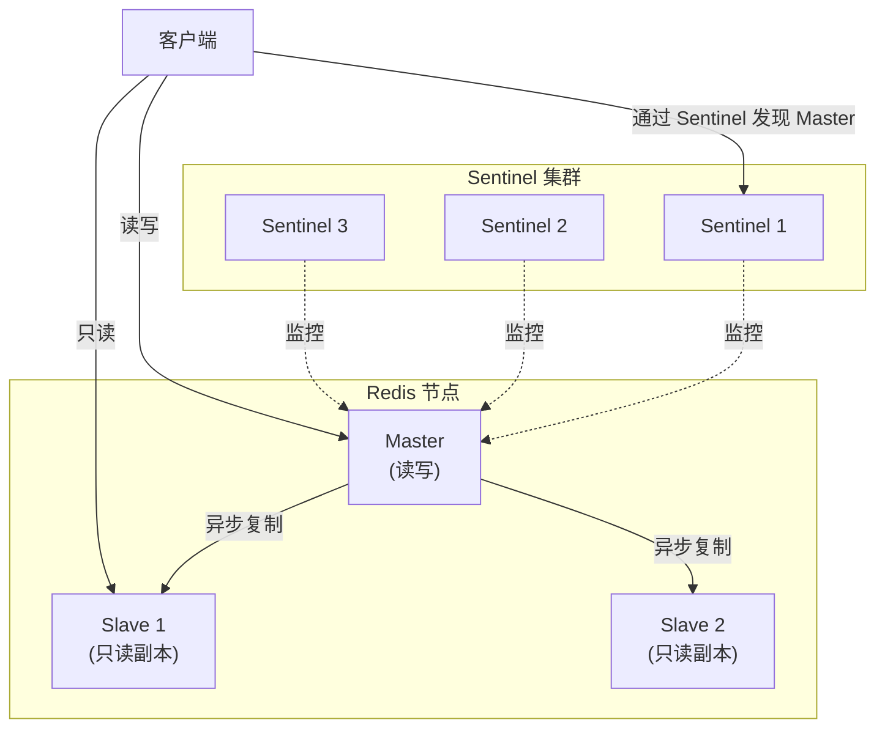
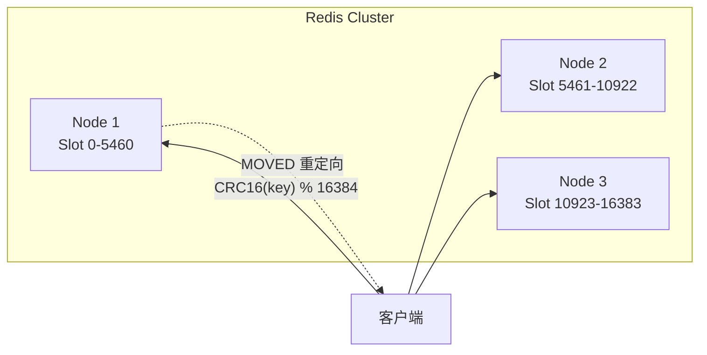

## 概述

内存中的数据结构存储系统，可用作数据库、缓存和消息中间件。支持多种数据结构：字符串、哈希、列表、集合、有序集合。支持 RDB 和 AOF 两种持久化，通过 Sentinel 和 Cluster 实现高可用。

**Redis 7+ 新特性**：
- **Redis Functions**：服务器端脚本新范式，替代部分 Lua 脚本场景
- **ACL v2**：更细粒度的权限控制
- **Sharded Pub/Sub**：跨集群分片的发布订阅

**Redis Stack**（可选模块）：JSON、Search（全文检索）、Time Series、Bloom/Cuckoo 过滤器。

---

## 速查卡

- **持久化**：RDB（快照，fork子进程，灾难恢复友好，可能丢数据）→ AOF（追加日志，三种同步策略，更安全但文件更大）
- **集群**：Sentinel（监控+自动故障转移，AP模型）→ Redis Cluster（原生分片，CRC16%16384哈希槽，MOVED重定向）
- **淘汰策略**：noeviction（默认报错）→ allkeys-lru（LRU淘汰）→ allkeys-lfu（LFU淘汰，4.0+，冷热区分更好）→ volatile-ttl
- **过期键删除**：定时随机检查 + 读取时惰性删除 + maxmemory扫描全key删除
- **LRU vs LFU**：LRU按最近使用时间 → LFU按使用频率，LFU更适合冷热数据区分，避免偶发访问挤掉热点
- **Redis Stack**：JSON、Search、Time Series、Bloom/Cuckoo过滤器等可选模块
- **Redis 7+**：Functions（服务端脚本）、ACL v2（细粒度权限）、Sharded Pub/Sub

## 持久化机制

### RDB（快照）

定时将内存数据 dump 到磁盘。

**优势**：整个 DB 一个文件便于备份；灾难恢复友好；性能最大化（fork 子进程）；大数据集启动快。

**劣势**：可能丢失最后一次持久化后的数据；大数据集 fork 可能导致服务暂停。

### AOF（追加文件）

将操作日志以追加方式写入文件。

**优势**：更高安全性（每秒/每修改/不同步三种策略）；append 模式不破坏已有内容；自动 rewrite 控制日志大小；可用于数据重建。

**劣势**：文件通常大于 RDB；运行效率可能慢于 RDB。

### 选择标准

牺牲性能换更高缓存一致性 → AOF；写操作频繁换更高性能 → RDB。

---

## Redis 集群

### 哨兵模式（Sentinel）

### Redis Cluster（原生分片）

| 方案 | 说明 |
|------|------|
| **哨兵模式** | Sentinel 监控 + 自动故障转移 |
| **Redis Cluster** | 原生数据分片集群 |

---

## 淘汰策略

| 策略 | 说明 | 版本 |
|------|------|:---:|
| `noeviction` | 写请求返回错误（默认） | — |
| `allkeys-lru` | 所有 key 中 LRU 淘汰 | — |
| `volatile-lru` | 有过期时间的 key 中 LRU | — |
| `allkeys-lfu` | 所有 key 中 LFU 淘汰 | 4.0+ |
| `volatile-lfu` | 有过期时间的 key 中 LFU | 4.0+ |
| `allkeys-random` | 所有 key 中随机淘汰 | — |
| `volatile-random` | 有过期时间的 key 中随机 | — |
| `volatile-ttl` | 越早过期越优先淘汰 | — |

> LRU（最近最少使用）vs LFU（最不频繁使用）：LFU 更适合有冷热数据区分明显的场景，可避免偶发访问挤掉热点数据。

## 过期键删除

1. 定时随机检查删除
2. 读取时检查删除
3. 内存达到 maxmemory 时扫描全 key 删除

---

## 自测

1. **RDB 和 AOF 的核心取舍是什么？生产环境通常如何配置？**
    → RDB 性能高、恢复快，但可能丢数据（两次快照之间的写入）。AOF 数据更安全（每秒同步最多丢 1 秒），但文件更大、恢复慢。生产环境通常 RDB + AOF 混合使用：RDB 做冷备，AOF 保数据安全。

2. **Redis Cluster 的 MOVED 和 ASK 重定向有什么区别？**
    → MOVED：key 所在槽确实属于其他节点，客户端应更新本地槽映射表，后续请求直接发给正确节点。ASK：槽正在迁移中（部分 key 还在旧节点），仅本次请求临时重定向，不更新映射表。

3. **LRU 和 LFU 淘汰策略的区别？为什么 Redis 4.0 引入 LFU？**
    → LRU 淘汰最近最少使用的 key（按时间），LFU 淘汰最不频繁使用的 key（按频率）。LFU 解决 LRU 的问题：偶发的大量访问（如批量查询）可能挤掉真正的热点数据。LFU 对冷热数据区分更准确。

4. **Redis 过期键的三种删除策略如何配合工作？**
    → 定时随机检查（主动清理，每次随机抽一批 key 检查过期）→ 惰性删除（访问 key 时检查，节省 CPU 但可能有"过期垃圾"堆积）→ maxmemory 淘汰（内存不足时强制扫描删除）。三者互补：定时保证大部分过期 key 被清理，惰性兜底访问场景，淘汰策略兜底内存压力。
