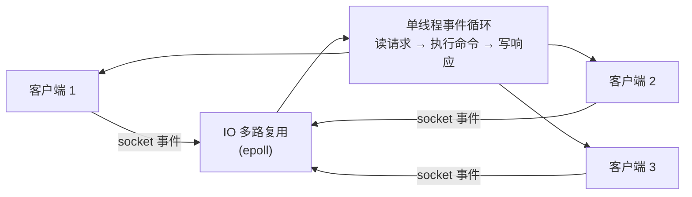
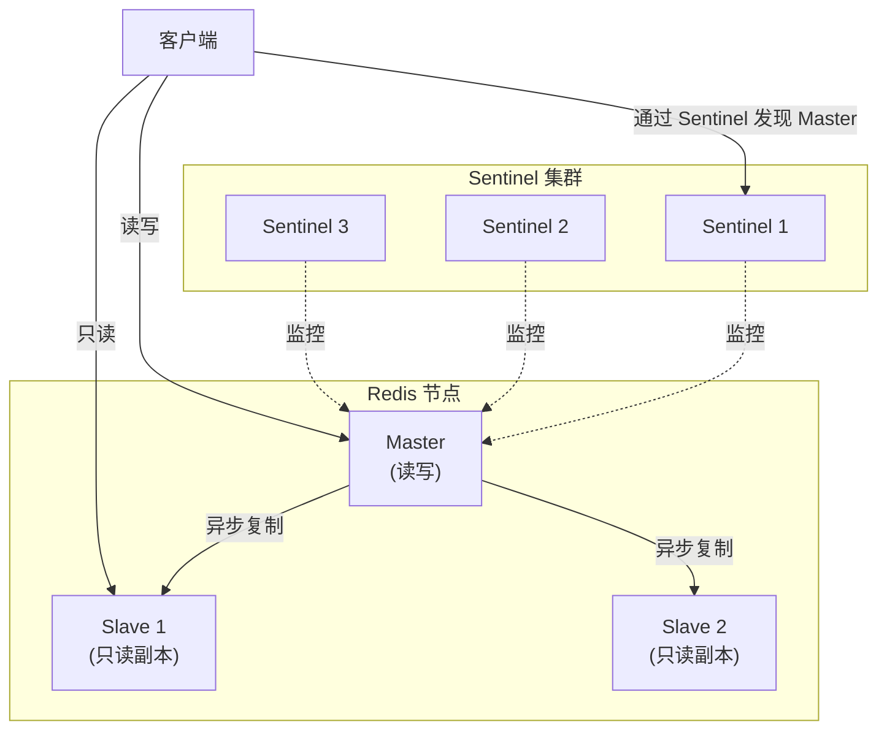
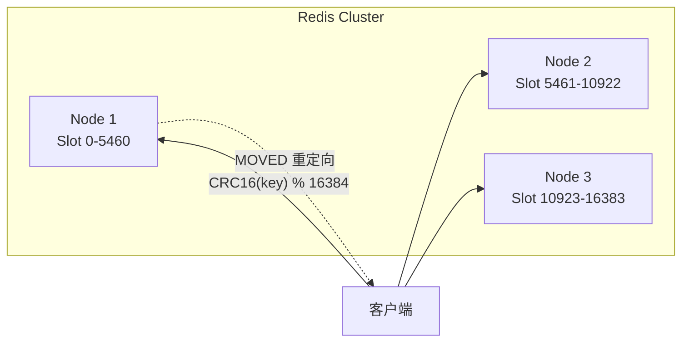
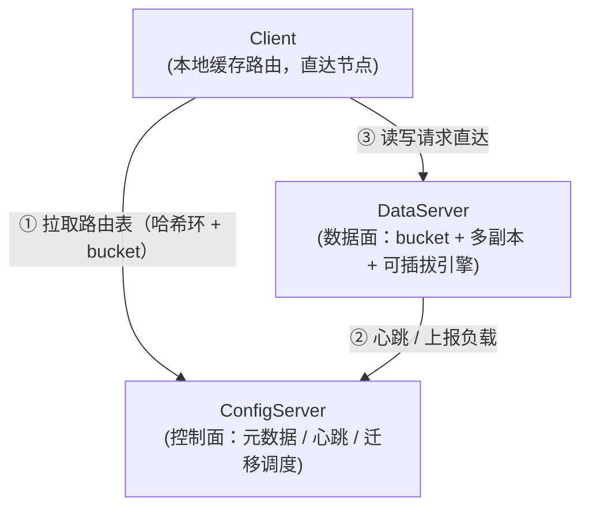

## 概述

内存中的数据结构存储系统，可用作数据库、缓存和消息中间件。支持多种数据结构：字符串、哈希、列表、集合、有序集合。支持 RDB 和 AOF 两种持久化，通过 Sentinel 和 Cluster 实现高可用。

### 核心数据结构

| 结构 | 说明 | 典型场景 |
|------|------|---------|
| **STRING** | 字符串 / 二进制，最基础 | 计数、缓存、分布式锁 |
| **HASH** | 字段-值映射 | 对象存储、锁的重入计数 |
| **LIST** | 有序列表 | 消息队列、时间线 |
| **SET** | 无序去重集合 | 标签、共同好友 |
| **ZSET** | 带分数的有序集合（跳表） | 排行榜、延迟队列 |

**Redis 7+ 新特性**：

- **Redis Functions**：服务器端脚本新范式，替代部分 Lua 脚本场景
- **ACL v2**：更细粒度的权限控制
- **Sharded Pub/Sub**：跨集群分片的发布订阅

**Redis Stack**（可选模块）：JSON、Search（全文检索）、Time Series、Bloom/Cuckoo 过滤器。

---

## 速查卡

- **数据结构**：STRING / HASH / LIST / SET / ZSET（跳表，排行榜）
- **线程模型**：单线程执行命令（无锁竞争）+ IO 多路复用；6.0 多线程只做网络读写，命令执行仍单线程
- **持久化**：RDB（快照，fork 子进程，灾难恢复友好）→ AOF（追加日志，三种同步策略，更安全）；生产 RDB + AOF 混合
- **高可用与集群**：Sentinel（监控+自动故障转移，AP）→ Cluster（原生分片，CRC16%16384 槽，MOVED/ASK 重定向，在线 slot 迁移扩容）
- **Tair（阿里分布式 KV）**：控制面(ConfigServer)/数据面(DataServer)分离 + 一致性哈希 bucket + 可插拔存储引擎
- **内存管理**：淘汰策略（noeviction→LRU→LFU，冷热区分）+ 过期键删除（定时随机 + 惰性 + maxmemory 扫描）
- **分布式锁**：SET NX EX 原子加锁 + value 唯一标识 + Lua 判断删除 + 看门狗；主从丢锁，强一致用 ZK/etcd
- **Redis Stack**：JSON、Search、Time Series、Bloom/Cuckoo 过滤器等可选模块
- **Redis 7+**：Functions（服务端脚本）、ACL v2（细粒度权限）、Sharded Pub/Sub

---

## 线程模型

### Redis 为什么快

| 因素 | 说明 |
|------|------|
| **纯内存操作** | 读写都在内存，无磁盘 IO 瓶颈（持久化异步/子进程） |
| **单线程执行命令** | 无锁竞争、无上下文切换开销 |
| **IO 多路复用** | 一个线程监听多个 socket，事件驱动、非阻塞 |
| **高效数据结构** | 跳表、哈希表等针对内存优化 |

### 单线程模型（6.0 之前）

Redis 6.0 前，命令的读取、解析、执行、写回全部由**一个线程**完成：


```mermaid
flowchart LR
    C1["客户端 1"] -->|"socket 事件"| Epoll["IO 多路复用<br/>(epoll)"]
    C2["客户端 2"] -->|"socket 事件"| Epoll
    C3["客户端 3"] -->|"socket 事件"| Epoll
    Epoll --> Loop["单线程事件循环<br/>读请求 → 执行命令 → 写响应"]
    Loop --> C1
    Loop --> C2
    Loop --> C3
```

**为什么单线程还快**：Redis 的瓶颈是**网络 IO 和内存**，不是 CPU。命令在内存里执行都是微秒级，单线程反而避免了多线程的**锁竞争**和**上下文切换**开销。

### 单线程的局限性

1. **CPU 利用率低**：只能利用单核，多核机器浪费
2. **慢命令阻塞**：`KEYS *`、大 Key 操作等慢命令会阻塞后续所有命令
3. **网络读写耗时**：请求/响应的 socket 读写是 CPU 消耗点，单线程有上限

### Redis 6.0 IO 多线程

Redis 6.0 引入 IO 多线程，但**命令执行仍是单线程**——只把耗时的网络读写（socket 解析、序列化）交给多线程：


```mermaid
flowchart LR
    subgraph IO["IO 线程池（多线程）"]
        T1["线程 1：读请求 / 写响应"]
        T2["线程 2：读请求 / 写响应"]
    end
    subgraph Main["主线程"]
        M["单线程执行命令<br/>(保证原子性)"]
    end
    IO -->|"解析后的命令"| Main
    Main -->|"执行结果"| IO
```

- **默认关闭**（`io-threads` 默认 1），需手动设置 `io-threads 4`
- **多线程只做「网络读写」**，命令执行始终单线程——**保证命令的原子性和顺序性不被破坏**
- 因为命令执行依然串行，Redis 的数据结构**不需要加锁**

> 关键：**Redis 6.0 的多线程 ≠ 多线程执行命令**。它只是把「读 socket 数据」「写 socket 响应」这种纯 IO 工作并行化，真正的命令执行永远单线程。这是面试最容易误解的点。

### 慢命令与规避

单线程模型下，一个慢命令会阻塞所有客户端：

| 慢操作 | 问题 | 规避 |
|--------|------|------|
| `KEYS *` | 全量遍历，阻塞 | 用 `SCAN` 游标迭代 |
| 大 Key 删除 | `DEL` 大集合阻塞 | `UNLINK` 异步删除 / 分批删 |
| 大集合遍历 | `SMEMBERS`/`HGETALL` 大 key | 拆分 key / `SSCAN`/`HSCAN` |

---

## 持久化机制

### RDB（快照）

定时将内存数据 dump 到磁盘。

**优势**：整个 DB 一个文件便于备份；灾难恢复友好；性能最大化（fork 子进程）；大数据集启动快。

**劣势**：可能丢失最后一次持久化后的数据；大数据集 fork 可能导致服务暂停。

### AOF（追加文件）

将操作日志以追加方式写入文件。

**优势**：更高安全性（每秒/每修改/不同步三种策略）；append 模式不破坏已有内容；自动 rewrite 控制日志大小；可用于数据重建。

**劣势**：文件通常大于 RDB；运行效率可能慢于 RDB。

### 选择标准

牺牲性能换更高缓存一致性 → AOF；写操作频繁换更高性能 → RDB。

---

## 高可用与集群

### 哨兵模式（Sentinel）


```mermaid
flowchart TB
    subgraph Sentinels["Sentinel 集群"]
        S1["Sentinel 1"]
        S2["Sentinel 2"]
        S3["Sentinel 3"]
    end

    subgraph Nodes["Redis 节点"]
        Master["Master<br/>(读写)"]
        Slave1["Slave 1<br/>(只读副本)"]
        Slave2["Slave 2<br/>(只读副本)"]
    end

    Master -->|"异步复制"| Slave1
    Master -->|"异步复制"| Slave2
    S1 -.->|"监控"| Master
    S2 -.->|"监控"| Master
    S3 -.->|"监控"| Master

    Client["客户端"] -->|"通过 Sentinel 发现 Master"| S1
    Client -->|"读写"| Master
    Client -->|"只读"| Slave1
```

### Redis Cluster（原生分片）


```mermaid
flowchart LR
    subgraph Cluster["Redis Cluster"]
        N1["Node 1<br/>Slot 0-5460"]
        N2["Node 2<br/>Slot 5461-10922"]
        N3["Node 3<br/>Slot 10923-16383"]
    end

    Client["客户端"] -->|"CRC16(key) % 16384"| N1
    Client --> N2
    Client --> N3

    N1 -.->|"MOVED 重定向"| Client
```

Cluster 把数据按 **slot（哈希槽）** 分片到多个主节点，每个主节点只负责一部分 key，这是它能横向扩展的根本（对比哨兵模式的「全量副本不分区」）。

#### slot 机制

- **固定 16384 个 slot**（0~16383），`slot = CRC16(key) % 16384`，key 永远跟着自己的 slot 走
- **slot 是分片的最小单位**，不可再拆；每个节点用一张 16384 位的 bitmap 记录「哪些 slot 归我」
- **哈希标签 `{...}`**：`{user1000}a` 和 `{user1000}b` 只对花括号内 `user1000` 算 slot，落同一 slot，用于把「事务/Lua 要操作的一组关联 key」强制放一起
- **所有 16384 个 slot 都被分配、无遗漏**时集群才 `cluster_state:ok`

#### 扩容与 slot 迁移

Cluster 扩容 = 在线迁移 slot。**slot 总数始终 16384 不变**，变的是「分给几个主节点、每个拿哪一段」。

**扩容前后 slot 分配**（3 主 → 4 主）：

| 阶段 | A | B | C | D |
|------|---|---|---|---|
| 扩容前 | 0~5460 | 5461~10922 | 10923~16383 | — |
| 扩容后 | 0~4095 | 4096~8191 | 8192~12287 | 12288~16383 |

本质是**旧主各自割让一段 slot 给新主**，重新平均分。选哪几个 slot 迁：均等抽取 + 优先迁 key 少/空的 slot（减少搬迁数据量）。

**加主节点步骤**：

1. 启动空节点 → `CLUSTER MEET <已有节点>` 加入集群（gossip 被发现）
2. `redis-cli --cluster reshard`（或手动 `CLUSTER SETSLOT` + `MIGRATE`）迁移 slot
3. 迁移完成，slot 归属经 gossip 广播，客户端更新路由表

**单个 slot 迁移底层流程**（从源 A 迁到新节点 D）：

1. 目标 D：`CLUSTER SETSLOT <slot> IMPORTING <A节点ID>`
2. 源 A：`CLUSTER SETSLOT <slot> MIGRATING <D节点ID>`
3. 源 A 逐个 `MIGRATE` key 到 D（**单 key 原子**，key 要么在 A 要么在 D，不会两头都有或都没有）
4. 搬完后双方 `CLUSTER SETSLOT <slot> NODE <D节点ID>`，gossip 广播归属

**迁移期间如何保持在线**：

| 重定向 | 含义 | 客户端动作 |
|--------|------|-----------|
| `MOVED` | slot 归属**永久**变了 | 更新本地 slot 表 |
| `ASK` | slot **迁移中**，这个 key 刚被搬走 | 仅本次临时去目标节点取，不改路由 |

迁移中 slot 处于 MIGRATING/IMPORTING 状态，客户端请求某 key 时：key 还在源 → 正常响应；key 已搬走 → 源返回 `ASK`，客户端带 `ASKING` 去目标取。加上 `MIGRATE` 单 key 原子，**读写全程不中断**。

**加从节点**：启动 → `CLUSTER MEET` → `CLUSTER REPLICATE <主节点ID>`，做一次全量同步 + 增量复制。只多一个只读副本，不分担写、不迁移 slot，几乎无感。

**迁移注意事项**：分批迁移（观察延迟/带宽）· 低峰期迁移 · 先拆大 key（大 key 迁移会短暂阻塞单线程）· 关注内网带宽。

### Tair（阿里分布式 KV 集群）

阿里自研的分布式 KV 存储系统（C++，非 Redis 封装），可看作 Redis 集群方案的另一种架构思路。注意区分：**经典 Tair**（自研分布式 KV）vs **阿里云 Tair（兼容 Redis）**（企业级 Redis 增强版）。

#### 为什么需要 Tair？（它解决什么问题）

Tair 诞生于淘宝早期（约 2010 年）的海量缓存场景，本质是解决 Memcached / 早期 Redis 在大规模分布式下暴露的痛点：

| 痛点 | 说明 | Tair 的解法 |
|------|------|------------|
| **单机内存上限** | 单机缓存容量有限，海量商品/交易数据装不下 | 分布式分片，数据横向拆到多节点 |
| **节点故障丢数据 → 缓存雪崩** | Memcached 无持久化、无副本，宕机数据全丢，请求瞬间穿透到 DB | 多副本（bucket 3 副本 + 主备）高可用 |
| **存储需求差异化** | 纯缓存 / 持久化 / 大容量低成本，不同业务诉求不同 | 可插拔存储引擎（mdb/ldb/rdb/fdb） |
| **弹性扩缩容** | 大促需快速扩容、活动后缩容，人工搬数据不可行 | bucket 粒度自动迁移，ConfigServer 调度 |
| **多业务各自为政** | 每个业务自搭一套缓存，运维成本高、资源浪费 | namespace 隔离，统一平台多业务共用 |

> 一句话：**Tair = 解决「海量数据 + 高可用 + 弹性伸缩 + 多业务统一」的分布式 KV 平台**，而不只是一个"支持更大内存的 Redis"。

#### 三大角色：控制面与数据面分离


```mermaid
flowchart TB
    CS["ConfigServer<br/>(控制面：元数据 / 心跳 / 迁移调度)"]
    Client["Client<br/>(本地缓存路由，直达节点)"]
    DS["DataServer<br/>(数据面：bucket + 多副本 + 可插拔引擎)"]

    Client -->|"① 拉取路由表（哈希环 + bucket）"| CS
    DS -->|"② 心跳 / 上报负载"| CS
    Client -->|"③ 读写请求直达"| DS
```

| 角色 | 职责 | 关键点 |
|------|------|--------|
| **Client** | 提供 put/get API，本地缓存路由表，直接与 DataServer 通信 | 无代理转发，**无中心瓶颈** |
| **ConfigServer** | 维护元数据（节点/bucket 分布/副本/负载），心跳监控，调度迁移 | 不碰业务数据，只做控制面 |
| **DataServer** | 存储数据，以 bucket 为单位，可插拔存储引擎 | 负责过期清理、备份 |

#### 数据分布：一致性哈希 + bucket

- key 映射到哈希环，环切成若干段，每段对应一个 **bucket**
- **bucket 是分布与迁移的最小单位**（类比 Redis Cluster 的 slot）
- 每个 bucket 有 N 个副本（常见 3 份），分布在不同节点，1 master + 多 slave

#### 复制与一致性（同步复制机制）

- 复制方式**可配置**：**同步复制**（master 等副本 ack 才返回，主挂了不丢数据）vs **异步复制**（默认，本地写完即返回，吞吐高）
- **同步复制写路径**：master 本地写 → 产生增量日志 → 推送给 slave → slave 落定回 ack → master 等齐 slave ack 才向客户端返回"成功"
- 本质是**主备同步复制**，保证 **RPO=0（已确认写入不丢失）**，而非 Raft/Paxos 那种**多数派共识的线性一致**；故障切换靠 **ConfigServer 仲裁**（心跳 → 提 slave 为 master），不是节点自组织选举

#### 可插拔存储引擎（Tair 核心特色）

| 引擎 | 底层 | 场景 |
|------|------|------|
| **mdb** | 自研内存引擎 | 纯缓存、超高 QPS |
| **ldb** | LevelDB | 持久化、大容量 |
| **rdb** | RocksDB | 持久化、高写入吞吐 |
| **fdb** | Flash/SSD 定制 | 超大容量、低成本 |

#### 与 Redis Cluster 对比

| 维度 | Redis Cluster | Tair |
|------|--------------|------|
| 数据分布 | CRC16 % 16384 哈希槽 | 一致性哈希 + bucket |
| 路由 | 客户端缓存 slot 表 + MOVED | 客户端缓存路由表 + 直达 |
| 控制面 | 无独立控制节点（gossip） | 独立 ConfigServer 主备 |
| 存储引擎 | 单一（内存 + RDB/AOF） | **可插拔**（mdb/ldb/rdb/fdb） |
| 复制一致性 | 默认异步 + 可选 `WAIT` | 同步/异步可配，同步复制 RPO=0 |
| 迁移 | 槽迁移 | bucket 迁移（ConfigServer 调度） |

### 方案对比

| 方案 | 说明 |
|------|------|
| **哨兵模式** | Sentinel 监控 + 自动故障转移 |
| **Redis Cluster** | 原生数据分片集群 |
| **Tair** | 阿里分布式 KV：控制面/数据面分离 + 可插拔存储引擎 |

---

## 内存管理

内存治理的两面：**淘汰策略**决定"内存满了淘汰谁"，**过期键删除**决定"带 TTL 的 key 过期后何时清"。

### 淘汰策略（maxmemory-policy）

| 策略 | 说明 | 版本 |
|------|------|:---:|
| `noeviction` | 写请求返回错误（默认） | — |
| `allkeys-lru` | 所有 key 中 LRU 淘汰 | — |
| `volatile-lru` | 有过期时间的 key 中 LRU | — |
| `allkeys-lfu` | 所有 key 中 LFU 淘汰 | 4.0+ |
| `volatile-lfu` | 有过期时间的 key 中 LFU | 4.0+ |
| `allkeys-random` | 所有 key 中随机淘汰 | — |
| `volatile-random` | 有过期时间的 key 中随机 | — |
| `volatile-ttl` | 越早过期越优先淘汰 | — |

> **LRU（最近最少使用）vs LFU（最不频繁使用）**：LFU 更适合冷热数据区分明显的场景，避免偶发的大量访问（如批量查询）挤掉真正的热点数据。

### 过期键删除

1. 定时随机检查删除
2. 读取时检查删除（惰性删除）
3. 内存达到 maxmemory 时扫描全 key 删除

---

## Redis 分布式锁

### 演进：从 SETNX 到安全释放

| 阶段 | 写法 | 问题 |
|------|------|------|
| ① 基础版 | `SETNX key value` + `EXPIRE key ttl` | 两步非原子，`SETNX` 后进程挂了 → 锁永不过期 |
| ② 原子加锁 | `SET key value NX EX ttl` | 加锁+过期原子，但释放仍有问题 |
| ③ 安全释放 | Lua：先 GET 判断 value 再 DEL | 防止误删别人的锁 |

三个关键点：

1. **value 用唯一标识**（UUID / 线程 ID）：区分锁的持有者
2. **加锁用原子命令**：`SET lock:xxx <uuid> NX EX 30`
3. **释放用 Lua 保证"判断 + 删除"原子**：

```lua
-- 判断是自己的锁才删除
if redis.call('get', KEYS[1]) == ARGV[1] then
    return redis.call('del', KEYS[1])
else
    return 0
end
```

### 锁过期与看门狗（Watchdog）

**问题**：业务执行时间 > 锁 TTL → 锁被自动释放 → 其他线程拿到锁 → 并发。

**方案**：Redisson 默认锁 TTL 30s，**看门狗每 10s 续期**到 30s，业务执行完主动释放；进程挂了看门狗停止续期，锁到期自动释放。

### 可重入锁（Redisson）

Redisson 用 **HASH 结构**存锁：`field = 线程标识`，`value = 重入次数`。加锁 +1、解锁 -1，减到 0 删除 key。

### 主从切换丢锁 → RedLock

Redis 主从**异步复制**，主挂了 slave 还没同步到锁 → 锁丢失，别的客户端又能拿到锁。

RedLock 思路：向 **N 个独立 Redis 实例**（非主从）依次加锁，**超过半数成功**且总耗时 < TTL 才算成功；释放时向所有实例释放。

> 争议（Martin Kleppmann vs Antirez）：RedLock 依赖时钟，GC 停顿 / 时钟跳跃仍可能破坏互斥，**无法保证绝对正确**。强正确性场景（资金/库存）应改用 ZK/etcd。

### Redis vs ZooKeeper 分布式锁

| 维度 | Redis | ZooKeeper |
|------|-------|-----------|
| 一致性模型 | AP（主从切换可能丢锁） | CP（ZAB 共识） |
| 实现 | SET NX + Lua + 看门狗 | 临时顺序节点 + Watch |
| 性能 | 高（微秒级） | 较低（写需半数确认） |
| 锁释放 | 主动删 + 看门狗防过期 | 会话断开自动删除（临时节点） |
| 适用 | 一般互斥、高并发 | 资金扣减、库存等强正确性 |

### 选型结论

- **一般场景**：Redis + Redisson（看门狗 + 可重入），够用且高性能
- **强正确性场景**：ZK/etcd（CP，临时节点自动释放，不依赖续期）

---

## 热点榜单设计

面试中的高频场景题。核心挑战：**海量并发写入 + 实时排序 + 时间衰减**。本质是将 ZSET + HASH + Lua + Pipeline 组合起来解决一个具体业务问题。

### 数据结构选型

| 结构 | 用途 |
|------|------|
| **ZSET** | 核心排名存储，score = 热度分，member = item ID |
| **HASH** | 存储 item 元数据（标题、URL、点赞/评论/分享计数等） |
| **STRING** | 原子计数器（单维度场景可替代 HASH） |

### 热度分公式

```
Score = (点赞 × 3 + 评论 × 5 + 分享 × 10) / (已过小时数 + 2)^1.5
```

> 核心思想：互动权重不同（分享 > 评论 > 点赞），分母用牛顿冷却定律做时间衰减。

### Lua 原子更新

将"递增计数 + 重算分数 + 更新排名"封装为一个 Lua 脚本，保证原子性，避免网络往返：

```lua
-- update_score.lua
-- KEYS[1]: HASH key（存储计数）, KEYS[2]: ZSET key
-- ARGV[1]: 行为类型, ARGV[2]: item ID, ARGV[3]: 重力因子
local hash_key = KEYS[1]
local zset_key = KEYS[2]

redis.call('HINCRBY', hash_key, ARGV[1], 1)

local counters = redis.call('HGETALL', hash_key)
local likes    = tonumber(counters['like'] or 0)
local comments = tonumber(counters['comment'] or 0)
local shares   = tonumber(counters['share'] or 0)
local created  = tonumber(counters['create_time'] or redis.call('TIME')[1])

local hours = (redis.call('TIME')[1] - created) / 3600
local score = (likes * 3 + comments * 5 + shares * 10) / math.pow(hours + 2, tonumber(ARGV[3]))

redis.call('ZADD', zset_key, score, ARGV[2])
return score
```

### 多级 ZSET 分层

不要所有数据放一个 ZSET，按时间维度拆分，解决全量排序性能问题：

| ZSET Key | 窗口 | 过期时间 | 用途 |
|----------|------|:---:|------|
| `hot:ranking:hour` | 最近 1 小时 | TTL 1h | 实时热度 |
| `hot:ranking:day` | 最近 24 小时 | — | 日榜 |
| `hot:ranking:week` | 最近 7 天 | — | 周榜 |

写入时 Pipeline 同时写多个 ZSET；`hour` 级别设 TTL 让 Redis 自动清理。查询时 `ZREVRANGE` 按 score 降序取 Top N：

```java
// 取日榜 Top 100
Set<Tuple> top = jedis.zrevrangeWithScores("hot:ranking:day", 0, 99);
```

### 高并发写入优化


```mermaid
flowchart LR
    Users["用户行为<br/>(点赞/评论/分享)"] --> GW["API Gateway"]
    GW --> MQ["Kafka / 消息队列<br/>削峰填谷"]
    MQ --> Consumer["批量消费<br/>200ms 窗口聚合"]
    Consumer -->|"Pipeline + Lua"| Redis["Redis<br/>ZSET + HASH"]
    Redis -->|"ZREVRANGE"| App["榜单服务<br/>返回 Top N"]
```

两个关键手段：

1. **MQ 异步解耦** — 用户行为先入 MQ，批量消费（200ms 窗口聚合），将 10 万 QPS 写入降为 ~500 batch/s
2. **Pipeline 批量写** — 一次网络往返提交多条命令，减少 RTT 开销

### 上限裁剪 & 兜底

- **ZREMRANGEBYRANK** 保留前 5000，防止 ZSET 无限增长
- **定时任务**计算 Top 100 存入本地缓存（Caffeine），Redis 故障时兜底
- **哨兵/集群**保证高可用，读写分离

### 面试回答层次

| 层次 | 要点 |
|------|------|
| **基础** | ZSET(ZADD/ZREVRANGE) + HASH 选型，复杂度 O(log N) |
| **进阶** | Lua 原子化 + Pipeline 批量 + 多时间维度分层 ZSET |
| **高阶** | MQ 异步削峰、时间衰减算法（牛顿冷却）、ZSET 底层跳表结构 |
| **深度** | Redis Cluster 跨 slot 问题、热点 Key 多级缓存、本地缓存降级 |

---

## 自测

1. **RDB 和 AOF 的核心取舍是什么？生产环境通常如何配置？**
   <br/>→ RDB 性能高、恢复快，但可能丢数据（两次快照之间的写入）。AOF 数据更安全（每秒同步最多丢 1 秒），但文件更大、恢复慢。生产环境通常 RDB + AOF 混合使用：RDB 做冷备，AOF 保数据安全。

2. **Redis Cluster 的 MOVED 和 ASK 重定向有什么区别？**
   <br/>→ MOVED：key 所在槽确实属于其他节点，客户端应更新本地槽映射表，后续请求直接发给正确节点。ASK：槽正在迁移中（部分 key 还在旧节点），仅本次请求临时重定向，不更新映射表。

3. **Tair 相比 Redis Cluster 在架构上有什么不同？**
   <br/>→ Tair 采用控制面（ConfigServer）/数据面（DataServer）分离 + 客户端本地路由直达，数据分布用一致性哈希 + bucket（而非 16384 槽），并支持可插拔存储引擎（mdb 内存 / ldb / rdb / fdb）。Redis Cluster 用 gossip 去中心化、无独立控制节点，存储引擎单一。两者都无代理转发，但 Tair 多了"存储引擎可换"和"ConfigServer 主动调度迁移"。

4. **LRU 和 LFU 淘汰策略的区别？为什么 Redis 4.0 引入 LFU？**
   <br/>→ LRU 淘汰最近最少使用的 key（按时间），LFU 淘汰最不频繁使用的 key（按频率）。LFU 解决 LRU 的问题：偶发的大量访问（如批量查询）可能挤掉真正的热点数据。LFU 对冷热数据区分更准确。

5. **Redis 过期键的三种删除策略如何配合工作？**
   <br/>→ 定时随机检查（主动清理，每次随机抽一批 key 检查过期）→ 惰性删除（访问 key 时检查，节省 CPU 但可能有"过期垃圾"堆积）→ maxmemory 淘汰（内存不足时强制扫描删除）。三者互补：定时保证大部分过期 key 被清理，惰性兜底访问场景，淘汰策略兜底内存压力。

6. **Redis 分布式锁为什么不能只用 `SETNX`？正确实现要满足哪些点？**
   <br/>→ `SETNX` 与 `EXPIRE` 两步非原子，中间进程挂掉锁会永不过期。正确实现：加锁用原子命令 `SET key uuid NX EX 30`；value 用唯一标识区分持有者；释放用 Lua 先判断 value 再 DEL 防止误删；配合看门狗续期避免业务超时锁被提前释放。

7. **Redis 主从切换为什么可能丢锁？RedLock 能否彻底解决？强一致场景该用什么？**
   <br/>→ 主从异步复制，主挂了 slave 未同步到锁，新主上锁丢失。RedLock 向 N 个独立实例加锁、过半成功才算成功，但依赖时钟，GC 停顿/时钟跳跃下仍无法保证绝对互斥。强一致场景（资金/库存）用 ZK/etcd（CP、临时节点会话断开自动释放）。

8. **热点榜单为什么用 ZSET 而不是其他数据结构？写入流程如何保证原子性？**
   <br/>→ ZSET 底层是跳表，ZADD 和 ZREVRANGE 都是 O(log N)，天然适合排名场景。HASH 存元数据，STRING 做简单计数。原子性通过 Lua 脚本保证：将"递增计数 → 重算分数 → ZADD 更新排名"封装在一次 Redis 执行中，避免网络往返带来的竞态。

9. **高并发场景下热点榜单的写入瓶颈如何解决？**
   <br/>→ 三个手段：（1）MQ 异步削峰，用户行为先入消息队列，批量消费后 Pipeline 写 Redis；（2）多级 ZSET 按时间分层（hour/day/week），避免单个 ZSET 过大；（3）ZREMRANGEBYRANK 定期裁剪保留前 N 条，控制内存。极端场景还可将热点 item 的计数拆到多个 slot 分散写入压力。

10. **Redis Cluster 的 slot 是怎么划分分配的？扩容前后有什么变化？**
    <br/>→ 固定 16384 个 slot，`slot = CRC16(key) % 16384`，key 永远跟着自己的 slot 走；`{...}` 哈希标签可把关联 key 强制放同一 slot。slot 是分片最小单位，扩容前由 N 个主节点平分，扩容后由 N+1 个主节点重新平分——旧主各自割让一段 slot（优先挑 key 少的）给新主，slot 总数不变。

11. **Redis Cluster 扩容的底层过程是什么？迁移期间如何保证服务不中断？**
    <br/>→ 扩容 = 在线迁移 slot：启动空节点 → CLUSTER MEET 加入集群 → 源节点 CLUSTER SETSLOT MIGRATING、目标节点 IMPORTING → 源节点逐个 MIGRATE key（单 key 原子）→ 双方 SETSLOT NODE 完成归属并 gossip 广播。迁移期间靠 ASK 临时重定向：key 还在源就正常响应，已搬走就返回 ASK 让客户端带 ASKING 去目标取，读写不中断。注意分批/低峰迁移、先拆大 key、控制带宽。
