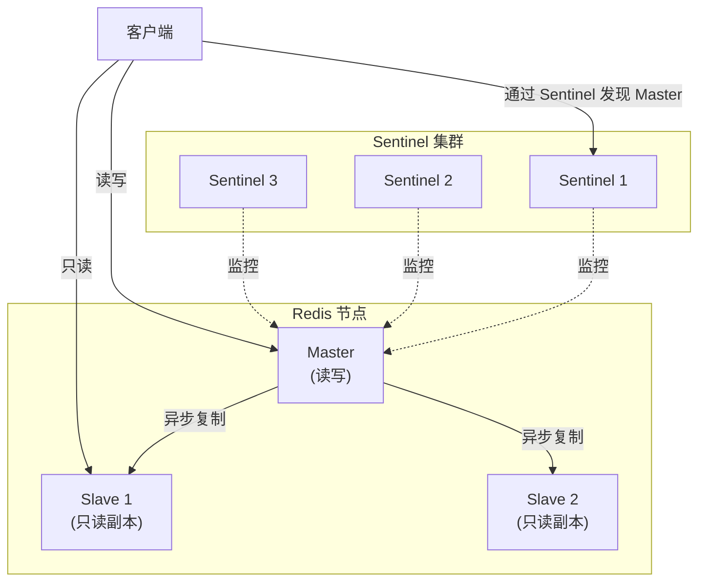
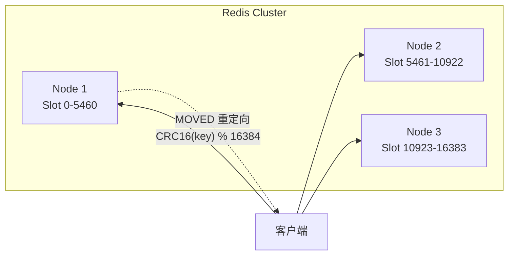

## 概述

内存中的数据结构存储系统，可用作数据库、缓存和消息中间件。支持多种数据结构：字符串、哈希、列表、集合、有序集合。支持 RDB 和 AOF 两种持久化，通过 Sentinel 和 Cluster 实现高可用。

**Redis 7+ 新特性**：
- **Redis Functions**：服务器端脚本新范式，替代部分 Lua 脚本场景
- **ACL v2**：更细粒度的权限控制
- **Sharded Pub/Sub**：跨集群分片的发布订阅

**Redis Stack**（可选模块）：JSON、Search（全文检索）、Time Series、Bloom/Cuckoo 过滤器。

---

## 速查卡

- **持久化**：RDB（快照，fork子进程，灾难恢复友好，可能丢数据）→ AOF（追加日志，三种同步策略，更安全但文件更大）
- **集群**：Sentinel（监控+自动故障转移，AP模型）→ Redis Cluster（原生分片，CRC16%16384哈希槽，MOVED重定向）
- **淘汰策略**：noeviction（默认报错）→ allkeys-lru（LRU淘汰）→ allkeys-lfu（LFU淘汰，4.0+，冷热区分更好）→ volatile-ttl
- **过期键删除**：定时随机检查 + 读取时惰性删除 + maxmemory扫描全key删除
- **LRU vs LFU**：LRU按最近使用时间 → LFU按使用频率，LFU更适合冷热数据区分，避免偶发访问挤掉热点
- **Redis Stack**：JSON、Search、Time Series、Bloom/Cuckoo过滤器等可选模块
- **Redis 7+**：Functions（服务端脚本）、ACL v2（细粒度权限）、Sharded Pub/Sub

## 持久化机制

### RDB（快照）

定时将内存数据 dump 到磁盘。

**优势**：整个 DB 一个文件便于备份；灾难恢复友好；性能最大化（fork 子进程）；大数据集启动快。

**劣势**：可能丢失最后一次持久化后的数据；大数据集 fork 可能导致服务暂停。

### AOF（追加文件）

将操作日志以追加方式写入文件。

**优势**：更高安全性（每秒/每修改/不同步三种策略）；append 模式不破坏已有内容；自动 rewrite 控制日志大小；可用于数据重建。

**劣势**：文件通常大于 RDB；运行效率可能慢于 RDB。

### 选择标准

牺牲性能换更高缓存一致性 → AOF；写操作频繁换更高性能 → RDB。

---

## Redis 集群

### 哨兵模式（Sentinel）


```mermaid
flowchart TB
    subgraph Sentinels["Sentinel 集群"]
        S1["Sentinel 1"]
        S2["Sentinel 2"]
        S3["Sentinel 3"]
    end

    subgraph Nodes["Redis 节点"]
        Master["Master<br/>(读写)"]
        Slave1["Slave 1<br/>(只读副本)"]
        Slave2["Slave 2<br/>(只读副本)"]
    end

    Master -->|"异步复制"| Slave1
    Master -->|"异步复制"| Slave2
    S1 -.->|"监控"| Master
    S2 -.->|"监控"| Master
    S3 -.->|"监控"| Master

    Client["客户端"] -->|"通过 Sentinel 发现 Master"| S1
    Client -->|"读写"| Master
    Client -->|"只读"| Slave1
```

### Redis Cluster（原生分片）


```mermaid
flowchart LR
    subgraph Cluster["Redis Cluster"]
        N1["Node 1<br/>Slot 0-5460"]
        N2["Node 2<br/>Slot 5461-10922"]
        N3["Node 3<br/>Slot 10923-16383"]
    end

    Client["客户端"] -->|"CRC16(key) % 16384"| N1
    Client --> N2
    Client --> N3

    N1 -.->|"MOVED 重定向"| Client
```

| 方案 | 说明 |
|------|------|
| **哨兵模式** | Sentinel 监控 + 自动故障转移 |
| **Redis Cluster** | 原生数据分片集群 |

---

## 淘汰策略

| 策略 | 说明 | 版本 |
|------|------|:---:|
| `noeviction` | 写请求返回错误（默认） | — |
| `allkeys-lru` | 所有 key 中 LRU 淘汰 | — |
| `volatile-lru` | 有过期时间的 key 中 LRU | — |
| `allkeys-lfu` | 所有 key 中 LFU 淘汰 | 4.0+ |
| `volatile-lfu` | 有过期时间的 key 中 LFU | 4.0+ |
| `allkeys-random` | 所有 key 中随机淘汰 | — |
| `volatile-random` | 有过期时间的 key 中随机 | — |
| `volatile-ttl` | 越早过期越优先淘汰 | — |

> LRU（最近最少使用）vs LFU（最不频繁使用）：LFU 更适合有冷热数据区分明显的场景，可避免偶发访问挤掉热点数据。

## 过期键删除

1. 定时随机检查删除
2. 读取时检查删除
3. 内存达到 maxmemory 时扫描全 key 删除

---

## 热点榜单设计

面试中的高频场景题。核心挑战：**海量并发写入 + 实时排序 + 时间衰减**。本质是将 ZSET + HASH + Lua + Pipeline 组合起来解决一个具体业务问题。

### 数据结构选型

| 结构 | 用途 |
|------|------|
| **ZSET** | 核心排名存储，score = 热度分，member = item ID |
| **HASH** | 存储 item 元数据（标题、URL、点赞/评论/分享计数等） |
| **STRING** | 原子计数器（单维度场景可替代 HASH） |

### 热度分公式

```
Score = (点赞 × 3 + 评论 × 5 + 分享 × 10) / (已过小时数 + 2)^1.5
```

> 核心思想：互动权重不同（分享 > 评论 > 点赞），分母用牛顿冷却定律做时间衰减。

### Lua 原子更新

将"递增计数 + 重算分数 + 更新排名"封装为一个 Lua 脚本，保证原子性，避免网络往返：

```lua
-- update_score.lua
-- KEYS[1]: HASH key（存储计数）, KEYS[2]: ZSET key
-- ARGV[1]: 行为类型, ARGV[2]: item ID, ARGV[3]: 重力因子
local hash_key = KEYS[1]
local zset_key = KEYS[2]

redis.call('HINCRBY', hash_key, ARGV[1], 1)

local counters = redis.call('HGETALL', hash_key)
local likes    = tonumber(counters['like'] or 0)
local comments = tonumber(counters['comment'] or 0)
local shares   = tonumber(counters['share'] or 0)
local created  = tonumber(counters['create_time'] or redis.call('TIME')[1])

local hours = (redis.call('TIME')[1] - created) / 3600
local score = (likes * 3 + comments * 5 + shares * 10) / math.pow(hours + 2, tonumber(ARGV[3]))

redis.call('ZADD', zset_key, score, ARGV[2])
return score
```

### 多级 ZSET 分层

不要所有数据放一个 ZSET，按时间维度拆分，解决全量排序性能问题：

| ZSET Key | 窗口 | 过期时间 | 用途 |
|----------|------|:---:|------|
| `hot:ranking:hour` | 最近 1 小时 | TTL 1h | 实时热度 |
| `hot:ranking:day` | 最近 24 小时 | — | 日榜 |
| `hot:ranking:week` | 最近 7 天 | — | 周榜 |

写入时 Pipeline 同时写多个 ZSET；`hour` 级别设 TTL 让 Redis 自动清理。查询时 `ZREVRANGE` 按 score 降序取 Top N：

```java
// 取日榜 Top 100
Set<Tuple> top = jedis.zrevrangeWithScores("hot:ranking:day", 0, 99);
```

### 高并发写入优化


```mermaid
flowchart LR
    Users["用户行为<br/>(点赞/评论/分享)"] --> GW["API Gateway"]
    GW --> MQ["Kafka / 消息队列<br/>削峰填谷"]
    MQ --> Consumer["批量消费<br/>200ms 窗口聚合"]
    Consumer -->|"Pipeline + Lua"| Redis["Redis<br/>ZSET + HASH"]
    Redis -->|"ZREVRANGE"| App["榜单服务<br/>返回 Top N"]
```

两个关键手段：

1. **MQ 异步解耦** — 用户行为先入 MQ，批量消费（200ms 窗口聚合），将 10 万 QPS 写入降为 ~500 batch/s
2. **Pipeline 批量写** — 一次网络往返提交多条命令，减少 RTT 开销

### 上限裁剪 & 兜底

- **ZREMRANGEBYRANK** 保留前 5000，防止 ZSET 无限增长
- **定时任务**计算 Top 100 存入本地缓存（Caffeine），Redis 故障时兜底
- **哨兵/集群**保证高可用，读写分离

### 面试回答层次

| 层次 | 要点 |
|------|------|
| **基础** | ZSET(ZADD/ZREVRANGE) + HASH 选型，复杂度 O(log N) |
| **进阶** | Lua 原子化 + Pipeline 批量 + 多时间维度分层 ZSET |
| **高阶** | MQ 异步削峰、时间衰减算法（牛顿冷却）、ZSET 底层跳表结构 |
| **深度** | Redis Cluster 跨 slot 问题、热点 Key 多级缓存、本地缓存降级 |

---

## 自测

1. **RDB 和 AOF 的核心取舍是什么？生产环境通常如何配置？**
   <br/>→ RDB 性能高、恢复快，但可能丢数据（两次快照之间的写入）。AOF 数据更安全（每秒同步最多丢 1 秒），但文件更大、恢复慢。生产环境通常 RDB + AOF 混合使用：RDB 做冷备，AOF 保数据安全。

2. **Redis Cluster 的 MOVED 和 ASK 重定向有什么区别？**
   <br/>→ MOVED：key 所在槽确实属于其他节点，客户端应更新本地槽映射表，后续请求直接发给正确节点。ASK：槽正在迁移中（部分 key 还在旧节点），仅本次请求临时重定向，不更新映射表。

3. **LRU 和 LFU 淘汰策略的区别？为什么 Redis 4.0 引入 LFU？**
   <br/>→ LRU 淘汰最近最少使用的 key（按时间），LFU 淘汰最不频繁使用的 key（按频率）。LFU 解决 LRU 的问题：偶发的大量访问（如批量查询）可能挤掉真正的热点数据。LFU 对冷热数据区分更准确。

4. **Redis 过期键的三种删除策略如何配合工作？**
   <br/>→ 定时随机检查（主动清理，每次随机抽一批 key 检查过期）→ 惰性删除（访问 key 时检查，节省 CPU 但可能有"过期垃圾"堆积）→ maxmemory 淘汰（内存不足时强制扫描删除）。三者互补：定时保证大部分过期 key 被清理，惰性兜底访问场景，淘汰策略兜底内存压力。

5. **热点榜单为什么用 ZSET 而不是其他数据结构？写入流程如何保证原子性？**
   <br/>→ ZSET 底层是跳表，ZADD 和 ZREVRANGE 都是 O(log N)，天然适合排名场景。HASH 存元数据，STRING 做简单计数。原子性通过 Lua 脚本保证：将"递增计数 → 重算分数 → ZADD 更新排名"封装在一次 Redis 执行中，避免网络往返带来的竞态。

6. **高并发场景下热点榜单的写入瓶颈如何解决？**
   <br/>→ 三个手段：（1）MQ 异步削峰，用户行为先入消息队列，批量消费后 Pipeline 写 Redis；（2）多级 ZSET 按时间分层（hour/day/week），避免单个 ZSET 过大；（3）ZREMRANGEBYRANK 定期裁剪保留前 N 条，控制内存。极端场景还可将热点 item 的计数拆到多个 slot 分散写入压力。
