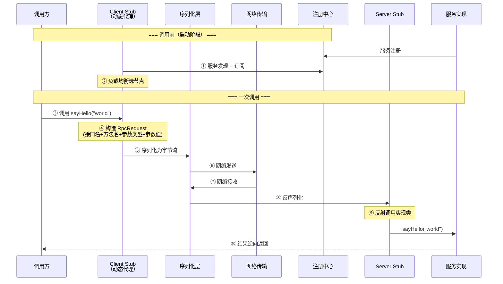
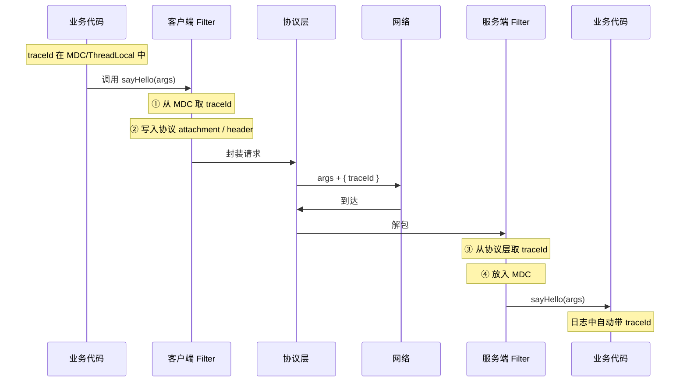
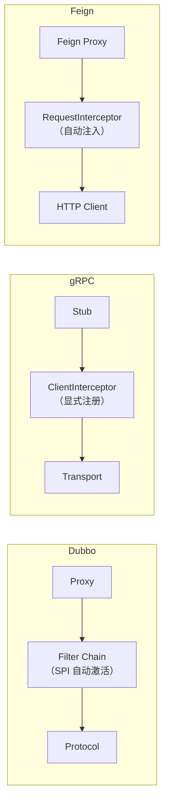

## 速查卡

- **RPC 10 步**：服务发现 → 负载均衡 → 构造请求 → 序列化 → 发送 → 接收 → 反序列化 → 反射调用 → 逆向返回
- **核心组件**：动态代理 + 序列化 + 网络传输 + 注册中心，框架 = 将四者封装
- **隐式传参**：通过协议层 attachment/metadata/header 透传 traceId 等上下文，Filter 双端配合
- **上下文传递**：MDC/ThreadLocal → Filter 塞入协议头 → 对端 Filter 取出放入 MDC → finally 清理防污染 → 线程池用 TTL
- **框架实现**：Dubbo（SPI + @Activate 自动激活）、gRPC（ClientInterceptor + Metadata）、Feign（RequestInterceptor + HTTP Header）

---

## 一、RPC 通信流程

核心目标：**让调用远程服务像调用本地方法一样简单**。

### 一次 RPC 调用的完整流程



### 各步骤技术选型

| 步骤 | 做什么 | 常见选型 |
|------|--------|----------|
| ① 服务发现 | 获取可用节点列表 | ZK / Nacos / Consul / etcd |
| ② 负载均衡 | 多节点中选一个 | 随机 / 轮询 / 加权 / 最少连接 / 一致性哈希 |
| ③ 本地代理 | 屏蔽远程调用细节 | JDK 动态代理 / Javassist / ByteBuddy |
| ④ 构造请求 | 封装接口名、方法名、参数 | `RpcRequest{serviceClass, method, paramTypes, args}` |
| ⑤ 序列化 | 对象 → 字节流 | Hessian2 / Protobuf / Kryo / JSON |
| ⑥ 网络传输 | 可靠双向字节流 | Netty（大多数）/ HTTP2（gRPC） |
| ⑧ 反序列化 | 字节流 → 对象 | 同⑤ |
| ⑨ 反射调用 | 找到实现类并执行 | `Method.invoke(target, args)` |

### 一句话

> **代理 → 序列化 → 发网络包 → 反序列化 → 反射调用 → 逆向返回**。调用方拿到的只是代理对象，整个过程对业务代码透明。

---

## 二、隐式传参与上下文传递

链路追踪信息（traceId）、用户身份、灰度标记等上下文，通过协议层隐式通道透传，RPC 框架均提供了相应机制。

### 核心模式：Filter 双端拦截 + 协议层透传



### Dubbo 实现：RpcContext + SPI Filter

```java
// 消费端 Filter —— 自动激活
@Activate(group = "consumer")
public class TraceConsumerFilter implements Filter {
    public Result invoke(Invoker<?> invoker, Invocation inv) {
        RpcContext.getContext().setAttachment("traceId", MDC.get("traceId"));
        return invoker.invoke(inv);
    }
}

// 提供端 Filter —— 自动激活
@Activate(group = "provider")
public class TraceProviderFilter implements Filter {
    public Result invoke(Invoker<?> invoker, Invocation inv) {
        String traceId = RpcContext.getContext().getAttachment("traceId");
        MDC.put("traceId", traceId);
        try {
            return invoker.invoke(inv);
        } finally {
            MDC.remove("traceId");  // 防止线程池复用污染
        }
    }
}
```

原理：Dubbo 协议层预留 `attachments`（Map&lt;String, String&gt;），Filter 写入后随请求传输，对端 Filter 取出。

### gRPC 实现：Metadata + Interceptor

```java
// ClientInterceptor
public class TraceClientInterceptor implements ClientInterceptor {
    public <ReqT, RespT> ClientCall<ReqT, RespT> interceptCall(
            MethodDescriptor<ReqT, RespT> method, CallOptions opts, Channel next) {
        return new ForwardingClientCall.SimpleForwardingClientCall<>(
                next.newCall(method, opts)) {
            public void start(Listener<RespT> listener, Metadata headers) {
                headers.put(
                    Metadata.Key.of("traceId", ASCII_STRING_MARSHALLER),
                    MDC.get("traceId"));
                super.start(listener, headers);
            }
        };
    }
}

// ServerInterceptor：从头取 traceId → MDC.put → 业务执行 → MDC.remove
```

### Feign 实现：RequestInterceptor

```java
@Component
public class FeignTraceInterceptor implements RequestInterceptor {
    public void apply(RequestTemplate template) {
        template.header("X-Trace-Id", MDC.get("traceId"));
    }
}
```

### 上下文传递的关键点

| 要点 | 说明 |
|------|------|
| **协议层通道** | Dubbo `attachment`、gRPC `Metadata`、HTTP `Header` 均为框架预留的元数据通道 |
| **MDC 配合日志** | Logback/Log4j2 的 `%X{traceId}` 自动输出到每条日志 |
| **finally 清理** | 线程池复用场景必须清理，否则串上下文 |
| **跨线程传递** | 子线程需手动传递 `MDC.getCopyOfContextMap()`，或使用 TTL |
| **异步回调** | `CompletableFuture.runAsync()` 中普通 MDC 不自动继承 |

### TTL（TransmittableThreadLocal）

普通 `ThreadLocal` 在线程池复用时不自动传递。阿里 TTL 解决了这个问题：

```java
// TTL 装饰线程池
Executor pool = TtlExecutors.getTtlExecutor(originalPool);

TransmittableThreadLocal<String> traceContext = new TransmittableThreadLocal<>();
traceContext.set("traceId-123");

pool.execute(() -> {
    // 这里能取到 traceId-123，普通 ThreadLocal 不行
    System.out.println(traceContext.get());
});
```

原理：`TtlRunnable` 在提交任务时捕获父线程 TTL 值，在工作线程执行前回放，执行后恢复原值。

---

## 三、不同 RPC 框架的 Filter 实现原理

各框架 Filter 的加载机制不同，核心区别在于**如何把拦截逻辑注入到调用链中**。

### 框架对比

| 框架 | 加载机制 | 注入方式 | 隐式传参通道 |
|------|----------|----------|-------------|
| **Dubbo** | SPI（自研增强版） | `META-INF/dubbo/` + `@Activate` 自动激活 | `RpcContext.setAttachment()` |
| **gRPC** | 非 SPI | 代码显式 `ServerBuilder.intercept()` 传入 | `Metadata`（HTTP2 Header） |
| **Feign** | 非 SPI | `@Component` 自动扫描，或 `Feign.builder().requestInterceptor()` | `RequestTemplate.header()` |
| **Servlet** | 非 SPI | `web.xml` 或 `@WebFilter` + 容器扫描 | `HttpServletRequest.setAttribute()` |

### Dubbo SPI 机制（基础）

整个 Dubbo 框架是基于 SPI 的微内核架构。协议（dubbo/rmi）、序列化（hessian2/kryo）、负载均衡（random/roundrobin）、注册中心（zk/nacos）全部是 SPI 扩展点。

**加载流程**：`@Activate(group, order)` 声明激活条件 → 配置文件 `META-INF/dubbo/` 注册实现类 → 启动时 `ExtensionLoader` 按需懒加载。

### Dubbo SPI vs Java 原生 SPI

| 维度 | Java SPI | Dubbo SPI |
|------|----------|-----------|
| 加载方式 | 全量加载 | 按 key 按需加载（懒加载） |
| IOC | 无 | 支持 setter 注入其他扩展点 |
| AOP | 无 | 支持包装类（Wrapper 机制），构造器传入被包装对象 |
| 条件激活 | 无 | `@Activate(group, order)` 自动激活 |
| 自适应 | 无 | `@Adaptive` 根据 URL 参数动态选择实现 |

### 各框架 Filter 的注入位置



---

## 自测

1. **RPC 一次调用的完整流程是什么？核心组件有哪些？**
   <br/>→ 服务发现 → 负载均衡 → 构造请求（接口名+方法名+参数）→ 序列化 → 网络发送 → 反序列化 → 反射调用 → 逆向返回。核心组件：动态代理 + 序列化 + 网络传输 + 注册中心。

2. **traceId 如何跨 RPC 调用传递？各框架的实现方式有什么不同？**
   <br/>→ 核心模式：Filter 双端配合 + 协议层元数据通道。Dubbo 通过 `RpcContext.setAttachment()` + SPI Filter 自动激活；gRPC 通过 `Metadata` + 显式注册 `ClientInterceptor`；Feign 通过 `RequestInterceptor` 注入 HTTP Header。上下文传递：MDC/ThreadLocal 存储 → Filter 塞入协议头 → 对端 Filter 取出放入 MDC → finally 清理。线程池场景需用 TTL 替代普通 ThreadLocal。

3. **Dubbo Filter 的加载机制是什么？和 gRPC Interceptor 有什么本质区别？**
   <br/>→ Dubbo Filter 通过 SPI 加载：`@Activate` 声明激活条件 + `META-INF/dubbo/` 注册 + `ExtensionLoader` 按需懒加载，启动时自动组装 Filter 链。gRPC Interceptor 通过代码显式 `ServerBuilder.intercept()` 传入，非 SPI。本质区别：Dubbo 是声明式 + 自动发现 + 条件激活，gRPC 是编程式 + 显式注册。
