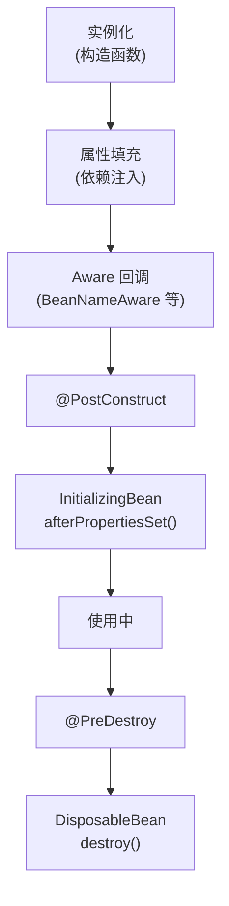
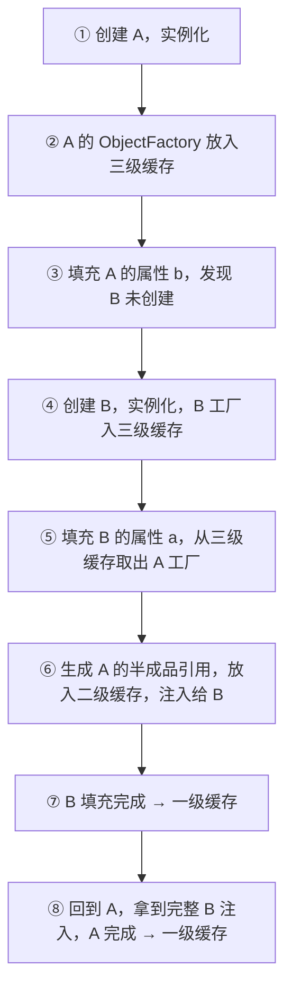
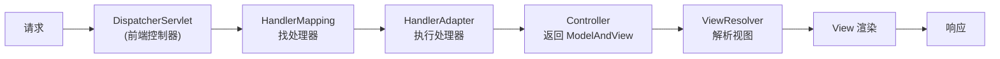

## 速查卡

- **IoC**：对象的创建与依赖注入交给容器，反转了「对象自己 new 依赖」的控制权；DI 是 IoC 的实现方式
- **Bean 生命周期**：实例化 → 属性填充 → 初始化（`@PostConstruct`/`InitializingBean`）→ 使用 → 销毁
- **循环依赖三级缓存**：一级 `singletonObjects`（成品）、二级 `earlySingletonObjects`（提前暴露的半成品）、三级 `singletonFactories`（能生成代理的工厂）
- **事务传播**：REQUIRED（默认，加入/新建）、REQUIRES_NEW（新事务，挂起当前）、NESTED（嵌套，可独立回滚）
- **事务失效**：自调用、非 public、异常被 catch、抛受检异常、多线程
- **SpringMVC**：DispatcherServlet → HandlerMapping → HandlerAdapter → Controller → ViewResolver → 渲染

---

## 一、IoC 与 Bean 生命周期

### IoC（控制反转）

传统写法对象自己 `new` 依赖，IoC 反转成「容器负责创建和注入」。DI（依赖注入）是 IoC 的实现手段：构造器注入、Setter 注入、字段注入（`@Autowired`）。

```java
// 传统：自己 new
@Service
class OrderService {
    private OrderDao dao = new OrderDaoImpl();  // 依赖写死
}

// IoC：容器注入
@Service
class OrderService {
    @Autowired
    private OrderDao dao;  // 由 Spring 容器注入实现
}
```

好处：解耦、易测试（可注入 mock）、统一管理生命周期。

### Bean 生命周期



| 阶段 | 说明 |
|------|------|
| 实例化 | 调用构造器创建对象 |
| 属性填充 | 注入依赖（`@Autowired`） |
| 初始化 | `@PostConstruct` → `InitializingBean` → 自定义 `init-method` |
| 使用 | Bean 就绪 |
| 销毁 | `@PreDestroy` → `DisposableBean` → 自定义 `destroy-method` |

---

## 二、循环依赖与三级缓存

### 什么是循环依赖

```java
@Component
class A { @Autowired private B b; }   // A 依赖 B

@Component
class B { @Autowired private A a; }   // B 依赖 A
```

A 创建时注入 B，B 创建时又注入 A，形成环。若顺序执行会死循环，Spring 用**三级缓存 + 提前暴露**解决。

### 三级缓存

| 缓存 | 名称 | 存的内容 |
|------|------|---------|
| 一级缓存 | `singletonObjects` | **完整** Bean（成品） |
| 二级缓存 | `earlySingletonObjects` | **提前暴露**的半成品 Bean（未填充属性） |
| 三级缓存 | `singletonFactories` | `ObjectFactory`，能生成半成品/代理的工厂 |

### 解决流程（A ↔ B 互依赖）



关键：**A 在「实例化后、属性填充前」就被提前暴露**。B 注入 A 时拿到的不是完整 A（属性还没填），而是 A 的引用。等 A 填充完，B 里的 A 引用自然指向完整 A。

### 为什么需要三级缓存（而不是二级）

- 二级缓存只能存「已经生成好的早期引用」
- 三级缓存存的是**工厂（lambda）**，**延迟生成代理**：只有当 A 真的需要被提前注入（发生循环依赖）时，才调用工厂生成早期引用或 AOP 代理
- 若 A 需要 AOP 代理，直接暴露原始对象会导致 B 注入的是原始 A 而非代理 A。三级缓存让 Spring 在提前暴露时**顺便创建代理**，保证注入的是代理对象

### 为什么构造器循环依赖无法解决

构造器注入在**实例化阶段**就需要依赖，此时对象还没实例化完，无法「提前暴露」。所以构造器循环依赖会抛 `BeanCurrentlyInCreationException`。**Setter/字段注入**是在「实例化之后」才注入，才能提前暴露。

> 规避：能用构造器注入就不用字段注入；遇到构造器循环依赖说明设计有问题，应抽公共 Bean 或用 `@Lazy`。

---

## 三、Spring 事务

### 传播行为（Propagation）

| 传播 | 含义 |
|------|------|
| **REQUIRED**（默认） | 有事务就加入，没有就新建 |
| **REQUIRES_NEW** | 总是新建事务，挂起当前事务 |
| **NESTED** | 嵌套事务，可单独回滚到保存点 |
| **SUPPORTS** | 有事务就加入，没有就以非事务运行 |
| **NOT_SUPPORTED** | 以非事务运行，有则挂起 |
| **MANDATORY** | 必须有事务，否则抛异常 |
| **NEVER** | 必须以非事务运行，否则抛异常 |

最常考：**REQUIRED vs REQUIRES_NEW**。REQUIRED 内层失败会让整个外层一起回滚；REQUIRES_NEW 内层是独立事务，内层回滚不影响外层已提交的部分。

### 隔离级别（与 MySQL 对应）

| Spring 隔离级别 | 说明 |
|----------------|------|
| DEFAULT | 跟随数据库默认（MySQL 可重复读） |
| READ_UNCOMMITTED | 读未提交，脏读 |
| READ_COMMITTED | 读已提交，防脏读 |
| REPEATABLE_READ | 可重复读，防不可重复读 |
| SERIALIZABLE | 串行化，防幻读 |

### 事务失效的 6 种场景

| 场景 | 原因 |
|------|------|
| **自调用** | `this.methodB()` 不经过代理，`@Transactional` 不生效 |
| **非 public 方法** | 事务通过动态代理实现，只有 public 方法能被代理 |
| **异常被 catch** | 异常被吞掉，事务感知不到，不会回滚 |
| **抛受检异常** | 默认只回滚 `RuntimeException`/`Error`，需 `rollbackFor = Exception.class` |
| **传播行为错误** | 如 `NOT_SUPPORTED` 导致无事务 |
| **多线程** | 子线程是独立线程，不共享父线程事务 |

### 自调用失效的解决

```java
// 错误：自调用，事务不生效
@Service
class UserService {
    public void outer() { this.inner(); }  // 绕过代理

    @Transactional
    public void inner() { /* ... */ }
}
```

解决：注入自身代理、`AopContext.currentProxy()`、或拆到另一个 Service。

---

## 四、SpringMVC 原理

### 请求处理流程



| 组件 | 职责 |
|------|------|
| **DispatcherServlet** | 前端控制器，统一接收请求、分发 |
| **HandlerMapping** | 根据 URL 找到对应的 Handler（Controller） |
| **HandlerAdapter** | 执行 Handler，适配不同类型的处理器 |
| **HandlerInterceptor** | 拦截器，前置/后置处理 |
| **ViewResolver** | 将逻辑视图名解析为物理视图 |
| **HandlerExceptionResolver** | 统一异常处理 |

### 关键流程

1. `DispatcherServlet` 接收请求
2. `HandlerMapping` 找到 `Controller`（及 `HandlerInterceptor` 链）
3. `HandlerAdapter` 执行 Controller，返回 `ModelAndView`
4. `ViewResolver` 解析视图，渲染返回

> 面试高频追问：`@RestController` 和 `@Controller` 的区别——`@RestController = @Controller + @ResponseBody`，方法返回值直接写 body（JSON），不走 ViewResolver。

---

## 自测

1. **IoC 和 DI 是什么关系？IoC 解决了什么问题？**
   <br/>→ DI（依赖注入）是 IoC（控制反转）的一种实现方式。IoC 把「对象自己 new 依赖」的控制权反转给容器，解决对象间的强耦合，便于解耦、测试和统一生命周期管理。

2. **Spring 三级缓存分别存什么？为什么需要三级而不是二级？**
   <br/>→ 一级 `singletonObjects`（完整 Bean）、二级 `earlySingletonObjects`（提前暴露的半成品）、三级 `singletonFactories`（ObjectFactory 工厂）。三级缓存存工厂是为了**延迟生成代理**：发生循环依赖时才调用工厂，若 Bean 需要 AOP 代理则此时生成代理，保证注入的是代理对象而非原始对象。

3. **构造器循环依赖为什么无法通过三级缓存解决？**
   <br/>→ 构造器注入在实例化阶段就需要依赖，此时对象还没实例化完，无法「提前暴露」半成品。三级缓存只能解决 Setter/字段注入（实例化之后）的循环依赖。

4. **REQUIRED 和 REQUIRES_NEW 的区别？什么场景用 REQUIRES_NEW？**
   <br/>→ REQUIRED 加入当前事务（内层失败整体回滚）；REQUIRES_NEW 总是新建独立事务并挂起当前（内层回滚不影响外层）。日志记录、发送消息等「不希望随主事务回滚」的独立操作用 REQUIRES_NEW。

5. **Spring 事务为什么自调用会失效？怎么解决？**
   <br/>→ 事务靠动态代理实现，`this.method()` 是直接调用目标对象的方法，绕过了代理，`@Transactional` 拦截不到。解决：注入自身代理、`AopContext.currentProxy()`、或拆到另一个 Bean。

6. **SpringMVC 一次请求的完整流程是什么？**
   <br/>→ DispatcherServlet 接收请求 → HandlerMapping 定位 Controller → HandlerAdapter 执行 → 返回 ModelAndView → ViewResolver 解析视图 → 渲染响应。`@RestController` 额外加了 `@ResponseBody`，直接写 JSON 不走视图。
