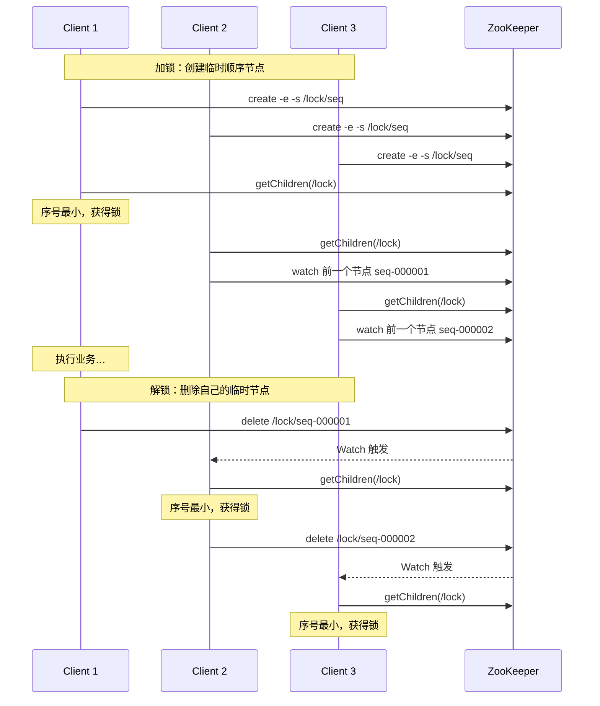
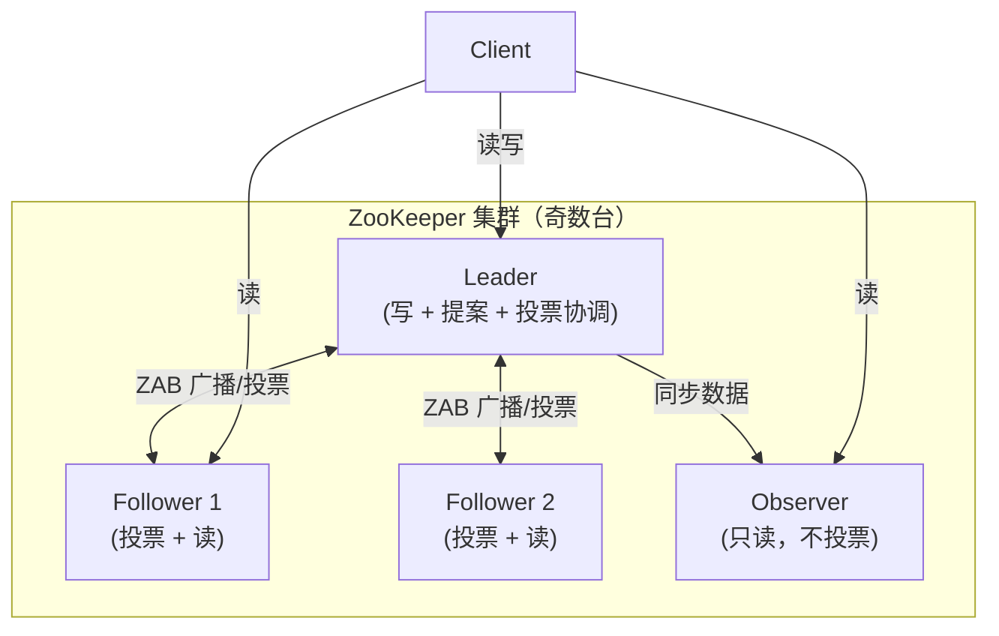

## 概述

ZooKeeper 允许分布式进程通过共享分层名称空间（**znodes**）相互协调，类似文件系统。

与文件系统的区别：
- 每个 znode 可关联数据（既可是文件也可是目录）
- znode 数据大小有限制（1MB 完整性检查，通常存储更小元数据）
- 旨在存储协调数据：状态信息、配置、位置信息等


## 速查卡

- **数据模型**：znode（类似文件系统，可存数据 ≤1MB），旨在存储协调数据：状态、配置、位置
- **架构**：一组机器复制 → 内存映像+事务日志+快照 → 大多数服务器可用即服务可用
- **读写处理**：读本地处理（吞吐与服务器数正比）→ 写转发共识后响应（吞吐随服务器数减小）→ 同步转发不共识
- **顺序保证**：zxid（全局唯一递增 ID），所有更新全排序，读响应标记最后处理的 zxid
- **应用场景**：分布式锁（临时顺序节点+Watch）→ 配置管理 → Leader 选举 → 集群成员管理 → 命名服务
- **CP 模型**：分区发生时少数派拒绝服务，保证数据一致（对比 Eureka AP）
- **部署**：奇数台（2n+1）→ Leader（写/投票）+ Follower（投票/读）+ Observer（只读不投票）；Quorum 半数以上才服务
- **命令**：zkServer.sh start/status → zkCli.sh → create -s/-e → get/ls/stat → 四字命令 echo stat | nc
## 服务架构

- 服务在**一组机器上复制**
- 机器维护数据树的**内存映像** + 事务日志 + 快照
- 数据在内存中 → **高吞吐、低延迟**
- 内存限制 → 数据库大小受限于内存

> 只要**大多数服务器**可用，ZooKeeper 服务就可用。

---

## 客户端连接

- 客户端连接到**单个**服务器，维护一个 TCP 连接
- 通过该连接：发送请求、获取响应、获取监视事件、发送心跳
- TCP 断开 → 连接其他服务器
- 首次连接时设置会话；服务器变更后会话重新建立

## 读写处理

| 操作 | 处理方式 |
|------|----------|
| **读** | 本地处理 |
| **写** | 转发到其他服务器，经过共识后响应 |
| **同步** | 转发到其他服务器，不达成共识 |

> 读吞吐量与服务器数成正比增长，写吞吐量随服务器数而减小。

---

## 顺序保证（zxid）

所有更新全部排序，每个更新标记 **zxid**（ZooKeeper 流水 ID）：
- 每个更新具有唯一 zxid
- 读（和订阅）的顺序与更新相关
- 读响应标记最后处理的 zxid

---

## 应用场景

- 分布式锁
- 配置管理
- 命名服务
- Leader 选举
- 集群成员管理

### 分布式锁时序（临时顺序节点 + Watch）



**加锁**：每个客户端在 `/lock` 下 `create -e -s` 创建临时顺序节点 → `getChildren` 排序 → 序号最小者获锁，其余对自己前一个节点注册 Watch 排队等待。

**解锁**：持有者删除自己的临时节点 → 触发下一个等待者的 Watch → 后者重新判断并获锁。临时节点保证客户端宕机/会话断开时锁自动释放，避免死锁。

---

## 部署架构



| 角色 | 职责 |
|------|------|
| **Leader** | 处理所有写请求，发起提案并广播，协调投票 |
| **Follower** | 参与投票、转发写请求给 Leader、处理读请求 |
| **Observer** | 不参与投票，只同步数据和处理读，横向扩展读能力（不影响写性能） |

关键点：

- **奇数台部署**（2n+1）：常见 3 台（容忍 1 台挂）、5 台（容忍 2 台挂）
- **Quorum 半数以上**：可用节点 > N/2 才对外服务
- **myid**：每个节点唯一 ID（1~255），与 `zoo.cfg` 的 `server.x` 一一对应

`zoo.cfg` 配置示例：

```
tickTime=2000
initLimit=10
syncLimit=5
dataDir=/var/lib/zookeeper

server.1=zk1:2888:3888
server.2=zk2:2888:3888
server.3=zk3:2888:3888
```

端口：`2181` 客户端连接、`2888` 节点间通信、`3888` Leader 选举。

---

## 常用命令

### 服务端

```bash
bin/zkServer.sh start      # 启动
bin/zkServer.sh stop       # 停止
bin/zkServer.sh status     # 查看角色（leader / follower / observer）
bin/zkServer.sh restart    # 重启
```

### 客户端

```bash
bin/zkCli.sh -server host:2181   # 连接集群
```

| 命令 | 说明 |
|------|------|
| `ls [-s] [-w] /path` | 列出子节点（-s 状态，-w 监听） |
| `create [-s] [-e] [-c] path data` | 创建节点（-s 顺序，-e 临时） |
| `get [-s] [-w] /path` | 读取节点数据 |
| `set [-s] path data` | 设置节点数据 |
| `stat /path` | 查看状态（zxid、版本号等） |
| `delete /path` / `deleteall /path` | 删除节点（后者递归） |
| `history` / `redo n` | 历史命令 / 重做第 n 条 |

### 四字命令（4lw，需在 zoo.cfg 配置）

```bash
echo stat | nc localhost 2181   # 服务状态
echo ruok | nc localhost 2181   # 是否存活（返回 imok）
echo conf | nc localhost 2181   # 运行时配置
echo mntr | nc localhost 2181   # 监控指标
```

### 节点类型

| 类型 | 命令 | 说明 |
|------|------|------|
| 持久节点 | `create /a data` | 显式删除才消失 |
| 持久顺序节点 | `create -s /a data` | 名字带递增序号，用于 Leader 选举 |
| 临时节点 | `create -e /a data` | 会话断开自动删除，用于服务注册/锁 |
| 临时顺序节点 | `create -e -s /a data` | 顺序 + 临时，公平分布式锁 |

---

## 自测

1. **ZooKeeper 为什么是 CP 模型？发生网络分区时会发生什么？**
   <br/>→ ZK 基于 ZAB 共识协议，写操作需要半数以上节点确认。网络分区时，少数派节点无法形成多数 → 拒绝写请求（放弃 A），保证数据一致。这也是 ZK 适合做分布式锁和 Leader 选举的原因。

2. **ZK 的 Watch 机制是如何工作的？有什么局限性？**
   <br/>→ 客户端对 znode 注册 Watcher，数据变化时服务端通知客户端。局限性：一次性触发（触发后需重新注册）、通知不包含变更内容（只告知"变了"）、服务端不保证客户端收到通知（网络问题可能丢失）。

3. **ZK 的临时节点和持久节点有什么区别？各用于什么场景？**
   <br/>→ 临时节点：客户端会话结束时自动删除，用于服务注册（服务下线自动清除）、分布式锁（连接断开自动释放）。持久节点：需主动删除，用于配置存储、命名服务等需要持久保留的场景。临时顺序节点结合 Watch 实现公平分布式锁。

4. **ZooKeeper 集群为什么用奇数台？Leader / Follower / Observer 各有什么职责？**
   <br/>→ 奇数台（2n+1）保证多数派 quorum，容忍 n 台故障（3 台容 1、5 台容 2）。Leader 处理所有写、发起提案并协调投票；Follower 参与投票、转发写、处理读；Observer 不参与投票、只同步数据和处理读，用于横向扩展读能力且不影响写性能。
