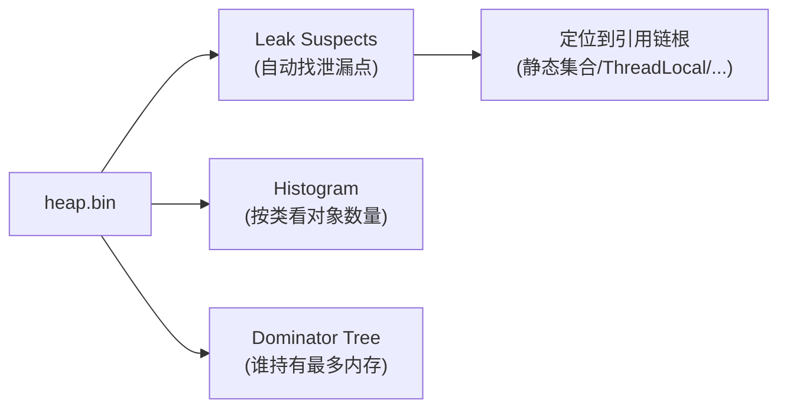

## 概述

内存问题和 CPU 问题（见「Java 进程 CPU 过高排查」）是 Java 线上故障的两大类。本文覆盖**内存占用过高**和**OOM 崩溃**两类场景的排查路径。

## 速查卡

- **排查三步**：`jstat -gcutil`（看各区使用率/FGC）→ `jmap -heap`（看堆配置）→ `jmap -dump` + MAT（分析大对象）
- **OOM 类型**：Java heap space（堆满）→ Metaspace（类加载过多）→ Direct buffer memory（堆外）→ StackOverflow（递归）
- **常见泄漏**：静态集合、ThreadLocal 不 remove、连接/流未关闭、监听器未注销
- **MAT 分析**：Leak Suspects（泄漏怀疑点）+ Histogram（按类看对象数量/大小）+ 支配树

---

## 一、内存问题的两类表现

| 表现 | 特征 | 排查重点 |
|------|------|---------|
| **内存占用高** | 服务没崩，但堆长期居高、GC 频繁 | 是否泄漏、堆是否太小 |
| **OOM 崩溃** | 抛 `OutOfMemoryError`，进程可能重启 | 哪种 OOM、谁占满了 |

两者思路一致：**先看 GC 和堆状态，再定位「谁占了内存」**。

---

## 二、排查步骤

### 1. 看 GC 与各区使用率

```bash
jstat -gcutil <pid> 1000
# S0  S1  E   O   M   CCS  YGC  YGCT  FGC  FGCT  GCT
```

- 看 `O`（老年代）和 `M`（元空间）使用率是否持续上涨
- `FGC`（Full GC 次数）是否持续增长——**FGC 频繁且回收后内存不降 = 泄漏**

### 2. 看堆配置与分布

```bash
jmap -heap <pid>
```

确认 `-Xmx` 是否设得太小，各代实际使用情况。

### 3. 导出堆转储分析

```bash
jmap -dump:live,format=b,file=heap.bin <pid>
```

`live` 参数会在 dump 前触发一次 Full GC，去掉可回收对象，得到更准确的「存活对象」快照。用 **MAT / VisualVM / JProfiler** 打开 `heap.bin` 分析。

---

## 三、OOM 类型与定位

| 报错信息 | 含义 | 定位方向 |
|----------|------|---------|
| `OutOfMemoryError: Java heap space` | 堆满，无法分配新对象 | 大对象 / 泄漏，jmap dump 分析 |
| `OutOfMemoryError: Metaspace` | 元空间满（类元数据） | 动态代理/反射滥用、类加载器泄漏 |
| `OutOfMemoryError: Direct buffer memory` | 堆外（直接内存）满 | NIO `allocateDirect`、Netty 堆外内存未释放 |
| `StackOverflowError` | 栈溢出 | 递归过深无终止条件 |

> **易错点**：`Metaspace` 和 `Direct buffer memory` 的 OOM 都**不在堆内**，调大 `-Xmx` 没用。Metaspace 用 `-XX:MaxMetaspaceSize` 限制，直接内存用 `-XX:MaxDirectMemorySize`。

---

## 四、常见内存泄漏场景

| 场景 | 泄漏原因 |
|------|---------|
| **静态集合** | `static List/Map` 无限 `add`，对象永不被回收 |
| **ThreadLocal** | 线程池场景不调 `remove()`，线程长期存活 → value 泄漏 |
| **连接/流未关闭** | DB 连接、文件流、Socket 未 `close`，占资源 |
| **监听器未注销** | 注册了事件监听但从不 `removeListener` |
| **equals/hashCode 写错** | 重复 key 无法覆盖，集合无限增长 |

---

## 五、MAT 分析思路

打开 `heap.bin` 后按顺序看：

1. **Leak Suspects**（泄漏怀疑点）——MAT 自动给出最可能是泄漏的对象引用链
2. **Histogram**（直方图）——按类统计对象数量和占用内存，找「数量/大小异常」的类
3. **Dominator Tree**（支配树）——看「谁持有了最大块内存」，顺着引用链找到泄漏根源



> 典型结论：某业务对象的数量远超预期（如几十万个 `Order`），顺着引用链找到是一个 `static` 集合没有清理 → 这就是泄漏点。

---

## 自测

1. **FGC 频繁但每次回收后内存降不下来，说明什么问题？**
   <br/>→ 说明存在内存泄漏——每次 Full GC 能回收的很少，说明大部分对象被强引用链「可达」，无法回收。应 dump 堆转储，用 MAT 分析谁持有这些对象。

2. **Metaspace 的 OOM 和 Java heap space 的 OOM 有什么区别？调大 -Xmx 有用吗？**
   <br/>→ Java heap space 是堆满，调大 -Xmx 有效；Metaspace 是类元数据满（动态代理/反射滥用、类加载器泄漏），在堆外，调大 -Xmx 无效，应限制/排查类加载，用 `-XX:MaxMetaspaceSize`。

3. **`jmap -dump` 的 `live` 参数有什么作用？**
   <br/>→ `live` 会在 dump 前触发一次 Full GC，只保留存活对象，得到更准确的「当前真正占用内存」的快照，排除可回收垃圾的干扰。

4. **ThreadLocal 为什么会导致内存泄漏？线程池场景为什么更严重？**
   <br/>→ ThreadLocalMap 的 key 是弱引用但 value 是强引用，Thread → ThreadLocalMap → Entry → value 这条链可达。线程池线程长期存活，value 一直无法回收，泄漏持续累积。必须 `finally` 中 `remove()`。

5. **MAT 分析时三个核心视图分别看什么？**
   <br/>→ Leak Suspects 自动给出泄漏怀疑点和引用链；Histogram 按类统计对象数量/大小，找异常类；Dominator Tree 看谁持有最大内存块，顺引用链定位泄漏根源（静态集合、ThreadLocal 等）。
