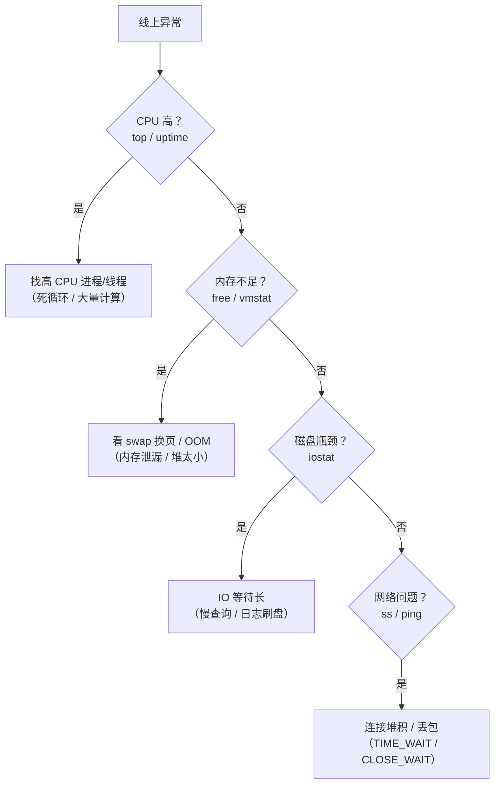

## 概述

线上问题排查的第一课是**先定位是哪个资源出问题**。Linux 资源看四维：CPU、内存、磁盘、网络。本文按维度给出「用什么命令看、看出什么问题、怎么判断」。

## 速查卡

- **四维排查**：CPU（top/uptime/pidstat）→ 内存（free/vmstat）→ 磁盘（df/iostat）→ 网络（ss/netstat）
- **load average**：1/5/15 分钟平均负载，是「运行中 + 不可中断（D 状态）进程数」；接近核数算正常，持续超核数=过载
- **free**：看 `available`（可用内存），`buffer/cache` 是可回收缓存，不是「已用」
- **vmstat**：`r`>核数=CPU 过载、`b`>0=IO 阻塞、`si/so`>0=内存不足在换页
- **iostat**：`util` 高 + `await` 长 = 磁盘瓶颈
- **ss**：`ss -tan` 统计连接状态，`TIME_WAIT`/`CLOSE_WAIT` 堆积各有含义

---

## 一、排查方法论

线上变慢/报错，先回答「瓶颈在哪」——用一套固定顺序快速定位：



---

## 二、CPU 排查

### 关键指标：load average

```bash
uptime
# 08:30:00 up 100 days,  3:05,  2 users,  load average: 0.85, 1.02, 0.95
```

- load average 是 **1 / 5 / 15 分钟**的平均负载
- 它统计的是「**运行中 + 不可中断（D 状态，等 IO）的进程数**」
- 判断：**load ≈ CPU 核数**算正常（满负荷），持续**超过核数**说明过载

> **易错点**：load 高 ≠ CPU 高。若 load 很高但 CPU 利用率低，通常是**大量进程阻塞在 IO**（D 状态），瓶颈在磁盘而非 CPU。

### 命令

```bash
top          # 实时看 CPU/内存，按 1 展开每个核
pidstat 1    # 每个进程的 CPU 使用率（需 sysstat 包）
```

`top` 里重点看 `%Cpu(s)` 的 `us`（用户态）、`sy`（内核态）、`wa`（等 IO）、`id`（空闲）。`wa` 高说明 CPU 在等 IO，可能磁盘是瓶颈。

---

## 三、内存排查

### free

```bash
free -h
#        total   used   free   shared   buff/cache   available
# Mem:    16G    8G     1G     100M       7G          7.5G
```

- 看 **`available`**（真正可用内存），而不是 `free`
- `buff/cache` 是**可回收**的缓存（文件页缓存），内存紧张时内核会回收，**不是「已占用」**
- 判断内存不足：`available` 持续很低 + swap 被使用

### vmstat

```bash
vmstat 1
# procs -----------memory---------- ---swap-- -----io---- -system-- ------cpu-----
# r  b   swpd   free   buff  cache   si   so   bi    bo   in   cs us sy id wa st
```

| 列 | 含义 | 判断 |
|----|------|------|
| `r` | 运行队列长度 | `r` 持续 > CPU 核数 = CPU 过载 |
| `b` | 阻塞在 IO 的进程 | `b` > 0 = IO 瓶颈 |
| `si` / `so` | swap 换入/换出 | 持续 > 0 = 内存不足，正在换页 |
| `cs` | 上下文切换次数 | 异常高 = 线程过多 / 锁竞争 |
| `wa` | CPU 等 IO 时间 | 高 = 磁盘瓶颈 |

---

## 四、磁盘排查

### df 与 iostat

```bash
df -h        # 磁盘空间是否满
iostat -x 1  # 磁盘 IO 性能（需 sysstat）
```

`iostat -x` 重点看：

| 指标 | 含义 | 判断 |
|------|------|------|
| `util` | 磁盘繁忙率 | 持续接近 100% = 磁盘饱和 |
| `await` | 单次 IO 平均等待时间 | 远大于几 ms（HDD）说明磁盘慢 |
| `r/s` `w/s` | 每秒读写次数 | 判断是读多还是写多 |

> 常见磁盘瓶颈来源：慢 SQL 全表扫描、日志刷盘频繁、大文件写入。`util` 高 + `await` 长，就要往「什么在大量读写磁盘」方向查。

---

## 五、网络排查

### ss（推荐，替代 netstat）

```bash
ss -tan                 # 所有 TCP 连接
ss -tan state time-wait # 只看 TIME_WAIT
ss -s                   # 连接状态汇总
```

连接状态堆积的含义（详见「网络连接排查」专题）：

- **`TIME_WAIT` 多**：主动关闭方太多（短连接场景），一般是正常的，但过多会占端口
- **`CLOSE_WAIT` 多**：被动关闭方没调 `close()`，是**代码 bug**（连接泄漏）

### 连通性排查

```bash
ping <host>          # 是否通（ICMP）
traceroute <host>    # 经过哪些跳，定位卡在哪一段
tcpdump -i eth0 port 8080  # 抓包分析
```

---

## 六、常用命令速查

| 维度 | 命令 | 看什么 |
|------|------|--------|
| CPU | `top` / `uptime` / `pidstat` | 负载、CPU 占用 |
| 内存 | `free -h` / `vmstat` | 可用内存、swap、换页 |
| 磁盘 | `df -h` / `iostat -x` | 空间、IO 性能 |
| 网络 | `ss` / `tcpdump` / `ping` | 连接、连通性 |
| 进程 | `ps aux` / `lsof` / `strace` | 进程资源、打开的文件、系统调用 |

---

## 自测

1. **load average 是什么？load 高但 CPU 利用率低说明什么？**
   <br/>→ load average 是 1/5/15 分钟的平均负载，统计「运行中 + 不可中断（D 状态）进程数」。load 高但 CPU 低，说明大量进程阻塞在 IO（D 状态），瓶颈在磁盘而非 CPU。

2. **`free -h` 里 `free` 很小但 `available` 很大，内存紧张吗？**
   <br/>→ 不紧张。`buff/cache` 是可回收的文件缓存，`available` 才代表真正可用内存。内核在内存紧张时会回收缓存，所以「free 小 + available 大」是健康状态。

3. **vmstat 里 `r`、`b`、`si/so` 分别代表什么？如何判断瓶颈？**
   <br/>→ `r` 是运行队列长度（> 核数 = CPU 过载）、`b` 是阻塞在 IO 的进程（> 0 = IO 瓶颈）、`si/so` 是 swap 换入换出（持续 > 0 = 内存不足在换页）。

4. **`iostat -x` 的 `util` 和 `await` 怎么判断磁盘是不是瓶颈？**
   <br/>→ `util` 持续接近 100% 说明磁盘饱和；`await`（单次 IO 平均等待）远大于几 ms 说明磁盘响应慢。两者同时高 → 磁盘瓶颈，需排查慢查询/日志刷盘/大文件读写。

5. **为什么优先用 `ss` 而不是 `netstat`？**
   <br/>→ `ss` 直接从内核 socket 表读取数据，速度比 `netstat`（遍历 /proc）快得多，尤其在连接数很大时。功能上 `ss -tan` 能精确过滤连接状态。
