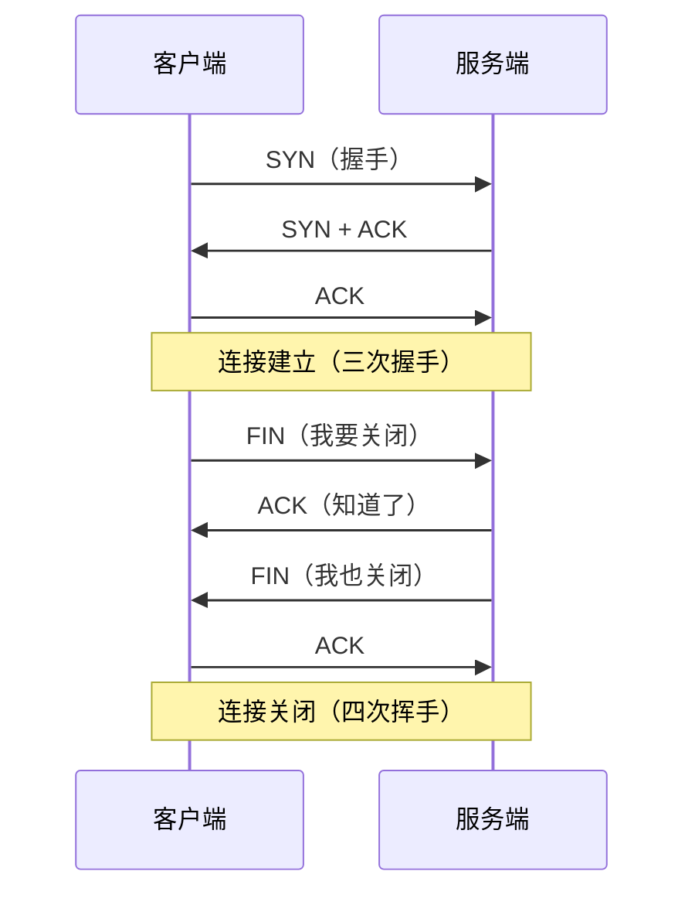

## 概述

后端服务最典型的网络故障是「连接数异常」——连接数暴涨、端口耗尽、连接堆积。理解 TCP 连接状态机，是排查这些问题的前提。

## 速查卡

- **四次挥手**：主动关闭方发 FIN → 被动方 ACK+FIN → 主动方 ACK；主动方进 `TIME_WAIT`，被动方进 `CLOSE_WAIT`
- **TIME_WAIT**：主动关闭方进入，等 2MSL（约 60s）；目的是重传最后的 ACK + 让旧报文消散
- **CLOSE_WAIT**：被动方收到 FIN 后进入，等应用调 `close()`；**堆积 = 代码 bug（连接泄漏）**
- **排查命令**：`ss -tan`、`ss -s`、`ss -tan state time-wait/close-wait`
- **TIME_WAIT 过多**：短连接场景正常，可 `tcp_tw_reuse` 复用 / 改长连接

---

## 一、TCP 三次握手与四次挥手



关闭时**主动关闭方**进入 `TIME_WAIT`，**被动关闭方**收到 FIN 后进入 `CLOSE_WAIT`。这是两个最常被问的状态。

---

## 二、TIME_WAIT

### 是什么

主动关闭方在发出最后一个 ACK 后，进入 `TIME_WAIT`，持续 **2MSL**（Maximum Segment Lifetime，约 30s，2MSL 约 60s）。

### 为什么需要 TIME_WAIT

| 目的 | 说明 |
|------|------|
| **保证最后的 ACK 能重传** | 若最后的 ACK 丢失，被动方会重发 FIN，主动方需保持在 TIME_WAIT 才能重发 ACK |
| **让旧报文自然消散** | 防止「旧连接的延迟报文」被误当作新连接的数据（同一个四元组复用） |

### TIME_WAIT 过多的影响与处理

- **影响**：大量 `TIME_WAIT` 占用端口（四元组），短连接场景下可能**端口耗尽**，无法新建连接
- **处理**：
  - 业务改**长连接**（连接池复用）
  - 开启 `tcp_tw_reuse`（复用 TIME_WAIT 连接）
  - 客户端也主动关闭的，调整成服务端主动关闭（让 TIME_WAIT 集中在服务端，服务端端口少无所谓）

> 认知：**TIME_WAIT 多本身不是 bug**，是「主动关闭方」的正常状态。短连接高频请求下，主动关闭方必然堆积 TIME_WAIT。要区分「正常多」和「端口耗尽故障」。

---

## 三、CLOSE_WAIT

### 是什么

被动关闭方收到对端的 FIN 后，进入 `CLOSE_WAIT`，**等待应用调用 `close()` 关闭 socket**。只要应用不 `close`，连接就一直卡在 `CLOSE_WAIT`。

### CLOSE_WAIT 堆积 = 代码 bug

`TIME_WAIT` 是正常的，**`CLOSE_WAIT` 堆积一定是应用代码问题**——收到了对端关闭请求，但代码没有关闭连接（连接泄漏）：

```java
// 典型泄漏：finally 里没有关闭
try {
    Socket socket = accept();
    // 处理请求，对端已 FIN
} catch (Exception e) {
    // 没有 socket.close() → 连接卡在 CLOSE_WAIT
}
```

**根因**：没有在 `finally` 里 `close()`，或连接池没正确归还连接。长期堆积会耗尽文件描述符（fd），服务无法接受新连接。

### 排查

```bash
ss -tan state close-wait | wc -l   # 统计 CLOSE_WAIT 数量
ss -tan state close-wait           # 看是哪些连接（对端 IP/端口）
```

结合代码查「哪里接受了连接却没关闭」。

---

## 四、排查命令速查

```bash
ss -s                    # 连接状态汇总
ss -tan                  # 所有 TCP 连接
ss -tan state time-wait  # 只看 TIME_WAIT
ss -tan state close-wait # 只看 CLOSE_WAIT
netstat -an | awk '/tcp/ {print $6}' | sort | uniq -c   # 按状态统计
```

| 命令 | 用途 |
|------|------|
| `ss -tan` | 查看所有 TCP 连接及状态 |
| `ss -s` | 连接状态汇总 |
| `tcpdump -i eth0 port 8080` | 抓包分析握手/挥手 |
| `ping` / `traceroute` | 连通性、路由排查 |

---

## 自测

1. **TIME_WAIT 和 CLOSE_WAIT 分别是谁进入的？为什么 TIME_WAIT 要等 2MSL？**
   <br/>→ TIME_WAIT 是主动关闭方进入；CLOSE_WAIT 是被动关闭方收到 FIN 后进入。TIME_WAIT 等 2MSL 是为了：① 保证最后的 ACK 丢失时能重传；② 让旧连接的延迟报文在网络中消散，避免被新连接误接收。

2. **TIME_WAIT 堆积是 bug 吗？什么时候需要处理？**
   <br/>→ 不是 bug，是主动关闭方的正常状态。只有「端口耗尽导致无法建连」时才需要处理：改长连接、`tcp_tw_reuse` 复用、调整谁主动关闭。

3. **CLOSE_WAIT 堆积说明什么？如何排查？**
   <br/>→ 说明被动方收到了 FIN 但应用代码没调 `close()`，是连接泄漏的 bug。用 `ss -tan state close-wait` 看堆积的连接，查代码里「接受连接后没在 finally 中关闭」的位置。长期堆积会耗尽 fd。

4. **为什么连接泄漏会导致「文件描述符耗尽」？**
   <br/>→ 每个 socket 占用一个文件描述符（fd），fd 有上限（ulimit -n）。CLOSE_WAIT 的连接一直不释放，fd 被占满后无法再 accept 新连接，服务表现为「无法建立连接」。

5. **如何统计当前各 TCP 状态的连接数？**
   <br/>→ `ss -s` 直接看汇总；或用 `ss -tan | awk '{print $1}' | sort | uniq -c` 或 `netstat -an | awk '/tcp/ {print $6}' | sort | uniq -c` 按状态统计。
